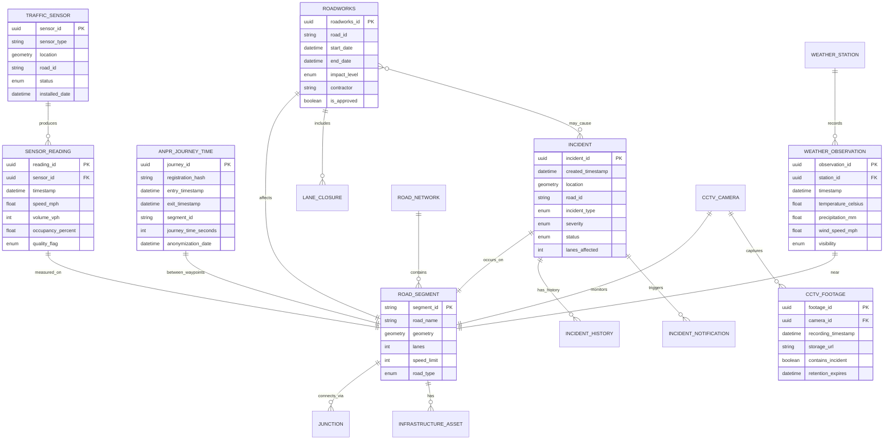

# Data Model: National Highways Data Architecture Modernization

## Document Control

| Field | Value |
|-------|-------|
| **Document ID** | ARC-001-DATA-v1.0 |
| **Document Type** | Logical and Physical Data Model |
| **Project** | National Highways Data Architecture Modernization (Project 001) |
| **Classification** | OFFICIAL |
| **Status** | DRAFT |
| **Version** | 1.0 |
| **Created Date** | 2025-11-13 |
| **Last Modified** | 2025-11-13 |
| **Review Cycle** | Monthly |
| **Next Review Date** | 2025-12-13 |
| **Owner** | Chief Data & Technology Officer, National Highways |
| **Reviewed By** | [PENDING] |
| **Approved By** | [PENDING] |
| **Distribution** | Programme Team, Data Domain Owners, Architecture Team |

## Revision History

| Version | Date | Author | Changes | Approved By | Approval Date |
|---------|------|--------|---------|-------------|---------------|
| 1.0 | 2025-11-13 | ArcKit AI | Initial creation from `/arckit.data-model` command | [PENDING] | [PENDING] |

## Document Purpose

This document defines the comprehensive data model for the National Highways Data Architecture Modernization programme, including entity relationships, attributes, data governance, GDPR compliance, and data quality requirements. This model drives database schema design, API specifications, data migration planning, and data governance policies. All entities trace back to Data Requirements (DR-001 through DR-005) from ARC-001-REQ-v1.0.

---

## Executive Summary

### Data Model Overview

**Total Entities**: 15 entities across 5 data mesh domains
**Total Attributes**: 178 attributes (including relationships)
**PII-Sensitive Entities**: 3 entities containing personal data requiring GDPR controls
**Data Classification**: 60% PUBLIC, 30% OFFICIAL, 10% OFFICIAL-SENSITIVE
**GDPR Compliance**: DPIA required for ANPR and CCTV data processing
**Data Mesh Domains**: Traffic Flow, Incidents, Roadworks, Assets, Weather

### Data Classification Summary

| Classification | Entities | Attributes | Retention Period | Access Control |
|----------------|----------|------------|------------------|----------------|
| PUBLIC | 9 | 98 | 7 years | Open Data API (no authentication) |
| OFFICIAL | 3 | 42 | 7 years | Partner API (authenticated) |
| OFFICIAL-SENSITIVE | 3 | 38 | 24 hours - 7 years (varies) | Restricted access (authorization + MFA) |

### PII/Sensitive Data Summary

**PII Entities Requiring GDPR Controls**:
1. **E-006: ANPR Journey Time Record** - Vehicle registration plates (anonymized after 24 hours)
2. **E-007: CCTV Footage** - Video containing identifiable persons/vehicles
3. **E-003: Incident Report** - Created by operator (user_id is indirect PII)

**Legal Basis for Processing**: Public task under UK GDPR Article 6(1)(e) - Road network management
**DPIA Status**: Required for ANPR and CCTV processing - ICO approval pending
**Data Subject Rights**: Access, rectification, erasure implemented via data steward processes

### Data Governance Stakeholders

| Stakeholder | Role | Responsibility |
|-------------|------|----------------|
| Chief Data & Technology Officer | Data Governance Executive | Overall data strategy and policy |
| Data Domain Owners (5) | Data Product Owners | Data quality, SLA compliance, domain data products |
| Data Protection Officer | Privacy & Compliance | UK GDPR compliance, DPIA approval |
| Chief Information Security Officer | Security Authority | OFFICIAL-SENSITIVE data protection |
| Data Stewards (per domain) | Operational Data Quality | Day-to-day data quality monitoring and issue resolution |

---

## Entity Relationship Diagram (ERD)



---

## Entity Catalog

### Domain 1: Traffic Flow Data Products

#### E-001: Traffic Sensor

**Entity ID**: E-001
**Entity Name**: Traffic Sensor
**Description**: IoT devices deployed across strategic road network measuring traffic flow, speed, and occupancy

**Source Requirement**: DR-001 (Traffic Flow Data Schema)

**Business Owner**: Traffic Flow Domain Owner
**Technical Owner**: Infrastructure & Operations Team
**Data Steward**: Traffic Data Quality Manager

**Data Classification**: OFFICIAL
**Estimated Volume**: 10,000 sensors initially, growing to 50,000 over 5 years
**Growth Rate**: 8,000 sensors/year (smart motorway expansion)
**Retention Period**: Metadata retained indefinitely (sensor remains in network), decommissioned sensor data archived after 2 years

**Attributes**:

| Attribute | Type | Required | PII | Description | Validation | Source Req |
|-----------|------|----------|-----|-------------|------------|------------|
| sensor_id | UUID | Yes | No | Unique sensor identifier | UUID v4 | DR-001 |
| sensor_type | ENUM | Yes | No | Type of sensor | INDUCTIVE_LOOP, RADAR, ANPR_CAMERA, CCTV_ANALYTICS | DR-001 |
| location | GEOMETRY (Point) | Yes | No | Geographic coordinates | WGS84, within UK boundary | DR-001 |
| road_id | STRING(50) | Yes | No | Strategic road network reference | Pattern: M/A/B + number + /J + junction (e.g., "M25/J15") | DR-001 |
| segment_id | STRING(50) | Yes | No | Road segment reference (FK) | References E-008: Road Segment | DR-001 |
| direction | ENUM | Yes | No | Traffic direction monitored | NORTHBOUND, SOUTHBOUND, EASTBOUND, WESTBOUND, CLOCKWISE, ANTICLOCKWISE | DR-001 |
| lane_coverage | INT | Yes | No | Number of lanes monitored | 1-4 lanes | DR-001 |
| status | ENUM | Yes | No | Operational status | ACTIVE, INACTIVE, FAULTY, MAINTENANCE, DECOMMISSIONED | DR-001 |
| installed_date | DATE | Yes | No | Sensor installation date | Not in future | DR-001 |
| last_maintenance | DATETIME | No | No | Last maintenance activity | ISO 8601 UTC | DR-001 |
| firmware_version | STRING(20) | No | No | Device firmware version | Semantic versioning (e.g., "1.2.3") | DR-001 |
| calibration_date | DATE | No | No | Last calibration date | Required annually | DR-001 |
| manufacturer | STRING(100) | No | No | Sensor manufacturer | | DR-001 |
| model | STRING(100) | No | No | Sensor model | | DR-001 |

**Relationships**:
- **One-to-Many**: Traffic Sensor → Sensor Reading (E-002) - One sensor produces many readings
- **Many-to-One**: Traffic Sensor → Road Segment (E-008) - Multiple sensors on one segment

**Indexes**:
- **Primary Key**: sensor_id (clustered index)
- **Foreign Key**: segment_id → E-008.segment_id
- **Performance Indexes**:
  - road_id (query by road)
  - location (geospatial queries for nearby sensors)
  - status (filter active sensors)
  - sensor_type (filter by sensor technology)

**Privacy Notes**: No PII. Sensor location is infrastructure data (public).

---

#### E-002: Sensor Reading

**Entity ID**: E-002
**Entity Name**: Sensor Reading
**Description**: Time-series measurements from traffic sensors capturing speed, volume, occupancy every 5-60 seconds

**Source Requirement**: DR-001 (Traffic Flow Data Schema)

**Business Owner**: Traffic Flow Domain Owner
**Technical Owner**: Data Engineering Team
**Data Steward**: Traffic Data Quality Manager

**Data Classification**: PUBLIC (aggregated), OFFICIAL (real-time granular)
**Estimated Volume**: 500 million readings/day (10,000 sensors × 50,000 readings/sensor/day)
**Growth Rate**: 5x over 5 years (50,000 sensors)
**Retention Period**: Raw readings 2 years (hot storage), aggregated (1-hour averages) retained 7 years

**Attributes**:

| Attribute | Type | Required | PII | Description | Validation | Source Req |
|-----------|------|----------|-----|-------------|------------|------------|
| reading_id | UUID | Yes | No | Unique reading identifier | UUID v4 | DR-001 |
| sensor_id | UUID | Yes | No | Sensor reference (FK) | References E-001 | DR-001 |
| timestamp | DATETIME | Yes | No | Reading timestamp | ISO 8601 UTC, not in future, not >5 min old | DR-001 |
| speed_mph | FLOAT | Yes | No | Average vehicle speed | 0-100 mph (reject if outside range) | DR-001 |
| volume_vehicles_per_hour | INT | Yes | No | Vehicle count per hour | 0-10,000 (flag if >5,000 for anomaly review) | DR-001 |
| occupancy_percent | FLOAT | Yes | No | Lane occupancy percentage | 0-100% (reject if outside range) | DR-001 |
| journey_time_seconds | INT | No | No | Journey time between waypoints | 0-7200 (max 2 hours) | DR-001 |
| data_quality_flag | ENUM | Yes | No | Quality assessment | VALID, SUSPECT, INVALID | DR-001 |
| headway_seconds | FLOAT | No | No | Average time between vehicles | 0-300 seconds | DR-001 |
| vehicle_classification | JSON | No | No | Vehicle type breakdown | {"car": 70, "lgv": 15, "hgv": 10, "motorcycle": 5} | DR-001 |

**Relationships**:
- **Many-to-One**: Sensor Reading → Traffic Sensor (E-001) - Many readings from one sensor
- **Many-to-One**: Sensor Reading → Road Segment (E-008) - Readings associated with segment

**Indexes**:
- **Primary Key**: reading_id (UUID, non-clustered for time-series data)
- **Foreign Key**: sensor_id → E-001.sensor_id
- **Performance Indexes**:
  - (sensor_id, timestamp DESC) - Time-series queries by sensor
  - timestamp DESC - Latest readings across all sensors
  - data_quality_flag - Filter invalid readings
- **Partitioning**: Partition by month (timestamp) for efficient archival

**Privacy Notes**: No PII. Aggregated traffic flow data is PUBLIC. Real-time granular data classified OFFICIAL.

---

#### E-006: ANPR Journey Time Record

**Entity ID**: E-006
**Entity Name**: ANPR Journey Time Record
**Description**: Vehicle journey times calculated by matching registration plates between ANPR waypoints, with 24-hour anonymization

**Source Requirement**: DR-003 (ANPR Data Anonymization), DR-004 (Data Retention Policy)

**Business Owner**: Traffic Flow Domain Owner
**Technical Owner**: Data Engineering Team
**Data Steward**: Data Protection Officer (DPO)

**Data Classification**: OFFICIAL-SENSITIVE (first 24 hours containing plate hash), PUBLIC (after anonymization - aggregated journey times only)
**Estimated Volume**: 5 million journey time records/day (20% of vehicles tracked via ANPR)
**Growth Rate**: 2x over 5 years (more ANPR cameras)
**Retention Period**: **Registration hash deleted after 24 hours (automated)**, aggregated journey times retained 7 years

**Attributes**:

| Attribute | Type | Required | PII | Description | Validation | Source Req |
|-----------|------|----------|-----|-------------|------------|------------|
| journey_id | UUID | Yes | No | Unique journey identifier | UUID v4 | DR-003 |
| registration_hash | STRING(64) | Yes | **YES** | SHA-256 hash of vehicle registration | SHA-256 with salt, deleted after 24 hours | DR-003 |
| entry_timestamp | DATETIME | Yes | No | Vehicle detected at entry waypoint | ISO 8601 UTC | DR-003 |
| exit_timestamp | DATETIME | Yes | No | Vehicle detected at exit waypoint | ISO 8601 UTC, must be after entry_timestamp | DR-003 |
| entry_camera_id | UUID | Yes | No | ANPR camera at entry (FK) | References E-001 (sensor_type=ANPR_CAMERA) | DR-003 |
| exit_camera_id | UUID | Yes | No | ANPR camera at exit (FK) | References E-001 (sensor_type=ANPR_CAMERA) | DR-003 |
| segment_id | STRING(50) | Yes | No | Road segment reference | References E-008 | DR-003 |
| journey_time_seconds | INT | Yes | No | Calculated journey time | 0-7200 seconds (0-2 hours) | DR-003 |
| expected_journey_time | INT | No | No | Expected time (free-flow conditions) | Historical average | DR-003 |
| delay_seconds | INT | No | No | Delay vs. expected | Calculated: journey_time - expected_time | DR-003 |
| anonymization_date | DATETIME | Yes | No | When registration_hash will be deleted | Created_timestamp + 24 hours | DR-003 |
| is_anonymized | BOOLEAN | Yes | No | Anonymization status | TRUE after 24 hours | DR-003 |

**Relationships**:
- **Many-to-One**: ANPR Journey Time → Road Segment (E-008) - Many journeys on one segment
- **Many-to-One**: ANPR Journey Time → Traffic Sensor (E-001) - Entry/exit cameras

**Indexes**:
- **Primary Key**: journey_id
- **Foreign Keys**: entry_camera_id, exit_camera_id → E-001.sensor_id
- **Performance Indexes**:
  - (entry_timestamp DESC, segment_id) - Recent journeys by segment
  - anonymization_date - Automated deletion job
  - is_anonymized - Filter anonymized vs. non-anonymized
- **Partitioning**: Partition by day (entry_timestamp) for efficient 24-hour deletion

**Privacy Notes**:
- **PII**: registration_hash is personal data (pseudonym) under UK GDPR
- **Legal Basis**: Public task (Article 6(1)(e)) - Journey time calculation for road network management
- **Purpose Limitation**: Data used ONLY for journey time calculation, NOT surveillance or law enforcement (without court order)
- **Storage Limitation**: Automated deletion after 24 hours via scheduled job
- **Data Subject Rights**: Right to erasure - registration_hash deleted within 24 hours (automated compliance)
- **DPIA**: Required - ICO approval for ANPR processing
- **Audit Logging**: All access to non-anonymized records logged with user_id, timestamp, purpose
- **Encryption**: registration_hash encrypted at rest (AES-256), encrypted in transit (TLS 1.3)

---

### Domain 2: Incidents Data Products

#### E-003: Incident

**Entity ID**: E-003
**Entity Name**: Incident
**Description**: Traffic incidents reported by control room operators or automated detection systems

**Source Requirement**: DR-002 (Incident Data Schema)

**Business Owner**: Incidents Domain Owner
**Technical Owner**: Data Engineering Team
**Data Steward**: Incidents Data Quality Manager

**Data Classification**: OFFICIAL (incident metadata), OFFICIAL-SENSITIVE (if contains personal details - rare)
**Estimated Volume**: 250,000 incidents/year (700 incidents/day average)
**Growth Rate**: Stable (no significant growth expected)
**Retention Period**: 7 years (safety analysis, legal requirements)

**Attributes**:

| Attribute | Type | Required | PII | Description | Validation | Source Req |
|-----------|------|----------|-----|-------------|------------|------------|
| incident_id | UUID | Yes | No | Unique incident identifier | UUID v4 | DR-002 |
| created_timestamp | DATETIME | Yes | No | Incident first reported | ISO 8601 UTC | DR-002 |
| updated_timestamp | DATETIME | Yes | No | Last status update | ISO 8601 UTC, >= created_timestamp | DR-002 |
| location | GEOMETRY (Point) | Yes | No | Geographic coordinates | WGS84, on or near road network | DR-002 |
| road_id | STRING(50) | Yes | No | Strategic road network reference | Pattern: M/A/B + number | DR-002 |
| segment_id | STRING(50) | Yes | No | Road segment reference (FK) | References E-008 | DR-002 |
| incident_type | ENUM | Yes | No | Type of incident | ACCIDENT, BREAKDOWN, DEBRIS, ROAD_CLOSURE, EMERGENCY_WORKS, WEATHER, ANIMAL, OTHER | DR-002 |
| severity | ENUM | Yes | No | Impact severity | LOW, MEDIUM, HIGH, CRITICAL | DR-002 |
| status | ENUM | Yes | No | Incident lifecycle status | REPORTED, CONFIRMED, ACTIVE, CLEARING, CLEARED, CLOSED | DR-002 |
| lanes_affected | INT | Yes | No | Number of lanes closed | 0-4 (0 = no closure, hard shoulder only) | DR-002 |
| direction | ENUM | Yes | No | Traffic direction affected | NORTHBOUND, SOUTHBOUND, EASTBOUND, WESTBOUND, BOTH_DIRECTIONS | DR-002 |
| estimated_clearance_time | DATETIME | No | No | Predicted resolution time | In future, updated as situation evolves | DR-002 |
| actual_clearance_time | DATETIME | No | No | Actual resolution time | Populated when status=CLEARED | DR-002 |
| created_by | STRING(100) | Yes | Indirect | User ID or system | e.g., "operator_123" or "automated_detection" | DR-002 |
| description | TEXT | No | No | Free-text incident description | Max 1000 characters | DR-002 |
| injuries_reported | BOOLEAN | No | No | Casualties involved | FALSE by default | DR-002 |
| emergency_services_attending | BOOLEAN | No | No | Police/Ambulance/Fire on scene | FALSE by default | DR-002 |
| traffic_impact_score | INT | No | No | Congestion impact (calculated) | 0-100 (based on delay caused) | DR-002 |

**Relationships**:
- **Many-to-One**: Incident → Road Segment (E-008) - Incident occurs on segment
- **One-to-Many**: Incident → Incident History (E-004) - Status change audit trail
- **One-to-Many**: Incident → Incident Notification (E-005) - Push notifications sent
- **Many-to-Many**: Incident ↔ Roadworks (E-009) - Incident may be caused by roadworks

**Indexes**:
- **Primary Key**: incident_id
- **Foreign Key**: segment_id → E-008.segment_id
- **Performance Indexes**:
  - status - Filter active incidents
  - (created_timestamp DESC) - Recent incidents
  - road_id - Incidents by road
  - location (geospatial) - Incidents near coordinate
  - severity - High-priority incidents
- **Full-Text Search**: description (free-text search)

**Privacy Notes**:
- **Indirect PII**: created_by contains operator user_id (indirect identifier, not publicly disclosed)
- **Sensitive Data**: injuries_reported flag (not personal data if Boolean only, no names/details)
- **Public Disclosure**: Incident location, type, severity published via open API (no personal details)

---

#### E-004: Incident History

**Entity ID**: E-004
**Entity Name**: Incident History
**Description**: Audit trail of all status changes and updates to incidents

**Source Requirement**: DR-002 (Incident Data Schema), NFR-SEC-005 (Audit Logging)

**Business Owner**: Incidents Domain Owner
**Technical Owner**: Data Engineering Team
**Data Steward**: Incidents Data Quality Manager

**Data Classification**: OFFICIAL
**Estimated Volume**: 2 million records/year (average 8 status changes per incident × 250k incidents)
**Retention Period**: 7 years (audit trail, incident investigation)

**Attributes**:

| Attribute | Type | Required | PII | Description | Validation | Source Req |
|-----------|------|----------|-----|-------------|------------|------------|
| history_id | UUID | Yes | No | Unique history record identifier | UUID v4 | DR-002 |
| incident_id | UUID | Yes | No | Incident reference (FK) | References E-003 | DR-002 |
| timestamp | DATETIME | Yes | No | Status change timestamp | ISO 8601 UTC | DR-002 |
| old_status | ENUM | No | No | Previous status | Nullable for initial creation | DR-002 |
| new_status | ENUM | Yes | No | New status | REPORTED, CONFIRMED, ACTIVE, CLEARING, CLEARED, CLOSED | DR-002 |
| changed_by | STRING(100) | Yes | Indirect | User ID or system | e.g., "operator_123", "automated_system" | DR-002 |
| change_reason | TEXT | No | No | Reason for status change | Max 500 characters | DR-002 |
| old_severity | ENUM | No | No | Previous severity | Nullable if severity unchanged | DR-002 |
| new_severity | ENUM | No | No | New severity | LOW, MEDIUM, HIGH, CRITICAL | DR-002 |

**Relationships**:
- **Many-to-One**: Incident History → Incident (E-003) - Multiple history records per incident

**Indexes**:
- **Primary Key**: history_id
- **Foreign Key**: incident_id → E-003.incident_id
- **Performance Indexes**:
  - (incident_id, timestamp DESC) - History timeline per incident
  - timestamp DESC - Recent changes across all incidents

**Privacy Notes**: Audit trail for incident management. changed_by is indirect PII (operator user_id).

---

#### E-005: Incident Notification

**Entity ID**: E-005
**Entity Name**: Incident Notification
**Description**: Push notifications sent to emergency services, navigation apps, and variable message signs

**Source Requirement**: FR-004 (Incident Management Workflow)

**Business Owner**: Incidents Domain Owner
**Technical Owner**: Data Engineering Team
**Data Steward**: Incidents Data Quality Manager

**Data Classification**: OFFICIAL
**Estimated Volume**: 1.5 million notifications/year (average 6 notifications per incident)
**Retention Period**: 90 days (operational troubleshooting)

**Attributes**:

| Attribute | Type | Required | PII | Description | Validation | Source Req |
|-----------|------|----------|-----|-------------|------------|------------|
| notification_id | UUID | Yes | No | Unique notification identifier | UUID v4 | FR-004 |
| incident_id | UUID | Yes | No | Incident reference (FK) | References E-003 | FR-004 |
| sent_timestamp | DATETIME | Yes | No | Notification sent time | ISO 8601 UTC | FR-004 |
| recipient_type | ENUM | Yes | No | Notification target | EMERGENCY_SERVICES, NAVIGATION_APP, VMS, CONTROL_ROOM, PUBLIC_API | FR-004 |
| recipient_id | STRING(100) | No | No | Specific recipient identifier | e.g., "google_maps", "vms_12345" | FR-004 |
| delivery_status | ENUM | Yes | No | Delivery confirmation | SENT, DELIVERED, FAILED, ACKNOWLEDGED | FR-004 |
| delivery_latency_ms | INT | No | No | Time to deliver | Milliseconds from incident update to delivery | FR-004 |
| notification_content | JSON | No | No | Message payload | Incident summary in JSON format | FR-004 |

**Relationships**:
- **Many-to-One**: Incident Notification → Incident (E-003) - Multiple notifications per incident

**Indexes**:
- **Primary Key**: notification_id
- **Foreign Key**: incident_id → E-003.incident_id
- **Performance Indexes**:
  - (sent_timestamp DESC) - Recent notifications
  - recipient_type - Filter by notification channel
  - delivery_status - Failed deliveries requiring retry

**Privacy Notes**: No PII. Operational notification metadata.

---

### Domain 3: Roadworks Data Products

#### E-009: Roadworks

**Entity ID**: E-009
**Entity Name**: Roadworks
**Description**: Planned roadworks and maintenance activities affecting the strategic road network

**Source Requirement**: DR-002 (Incident Data Schema - roadworks context), FR-005 (Roadworks Scheduling)

**Business Owner**: Roadworks Domain Owner
**Technical Owner**: Data Engineering Team
**Data Steward**: Roadworks Data Quality Manager

**Data Classification**: OFFICIAL (published as open data)
**Estimated Volume**: 15,000 roadworks/year (40 active roadworks/day average)
**Retention Period**: 10 years (infrastructure lifecycle management, planning analysis)

**Attributes**:

| Attribute | Type | Required | PII | Description | Validation | Source Req |
|-----------|------|----------|-----|-------------|------------|------------|
| roadworks_id | UUID | Yes | No | Unique roadworks identifier | UUID v4 | FR-005 |
| road_id | STRING(50) | Yes | No | Strategic road network reference | Pattern: M/A/B + number | FR-005 |
| segment_id | STRING(50) | Yes | No | Road segment reference (FK) | References E-008 | FR-005 |
| location | GEOMETRY (Polygon) | Yes | No | Geographic extent of roadworks | WGS84 polygon | FR-005 |
| start_date | DATETIME | Yes | No | Planned start date/time | In future (for planned), historical (for active) | FR-005 |
| end_date | DATETIME | Yes | No | Planned completion date/time | After start_date | FR-005 |
| actual_start_date | DATETIME | No | No | Actual start (if different from plan) | | FR-005 |
| actual_end_date | DATETIME | No | No | Actual completion (if different) | | FR-005 |
| status | ENUM | Yes | No | Roadworks status | PLANNED, APPROVED, ACTIVE, DELAYED, COMPLETED, CANCELLED | FR-005 |
| impact_level | ENUM | Yes | No | Traffic impact severity | LOW, MEDIUM, HIGH, SEVERE | FR-005 |
| contractor | STRING(200) | No | No | Contractor company name | | FR-005 |
| project_name | STRING(200) | Yes | No | Roadworks project description | Max 200 characters | FR-005 |
| lanes_affected | INT | Yes | No | Number of lanes closed | 0-4 | FR-005 |
| closure_type | ENUM | Yes | No | Type of closure | LANE_CLOSURE, HARD_SHOULDER, FULL_CLOSURE, CONTRAFLOW | FR-005 |
| diversion_route | TEXT | No | No | Alternative route description | Max 1000 characters | FR-005 |
| is_approved | BOOLEAN | Yes | No | Approval status | Requires approval before ACTIVE | FR-005 |
| notice_period_weeks | INT | Yes | No | Advance notice provided | Minimum 6 weeks for major roadworks | FR-005 |
| estimated_cost | DECIMAL(12,2) | No | No | Project cost estimate | GBP, commercial-sensitive (not public) | FR-005 |

**Relationships**:
- **Many-to-One**: Roadworks → Road Segment (E-008) - Roadworks on segment
- **One-to-Many**: Roadworks → Lane Closure (E-010) - Detailed lane closure schedule
- **Many-to-Many**: Roadworks ↔ Incident (E-003) - Roadworks may cause incidents

**Indexes**:
- **Primary Key**: roadworks_id
- **Foreign Key**: segment_id → E-008.segment_id
- **Performance Indexes**:
  - status - Filter active/planned roadworks
  - (start_date, end_date) - Temporal queries
  - road_id - Roadworks by road
  - location (geospatial) - Roadworks in area
  - impact_level - High-impact roadworks

**Privacy Notes**: No PII. Roadworks data published as open data (excluding estimated_cost - commercial sensitivity).

---

#### E-010: Lane Closure

**Entity ID**: E-010
**Entity Name**: Lane Closure
**Description**: Detailed schedule of lane closures during roadworks (specific lanes, times)

**Source Requirement**: FR-005 (Roadworks Scheduling)

**Business Owner**: Roadworks Domain Owner
**Technical Owner**: Data Engineering Team
**Data Steward**: Roadworks Data Quality Manager

**Data Classification**: PUBLIC (open data API)
**Estimated Volume**: 50,000 lane closure records/year (average 3.3 closures per roadworks)
**Retention Period**: 10 years

**Attributes**:

| Attribute | Type | Required | PII | Description | Validation | Source Req |
|-----------|------|----------|-----|-------------|------------|------------|
| closure_id | UUID | Yes | No | Unique lane closure identifier | UUID v4 | FR-005 |
| roadworks_id | UUID | Yes | No | Parent roadworks reference (FK) | References E-009 | FR-005 |
| lane_number | INT | Yes | No | Lane number (1=left, increasing right) | 1-4 | FR-005 |
| closure_start | DATETIME | Yes | No | Lane closure start time | ISO 8601 UTC | FR-005 |
| closure_end | DATETIME | Yes | No | Lane closure end time | After closure_start | FR-005 |
| closure_reason | TEXT | No | No | Reason for lane closure | Max 200 characters | FR-005 |
| is_recurring | BOOLEAN | No | No | Recurring closure pattern | E.g., nightly closures | FR-005 |

**Relationships**:
- **Many-to-One**: Lane Closure → Roadworks (E-009) - Multiple closures per roadworks

**Indexes**:
- **Primary Key**: closure_id
- **Foreign Key**: roadworks_id → E-009.roadworks_id
- **Performance Indexes**:
  - (closure_start, closure_end) - Active closures at time T

**Privacy Notes**: No PII. Open data.

---

### Domain 4: Assets Data Products

#### E-008: Road Segment

**Entity ID**: E-008
**Entity Name**: Road Segment
**Description**: Strategic road network topology - segments between junctions with consistent characteristics

**Source Requirement**: DR-005 (Data Mesh Domain Data Products - Assets Domain)

**Business Owner**: Assets Domain Owner
**Technical Owner**: Infrastructure & Operations Team
**Data Steward**: Asset Data Quality Manager

**Data Classification**: PUBLIC (open data - road network topology)
**Estimated Volume**: 25,000 segments (4,300 miles / average 0.17 miles per segment)
**Growth Rate**: <1% annually (new road construction rare)
**Retention Period**: Indefinite (infrastructure lifecycle)

**Attributes**:

| Attribute | Type | Required | PII | Description | Validation | Source Req |
|-----------|------|----------|-----|-------------|------------|------------|
| segment_id | STRING(50) | Yes | No | Unique segment identifier | Composite: road_id + "_" + segment_number | DR-005 |
| road_name | STRING(100) | Yes | No | Road name/number | E.g., "M25", "A1(M)", "M6" | DR-005 |
| road_type | ENUM | Yes | No | Road classification | MOTORWAY, A_ROAD, B_ROAD | DR-005 |
| start_junction | STRING(20) | Yes | No | Starting junction | E.g., "J15", "M25/J15" | DR-005 |
| end_junction | STRING(20) | Yes | No | Ending junction | E.g., "J16" | DR-005 |
| geometry | GEOMETRY (LineString) | Yes | No | Road centerline geometry | WGS84 LineString, 2D coordinates | DR-005 |
| length_meters | INT | Yes | No | Segment length | Derived from geometry, in meters | DR-005 |
| lanes | INT | Yes | No | Number of lanes (one direction) | 1-4 lanes | DR-005 |
| speed_limit_mph | INT | Yes | No | Posted speed limit | 20, 30, 40, 50, 60, 70 mph (typical UK limits) | DR-005 |
| hard_shoulder | BOOLEAN | No | No | Hard shoulder present | TRUE for most motorways | DR-005 |
| smart_motorway | BOOLEAN | No | No | Smart motorway segment | Dynamic hard shoulder, variable speed limits | DR-005 |
| surface_type | ENUM | No | No | Road surface material | ASPHALT, CONCRETE, COMPOSITE | DR-005 |
| last_resurfaced | DATE | No | No | Last resurfacing date | | DR-005 |
| annual_average_daily_traffic | INT | No | No | AADT vehicle count | Historical average | DR-005 |

**Relationships**:
- **Many-to-One**: Road Segment → Road Network (E-011) - Segments compose road network
- **One-to-Many**: Road Segment → Traffic Sensor (E-001) - Sensors monitor segments
- **One-to-Many**: Road Segment → Incident (E-003) - Incidents occur on segments
- **One-to-Many**: Road Segment → Roadworks (E-009) - Roadworks affect segments
- **Many-to-Many**: Road Segment ↔ Junction (E-012) - Segments connect via junctions

**Indexes**:
- **Primary Key**: segment_id
- **Foreign Key**: road_network_id → E-011.network_id
- **Performance Indexes**:
  - road_name - Query by road
  - geometry (spatial index) - Geospatial queries
  - road_type - Filter by classification
- **Geospatial Index**: GIST index on geometry (PostGIS)

**Privacy Notes**: No PII. Public infrastructure data (open data API).

---

#### E-011: Road Network

**Entity ID**: E-011
**Entity Name**: Road Network
**Description**: Top-level road network structure (e.g., M25 as complete network)

**Source Requirement**: DR-005 (Assets Domain Data Product)

**Business Owner**: Assets Domain Owner
**Technical Owner**: Infrastructure & Operations Team
**Data Steward**: Asset Data Quality Manager

**Data Classification**: PUBLIC
**Estimated Volume**: 120 networks (major motorways and A-roads)
**Retention Period**: Indefinite

**Attributes**:

| Attribute | Type | Required | PII | Description | Validation | Source Req |
|-----------|------|----------|-----|-------------|------------|------------|
| network_id | STRING(20) | Yes | No | Unique network identifier | E.g., "M25", "M1", "A1M" | DR-005 |
| network_name | STRING(100) | Yes | No | Full network name | E.g., "M25 London Orbital Motorway" | DR-005 |
| total_length_miles | FLOAT | Yes | No | Total network length | Sum of all segment lengths | DR-005 |
| region | ENUM | Yes | No | Geographic region | LONDON, SOUTH_EAST, MIDLANDS, NORTH, SCOTLAND, WALES | DR-005 |
| strategic_importance | ENUM | Yes | No | Network criticality | CORE, STRATEGIC, LOCAL | DR-005 |

**Relationships**:
- **One-to-Many**: Road Network → Road Segment (E-008) - Network contains segments

**Indexes**:
- **Primary Key**: network_id
- **Performance Indexes**: region, strategic_importance

**Privacy Notes**: No PII. Public data.

---

#### E-012: Junction

**Entity ID**: E-012
**Entity Name**: Junction
**Description**: Junctions connecting road segments (motorway junctions, roundabouts, intersections)

**Source Requirement**: DR-005 (Assets Domain)

**Business Owner**: Assets Domain Owner
**Technical Owner**: Infrastructure & Operations Team
**Data Steward**: Asset Data Quality Manager

**Data Classification**: PUBLIC
**Estimated Volume**: 3,000 junctions across strategic road network
**Retention Period**: Indefinite

**Attributes**:

| Attribute | Type | Required | PII | Description | Validation | Source Req |
|-----------|------|----------|-----|-------------|------------|------------|
| junction_id | STRING(50) | Yes | No | Unique junction identifier | E.g., "M25/J15", "A1/M_J23" | DR-005 |
| junction_name | STRING(200) | No | No | Junction name | E.g., "M25 Junction 15 (M4 interchange)" | DR-005 |
| junction_type | ENUM | Yes | No | Junction design | MOTORWAY_JUNCTION, ROUNDABOUT, GRADE_SEPARATED, AT_GRADE | DR-005 |
| location | GEOMETRY (Point) | Yes | No | Geographic coordinates | WGS84 point | DR-005 |
| connects_to | ARRAY[STRING] | Yes | No | Connected road segment IDs | References E-008.segment_id (multiple) | DR-005 |

**Relationships**:
- **Many-to-Many**: Junction ↔ Road Segment (E-008) - Junctions connect segments

**Indexes**:
- **Primary Key**: junction_id
- **Performance Indexes**: location (geospatial), junction_type

**Privacy Notes**: No PII. Public infrastructure data.

---

#### E-013: Infrastructure Asset

**Entity ID**: E-013
**Entity Name**: Infrastructure Asset
**Description**: Infrastructure assets along road network (bridges, tunnels, gantries, signage)

**Source Requirement**: DR-005 (Assets Domain)

**Business Owner**: Assets Domain Owner
**Technical Owner**: Infrastructure & Operations Team
**Data Steward**: Asset Data Quality Manager

**Data Classification**: OFFICIAL-SENSITIVE (some assets - security risk if detailed specs disclosed)
**Estimated Volume**: 50,000 assets (bridges, tunnels, gantries, signage)
**Retention Period**: Indefinite (infrastructure lifecycle)

**Attributes**:

| Attribute | Type | Required | PII | Description | Validation | Source Req |
|-----------|------|----------|-----|-------------|------------|------------|
| asset_id | UUID | Yes | No | Unique asset identifier | UUID v4 | DR-005 |
| asset_type | ENUM | Yes | No | Type of infrastructure | BRIDGE, TUNNEL, GANTRY, SIGN, BARRIER, LIGHTING, DRAINAGE | DR-005 |
| segment_id | STRING(50) | Yes | No | Road segment location (FK) | References E-008 | DR-005 |
| location | GEOMETRY (Point) | Yes | No | Geographic coordinates | WGS84 point | DR-005 |
| asset_name | STRING(200) | No | No | Asset name/description | E.g., "M25 Thames Bridge" | DR-005 |
| construction_year | INT | No | No | Year built/installed | | DR-005 |
| last_inspection | DATE | No | No | Last safety inspection date | | DR-005 |
| next_inspection | DATE | No | No | Scheduled inspection date | Required annually for bridges/tunnels | DR-005 |
| condition_rating | ENUM | No | No | Structural condition | EXCELLENT, GOOD, FAIR, POOR, CRITICAL | DR-005 |
| height_restriction_meters | FLOAT | No | No | Vehicle height limit (bridges) | For HGV routing | DR-005 |
| weight_restriction_tonnes | FLOAT | No | No | Vehicle weight limit (bridges) | For HGV routing | DR-005 |
| specifications | JSON | No | Sensitive | Detailed asset specifications | OFFICIAL-SENSITIVE (security risk if disclosed) | DR-005 |

**Relationships**:
- **Many-to-One**: Infrastructure Asset → Road Segment (E-008) - Assets located on segments

**Indexes**:
- **Primary Key**: asset_id
- **Foreign Key**: segment_id → E-008.segment_id
- **Performance Indexes**: asset_type, location (geospatial), next_inspection (maintenance scheduling)

**Privacy Notes**: No PII. Some asset details classified OFFICIAL-SENSITIVE (bridge structural specs - terrorism risk).

---

### Domain 5: Weather Data Products

#### E-014: Weather Station

**Entity ID**: E-014
**Entity Name**: Weather Station
**Description**: Roadside weather stations measuring temperature, precipitation, wind, visibility

**Source Requirement**: DR-005 (Weather Domain Data Product), INT-004 (Met Office Weather Feed)

**Business Owner**: Weather Domain Owner
**Technical Owner**: Infrastructure & Operations Team
**Data Steward**: Weather Data Quality Manager

**Data Classification**: PUBLIC
**Estimated Volume**: 500 weather stations (roadside + Met Office integration)
**Retention Period**: Indefinite (station metadata), decommissioned station archived after 2 years

**Attributes**:

| Attribute | Type | Required | PII | Description | Validation | Source Req |
|-----------|------|----------|-----|-------------|------------|------------|
| station_id | UUID | Yes | No | Unique weather station identifier | UUID v4 | INT-004 |
| station_name | STRING(100) | Yes | No | Station name/location | E.g., "M25 J15 Roadside Station" | INT-004 |
| location | GEOMETRY (Point) | Yes | No | Geographic coordinates | WGS84 point | INT-004 |
| segment_id | STRING(50) | No | No | Nearest road segment (FK) | References E-008 | INT-004 |
| station_type | ENUM | Yes | No | Station type | ROADSIDE, MET_OFFICE_DATAPOINT, PRIVATE | INT-004 |
| installed_date | DATE | Yes | No | Station installation date | | INT-004 |
| status | ENUM | Yes | No | Operational status | ACTIVE, INACTIVE, FAULTY, DECOMMISSIONED | INT-004 |

**Relationships**:
- **One-to-Many**: Weather Station → Weather Observation (E-015) - Station produces observations
- **Many-to-One**: Weather Station → Road Segment (E-008) - Station near segment

**Indexes**:
- **Primary Key**: station_id
- **Foreign Key**: segment_id → E-008.segment_id
- **Performance Indexes**: location (geospatial), status

**Privacy Notes**: No PII. Public infrastructure data.

---

#### E-015: Weather Observation

**Entity ID**: E-015
**Entity Name**: Weather Observation
**Description**: Time-series weather measurements from roadside stations and Met Office Datapoint API

**Source Requirement**: INT-004 (Met Office Weather Feed)

**Business Owner**: Weather Domain Owner
**Technical Owner**: Data Engineering Team
**Data Steward**: Weather Data Quality Manager

**Data Classification**: PUBLIC (Met Office data under Open Government License)
**Estimated Volume**: 2 million observations/day (500 stations × 4,000 readings/day at 15-min intervals)
**Retention Period**: Raw observations 2 years, aggregated (hourly) 7 years

**Attributes**:

| Attribute | Type | Required | PII | Description | Validation | Source Req |
|-----------|------|----------|-----|-------------|------------|------------|
| observation_id | UUID | Yes | No | Unique observation identifier | UUID v4 | INT-004 |
| station_id | UUID | Yes | No | Weather station reference (FK) | References E-014 | INT-004 |
| timestamp | DATETIME | Yes | No | Observation timestamp | ISO 8601 UTC, 15-min intervals | INT-004 |
| temperature_celsius | FLOAT | No | No | Air temperature | -30 to +40°C (UK range) | INT-004 |
| precipitation_mm | FLOAT | No | No | Rainfall/snow accumulation | 0-100 mm/hour | INT-004 |
| wind_speed_mph | FLOAT | No | No | Wind speed | 0-100 mph | INT-004 |
| wind_direction_degrees | INT | No | No | Wind direction | 0-360 degrees (0=North, 90=East) | INT-004 |
| visibility_meters | INT | No | No | Visibility distance | 0-10,000 meters | INT-004 |
| road_surface_temperature_celsius | FLOAT | No | No | Road surface temp (roadside stations) | -30 to +50°C | INT-004 |
| ice_warning | BOOLEAN | No | No | Ice detected on road surface | TRUE if road_temp ≤ 0°C + precipitation | INT-004 |
| flood_warning | BOOLEAN | No | No | Flooding risk alert | TRUE if precipitation > threshold | INT-004 |

**Relationships**:
- **Many-to-One**: Weather Observation → Weather Station (E-014) - Observations from station
- **Many-to-One**: Weather Observation → Road Segment (E-008) - Observations near segment

**Indexes**:
- **Primary Key**: observation_id
- **Foreign Key**: station_id → E-014.station_id
- **Performance Indexes**:
  - (station_id, timestamp DESC) - Time-series by station
  - timestamp DESC - Latest observations
  - ice_warning, flood_warning - Severe weather alerts
- **Partitioning**: Partition by month (timestamp)

**Privacy Notes**: No PII. Public weather data.

---

### Cross-Domain Entity

#### E-007: CCTV Footage

**Entity ID**: E-007
**Entity Name**: CCTV Footage
**Description**: Video footage from 3,500 CCTV cameras monitoring strategic road network

**Source Requirement**: DR-003 (ANPR context - CCTV), DR-004 (Data Retention - CCTV 31 days operational, 7 years evidentiary)

**Business Owner**: Incidents Domain Owner (operational use), CISO (security controls)
**Technical Owner**: Infrastructure & Operations Team
**Data Steward**: Data Protection Officer (DPO)

**Data Classification**: OFFICIAL-SENSITIVE (video contains identifiable persons/vehicles)
**Estimated Volume**: 35 TB/day (3,500 cameras × 10 GB/camera/day)
**Retention Period**: **31 days operational footage (automated deletion)**, **7 years if legal hold** (police investigation, litigation)

**Attributes**:

| Attribute | Type | Required | PII | Description | Validation | Source Req |
|-----------|------|----------|-----|-------------|------------|------------|
| footage_id | UUID | Yes | No | Unique footage identifier | UUID v4 | DR-004 |
| camera_id | UUID | Yes | No | CCTV camera reference (FK) | References E-001 (sensor_type=CCTV_ANALYTICS) | DR-004 |
| recording_timestamp | DATETIME | Yes | No | Footage start time | ISO 8601 UTC | DR-004 |
| duration_seconds | INT | Yes | No | Clip duration | 1-3600 seconds (1 sec - 1 hour clips) | DR-004 |
| storage_url | STRING(500) | Yes | No | Encrypted storage location | Azure Blob Storage URL (encrypted) | DR-004 |
| contains_incident | BOOLEAN | No | No | Footage associated with incident | TRUE if linked to E-003 | DR-004 |
| incident_id | UUID | No | No | Incident reference (FK, nullable) | References E-003 if incident captured | DR-004 |
| retention_expires | DATETIME | Yes | No | Automated deletion date | recording_timestamp + 31 days (or +7 years if legal hold) | DR-004 |
| legal_hold | BOOLEAN | Yes | No | Retention extended for legal purposes | TRUE prevents automated deletion | DR-004 |
| legal_hold_reason | TEXT | No | No | Justification for legal hold | E.g., "Police investigation ref: 2025/ABC123" | DR-004 |
| is_deleted | BOOLEAN | Yes | No | Soft delete flag | TRUE after retention expires, permanent delete after 30 days | DR-004 |

**Relationships**:
- **Many-to-One**: CCTV Footage → Traffic Sensor (E-001) - Camera captures footage
- **Many-to-One**: CCTV Footage → Incident (E-003) - Footage may capture incident

**Indexes**:
- **Primary Key**: footage_id
- **Foreign Keys**: camera_id → E-001.sensor_id, incident_id → E-003.incident_id
- **Performance Indexes**:
  - retention_expires - Automated deletion job
  - (camera_id, recording_timestamp DESC) - Footage by camera timeline
  - legal_hold - Filter footage with extended retention
  - is_deleted - Exclude deleted footage from queries

**Privacy Notes**:
- **PII**: Video footage contains identifiable persons (faces) and vehicles (registration plates) - **HIGH PRIVACY RISK**
- **Legal Basis**: Public task (Article 6(1)(e)) + Legitimate interests (Article 6(1)(f)) - Crime prevention, traffic management, incident investigation
- **Purpose Limitation**: Footage used ONLY for: Incident investigation, traffic management, crime prevention (with police), legal proceedings
- **Storage Limitation**: 31 days automated deletion (operational footage), 7 years if legal hold (police/court requirement)
- **Data Subject Rights**:
  - **Right to Access**: Citizens can request footage (Subject Access Request - SAR) if identifiable
  - **Right to Erasure**: NOT applicable during 31-day retention (legitimate interest overrides), NOT applicable if legal hold
- **DPIA**: **REQUIRED** - High-risk large-scale video surveillance, ICO approval mandatory
- **Access Controls**: RBAC with least privilege - Control room operators (view only), CISO-approved personnel (download for legal), Emergency services (secure PSN access)
- **Encryption**: AES-256 at rest (Azure Storage Service Encryption), TLS 1.3 in transit
- **Audit Logging**: ALL access logged (user_id, timestamp, footage_id, purpose) - 7-year retention
- **Signage**: CCTV warning signs required under Data Protection Act 2018 Schedule 1 Part 2 (public awareness)
- **ICO Registration**: National Highways registered as data controller for CCTV processing

---

## Data Governance Matrix

| Entity | Data Owner (Business) | Data Steward (Quality) | Data Custodian (Technical) | Access Control | Sensitivity | Compliance | Quality SLA |
|--------|----------------------|------------------------|----------------------------|----------------|-------------|------------|-------------|
| E-001: Traffic Sensor | Traffic Domain Owner | Traffic Data Quality Mgr | Infrastructure Team | Metadata: Public; Config: OFFICIAL | OFFICIAL | None | 99% sensor uptime |
| E-002: Sensor Reading | Traffic Domain Owner | Traffic Data Quality Mgr | Data Engineering Team | Aggregated: Public; Real-time: OFFICIAL | PUBLIC/OFFICIAL | None | >99% completeness, <2 min freshness |
| E-003: Incident | Incidents Domain Owner | Incidents Data Quality Mgr | Data Engineering Team | Summary: Public; Details: OFFICIAL | OFFICIAL | None | >99.5% accuracy, <30 sec freshness |
| E-004: Incident History | Incidents Domain Owner | Incidents Data Quality Mgr | Data Engineering Team | Internal audit only | OFFICIAL | NFR-SEC-005 (Audit Logging) | 100% audit trail integrity |
| E-005: Incident Notification | Incidents Domain Owner | Incidents Data Quality Mgr | Data Engineering Team | Internal operations | OFFICIAL | None | <10 sec delivery latency p95 |
| E-006: ANPR Journey Time | Traffic Domain Owner | Data Protection Officer | Data Engineering Team | RESTRICTED (first 24h), Public (aggregated) | OFFICIAL-SENSITIVE | UK GDPR, DPIA | 100% anonymization within 24h |
| E-007: CCTV Footage | CISO | Data Protection Officer | Infrastructure Team | RESTRICTED (MFA, authorization) | OFFICIAL-SENSITIVE | UK GDPR, DPIA, DPA 2018 | 31-day retention 100% automated |
| E-008: Road Segment | Assets Domain Owner | Asset Data Quality Mgr | Infrastructure Team | Public (open data) | PUBLIC | None | >99.9% accuracy (safety-critical) |
| E-009: Roadworks | Roadworks Domain Owner | Roadworks Data Quality Mgr | Data Engineering Team | Public (open data) | OFFICIAL | None | 100% accuracy (legal requirement for notice) |
| E-010: Lane Closure | Roadworks Domain Owner | Roadworks Data Quality Mgr | Data Engineering Team | Public (open data) | PUBLIC | None | 100% accuracy |
| E-011: Road Network | Assets Domain Owner | Asset Data Quality Mgr | Infrastructure Team | Public (open data) | PUBLIC | None | >99% accuracy |
| E-012: Junction | Assets Domain Owner | Asset Data Quality Mgr | Infrastructure Team | Public (open data) | PUBLIC | None | >99% accuracy |
| E-013: Infrastructure Asset | Assets Domain Owner | Asset Data Quality Mgr | Infrastructure Team | Summary: Public; Specs: OFFICIAL-SENSITIVE | OFFICIAL-SENSITIVE | Security classification | >95% condition data current |
| E-014: Weather Station | Weather Domain Owner | Weather Data Quality Mgr | Infrastructure Team | Public (open data) | PUBLIC | Met Office data license | N/A (Met Office SLA applies) |
| E-015: Weather Observation | Weather Domain Owner | Weather Data Quality Mgr | Data Engineering Team | Public (Met Office OGL) | PUBLIC | Open Government License | >95% forecast accuracy (Met Office) |

---

## CRUD Matrix

| Entity | Public API (Read) | Partner API (Read) | Control Room Dashboard (CRUD) | Data Engineering (CRUD) | Emergency Services (Read) | Data Steward (CRUD) |
|--------|------------------|-------------------|------------------------------|------------------------|--------------------------|---------------------|
| E-001: Traffic Sensor | R (metadata) | R (full) | -R-- | CRUD | -R-- | -RU- (status updates) |
| E-002: Sensor Reading | R (aggregated) | R (real-time) | -R-- | CR-- (automated ingestion) | -R-- | --UD (quality corrections) |
| E-003: Incident | R (summary) | R (detailed) | CRUD | CR-- (automated detection) | -R-- | -RU- (data quality) |
| E-004: Incident History | ---- | ---- | -R-- | CR-- (audit trail) | ---- | -R-- (audit review) |
| E-005: Incident Notification | ---- | ---- | -R-- | CR-- (automated) | -R-- | -R-- |
| E-006: ANPR Journey Time | R (aggregated, anonymized) | ---- | ---- | CR-D (automated, 24h deletion) | ---- | ---- (DPO audit only) |
| E-007: CCTV Footage | ---- | ---- | -R-- (live feed) | CR-D (automated, 31-day deletion) | -R-- (PSN secure) | -R-- (legal hold management) |
| E-008: Road Segment | R (full) | R (full) | -R-- | -RU- (rare updates) | -R-- | -RU- |
| E-009: Roadworks | R (full) | R (full) | CRUD | -R-- | -R-- | -RU- |
| E-010: Lane Closure | R (full) | R (full) | CRUD | -R-- | -R-- | -RU- |
| E-011: Road Network | R (full) | R (full) | -R-- | -RU- (rare) | -R-- | -RU- |
| E-012: Junction | R (full) | R (full) | -R-- | -RU- (rare) | -R-- | -RU- |
| E-013: Infrastructure Asset | R (summary, height/weight limits) | R (detailed) | -R-- | -RU- (asset management) | -R-- | -RU- |
| E-014: Weather Station | R (metadata) | R (full) | -R-- | -RU- | -R-- | -RU- |
| E-015: Weather Observation | R (full) | R (full) | -R-- | CR-- (Met Office feed) | -R-- | -R-- |

**Legend**: C=Create, R=Read, U=Update, D=Delete, - = No Access

---

## Data Integration Mapping

### Upstream Systems (Data Sources)

| Entity | Source System | Integration Type | Update Frequency | Data Quality SLA | Owner |
|--------|--------------|------------------|------------------|------------------|-------|
| E-002: Sensor Reading | 10,000 IoT Traffic Sensors | Event streaming (Kafka) | 5-60 seconds (real-time) | >99% completeness, <2 min latency | Infrastructure Team |
| E-003: Incident | Control Room Operator Input | API (CRUD) | On-demand (manual entry) | >99.5% accuracy (operator training) | Regional Control Rooms |
| E-003: Incident | Automated Incident Detection (CCTV AI) | Event streaming | <30 seconds (real-time) | >85% accuracy (false positives expected) | Data Engineering Team |
| E-006: ANPR Journey Time | ANPR Cameras | Event streaming (Kafka) | On vehicle detection (real-time) | >95% plate read accuracy | Infrastructure Team |
| E-007: CCTV Footage | 3,500 CCTV Cameras | Video streaming | Continuous (24/7) | 99% camera uptime | Infrastructure Team |
| E-009: Roadworks | Roadworks Planning System (legacy Oracle) | Batch ETL (nightly) | Daily (overnight batch) | 100% accuracy (legal requirement) | Roadworks Domain Owner |
| E-015: Weather Observation | Met Office Datapoint API | API polling | 15 minutes | >95% forecast accuracy (Met Office SLA) | Met Office (external) |

### Downstream Systems (Data Consumers)

| Entity | Consumer System | Integration Type | Sync Method | Latency SLA | Purpose |
|--------|----------------|------------------|-------------|-------------|---------|
| E-002: Sensor Reading | Public Journey Planning API | API (RESTful JSON) | On-demand query | <500ms p95 | Third-party navigation apps |
| E-002: Sensor Reading | Regional Control Room Dashboard | WebSocket (real-time) | Push (event-driven) | <2 seconds | Operator monitoring |
| E-003: Incident | Emergency Services CAD Systems | API (push notification) | Event-driven (push) | <10 seconds | Emergency response |
| E-003: Incident | Variable Message Signs (VMS) | API (push notification) | Event-driven (push) | <30 seconds | Driver warning |
| E-003: Incident | Navigation Apps (Google, Waze, TomTom) | API (push notification) | Event-driven (push) | <10 seconds | Route optimization |
| E-006: ANPR Journey Time (aggregated) | Public API | API (RESTful JSON) | On-demand query | <500ms p95 | Journey time prediction |
| E-008: Road Segment | Local Authority Traffic Systems (152) | API (RESTful JSON) + DATEX II XML | On-demand query | <1 second | Local traffic management |
| E-009: Roadworks | Public API | API (RESTful JSON) + DATEX II XML | On-demand query | <500ms p95 | Journey planning with roadworks |
| E-015: Weather Observation | Control Room Dashboard | WebSocket (real-time) | Push (event-driven) | <30 seconds | Weather-related incident management |

### Master Data Management (Source of Truth)

| Entity | Master System | Rationale |
|--------|--------------|-----------|
| E-001: Traffic Sensor | National Highways Sensor Registry (new cloud platform) | Single source of truth for sensor metadata |
| E-002: Sensor Reading | National Highways Data Lake (cloud) | Authoritative real-time traffic data |
| E-003: Incident | National Highways Incident Management System (new cloud) | Control room operators are authoritative source |
| E-006: ANPR Journey Time | National Highways ANPR Platform (new cloud) | Calculated journey times, not from external source |
| E-007: CCTV Footage | National Highways Video Storage (Azure Blob) | Authoritative video footage |
| E-008: Road Segment | National Highways Asset Management System | Authoritative road network topology (Ordnance Survey derived) |
| E-009: Roadworks | National Highways Roadworks Planning System | Authoritative roadworks schedule |
| E-015: Weather Observation | Met Office Datapoint API | Met Office is authoritative for weather data (external) |

**Note**: No bidirectional sync to avoid split-brain scenarios. Derived/cached copies are read-only and clearly labeled as replicas.

---

## Privacy & Compliance

### GDPR/DPA 2018 Compliance

#### PII Identification Across All Entities

| Entity | PII Attributes | Data Subject | Legal Basis | Retention Period | Automated Deletion |
|--------|---------------|--------------|-------------|------------------|-------------------|
| E-003: Incident | created_by (operator user_id) | Control room operator | Public task (Article 6(1)(e)) | 7 years (audit trail) | No (legitimate interest) |
| E-006: ANPR Journey Time | registration_hash (SHA-256 pseudonym) | Vehicle owner/driver | Public task (Article 6(1)(e)) | **24 hours** | **YES** (automated) |
| E-007: CCTV Footage | Video (faces, registration plates) | Drivers, pedestrians, vehicle owners | Public task (6(1)(e)) + Legitimate interest (6(1)(f)) | **31 days operational, 7 years legal hold** | **YES** (automated, unless legal hold) |

#### Legal Basis for Processing

**Public Task (Article 6(1)(e) UK GDPR)**:
- Road network management and traffic management are statutory functions of National Highways under the Highways Act 1980 and Traffic Management Act 2004
- Processing necessary for performance of public task in the public interest
- Applies to: ANPR journey time calculation, CCTV traffic monitoring, incident management

**Legitimate Interests (Article 6(1)(f) UK GDPR)**:
- Crime prevention and detection (CCTV footage for police investigations)
- Public safety (CCTV for incident verification)
- Balancing test: Legitimate interest (public safety) overrides privacy interest (reasonable expectation of video surveillance on public roads with signage)
- Applies to: CCTV footage retention for crime prevention

#### Data Subject Rights Implementation

| Right | Implementation | Entity/Process |
|-------|---------------|----------------|
| **Right to be Informed** | Privacy notices published on website, CCTV warning signs | All PII entities |
| **Right of Access (SAR)** | Subject Access Request process: 30-day response, provide copy of personal data | E-006 (if within 24h), E-007 (CCTV footage) |
| **Right to Rectification** | Incident report corrections via data steward | E-003 (operator user_id correction rare) |
| **Right to Erasure** | **NOT applicable for ANPR (automated 24h deletion)**, **NOT applicable for CCTV during 31-day retention** (legitimate interest), Legal hold overrides | E-006 (automated), E-007 (retention policy overrides) |
| **Right to Restrict Processing** | Not applicable (public task exemption) | N/A |
| **Right to Data Portability** | Not applicable (public task exemption) | N/A |
| **Right to Object** | Not applicable (public task exemption, signage provides notice) | N/A |

#### Data Protection Impact Assessment (DPIA)

**DPIA Required**: **YES** - High-risk processing under UK GDPR Article 35

**Triggering Factors**:
1. Large-scale processing of special category data or personal data
2. Systematic monitoring of publicly accessible areas (CCTV)
3. Use of new technologies (ANPR, AI-based incident detection)

**DPIA Scope**:
- **E-006: ANPR Journey Time Record**: Vehicle registration plate capture and journey time calculation
- **E-007: CCTV Footage**: Large-scale video surveillance of strategic road network (3,500 cameras)

**Key Privacy Risks Identified**:
1. **Function Creep**: ANPR/CCTV used for surveillance beyond traffic management (e.g., police mass surveillance without court order)
2. **Data Breach**: Unauthorized access to CCTV footage or ANPR data exposing vehicle movements
3. **Retention Violation**: Failure of automated deletion (ANPR 24h, CCTV 31 days) causing excessive retention
4. **Re-identification**: Hashed registration plates re-identified if salt compromised

**Mitigation Measures**:
1. **Purpose Limitation**: Strict access controls - ANPR/CCTV accessible only for authorized purposes (traffic management, court-ordered police access)
2. **Encryption**: AES-256 at rest, TLS 1.3 in transit, registration_hash salted SHA-256
3. **Automated Deletion**: Daily scheduled jobs delete ANPR after 24h, CCTV after 31 days (monitored, alerted)
4. **Audit Logging**: All access to ANPR/CCTV logged with 7-year retention for accountability
5. **Access Controls**: RBAC with least privilege, MFA for CCTV access, DPO approval for legal hold
6. **Privacy by Design**: Anonymization preferred (aggregated journey times), PII minimized (no driver photos, just plates)

**ICO Consultation**: DPIA submitted to ICO for review - approval pending (requirement for OFFICIAL-SENSITIVE data processing)

#### Cross-Border Data Transfer

**UK Data Residency**: All personal data (E-006 ANPR, E-007 CCTV) stored in Azure UK regions only (UK South + UK West)
**No Cross-Border Transfers**: Data does NOT leave UK sovereign territory
**If Transfer Required** (e.g., cloud provider support): Standard Contractual Clauses (SCCs) + UK Addendum + encryption

---

### Sector-Specific Compliance

#### Government Security Classifications (UK)

| Classification | Entities | Security Controls | Justification |
|----------------|----------|------------------|---------------|
| **PUBLIC** | E-002 (aggregated), E-008, E-009, E-010, E-011, E-012, E-014, E-015 | Encryption in transit (TLS 1.3), open data API (no authentication) | Published under Open Government License, no security risk |
| **OFFICIAL** | E-001, E-002 (real-time), E-003, E-004, E-005, E-013 (summary) | Encryption at rest + in transit, authentication (API key/OAuth 2.0), RBAC | Government business data, no immediate risk if disclosed but prefer protection |
| **OFFICIAL-SENSITIVE** | E-006 (ANPR), E-007 (CCTV), E-013 (detailed specs) | Encryption at rest (AES-256) + in transit (TLS 1.3), MFA, authorization, audit logging (7 years), UK data residency | Personal data (GDPR), infrastructure vulnerabilities (terrorism risk) |

**NCSC Cloud Security Principles**: All 14 principles addressed in architecture (see NFR-C-002 in requirements.md)

#### Open Government License (OGL)

**Open Data Entities** (published under OGL):
- E-002: Sensor Reading (aggregated traffic flow, not real-time granular)
- E-006: ANPR Journey Time (aggregated, anonymized journey times only - not individual vehicle movements)
- E-008: Road Segment (road network topology)
- E-009: Roadworks (planned roadworks schedules)
- E-010: Lane Closure (lane closure schedules)
- E-011: Road Network (high-level network structure)
- E-012: Junction (junction locations and types)
- E-013: Infrastructure Asset (height/weight restrictions for HGV routing - not structural specs)
- E-015: Weather Observation (weather data - Met Office already publishes under OGL)

**License Terms**: Open Government License v3.0 - Free to use, reuse, and distribute (attribution required: "Contains National Highways data © Crown copyright and database rights")

---

## Data Quality Framework

### Quality Dimensions and Metrics

| Entity | Accuracy Target | Completeness Target | Timeliness Target | Consistency | Monitoring Method |
|--------|----------------|---------------------|-------------------|-------------|-------------------|
| E-001: Traffic Sensor | 99% sensor uptime | 100% metadata fields populated | N/A (static metadata) | Cross-check with asset register | Daily sensor health check |
| E-002: Sensor Reading | >95% readings within expected range (0-100 mph speed) | ≥99% sensors reporting every 5 min | <2 min freshness (reading timestamp to platform) | Reconcile with ANPR journey times | Real-time anomaly detection |
| E-003: Incident | >99.5% accuracy (operator validation) | 100% required fields (location, type, severity) | <30 sec freshness (creation to API) | Cross-check with CCTV footage, sensor anomalies | Daily incident review, CCTV verification |
| E-006: ANPR Journey Time | >95% plate read accuracy | ≥90% entry-exit match rate | <1 min (plate capture to journey time calc) | Validate against sensor-based journey times | Daily match rate monitoring |
| E-007: CCTV Footage | 99% camera uptime | N/A | <5 sec (live feed latency) | N/A | Camera health monitoring |
| E-008: Road Segment | >99.9% accuracy (Ordnance Survey source) | 100% attributes populated | Updated within 30 days of road changes | Cross-reference with Ordnance Survey updates | Quarterly asset reconciliation |
| E-009: Roadworks | 100% accuracy (legal requirement for public notice) | 100% required fields | Updated within 24h of schedule change | Cross-check with contractor submissions | Daily roadworks validation |
| E-015: Weather Observation | >95% forecast accuracy (Met Office SLA) | >90% observations received | <15 min freshness | Cross-validate Met Office vs. roadside stations | Met Office SLA monitoring |

### Data Quality Monitoring

**Automated Quality Checks** (Real-Time):
- **E-002: Sensor Reading**: Reject readings where speed <0 or >100 mph, volume <0 or >10,000 vph, occupancy <0 or >100%
- **E-002: Sensor Reading**: Flag anomalies where speed drops from 70 mph to 0 mph in <1 minute (sensor fault or major incident)
- **E-003: Incident**: Require location within 100m of road network (reject if in ocean/off-network)
- **E-006: ANPR Journey Time**: Flag if journey_time < 50% or > 200% of expected_journey_time (plate misread or exceptional delay)
- **E-009: Roadworks**: Validate end_date > start_date, notice_period_weeks ≥ 6 for major roadworks

**Data Quality Dashboards**:
- **Traffic Domain**: Sensor uptime %, readings completeness %, anomaly rate
- **Incidents Domain**: Incident accuracy % (CCTV-verified), average incident creation lag
- **Roadworks Domain**: Roadworks accuracy % (contractor validation), late notification count
- **Weather Domain**: Met Office feed availability %, forecast accuracy %

**Data Quality Issue Resolution**:
1. **Detection**: Automated quality checks flag issues in real-time
2. **Triage**: Data quality issue queue reviewed by data stewards (daily)
3. **Investigation**: Root cause analysis (sensor fault, operator error, software bug)
4. **Remediation**: Fix data (if correctable), exclude from analytics (if invalid), repair sensor/system
5. **Prevention**: Update validation rules, retrain operators, fix software bugs
6. **Escalation**: Critical quality issues (>5% data loss) escalated to domain owner within 4 hours

---

## Requirements Traceability Matrix

| Requirement ID | Requirement Summary | Entity | Attributes | Rationale |
|----------------|---------------------|--------|------------|-----------|
| DR-001 | Traffic Flow Data Schema | E-001: Traffic Sensor | sensor_id, sensor_type, location, road_id, status, installed_date | Define sensor metadata for 10,000+ IoT devices |
| DR-001 | Traffic Flow Data Schema | E-002: Sensor Reading | reading_id, sensor_id, timestamp, speed_mph, volume_vph, occupancy_percent, data_quality_flag | Capture real-time traffic flow measurements |
| DR-002 | Incident Data Schema | E-003: Incident | incident_id, created_timestamp, location, road_id, incident_type, severity, status, lanes_affected, created_by | Define incident lifecycle and attributes |
| DR-002 | Incident Data Schema | E-004: Incident History | history_id, incident_id, timestamp, old_status, new_status, changed_by | Audit trail for incident status changes |
| DR-003 | ANPR Data Anonymization | E-006: ANPR Journey Time | journey_id, registration_hash, entry_timestamp, exit_timestamp, journey_time_seconds, anonymization_date, is_anonymized | GDPR-compliant vehicle tracking with 24h anonymization |
| DR-004 | Data Retention Policy | E-006: ANPR Journey Time | anonymization_date (24h retention), is_anonymized (deletion flag) | Automated deletion of registration_hash after 24 hours |
| DR-004 | Data Retention Policy | E-007: CCTV Footage | retention_expires (31 days operational, 7 years legal hold), legal_hold, is_deleted | Automated CCTV footage deletion per GDPR |
| DR-004 | Data Retention Policy | E-002: Sensor Reading | Partitioning by month (2-year raw retention, 7-year aggregated) | Archive old sensor data to cold storage |
| DR-004 | Data Retention Policy | E-003: Incident | 7-year retention (no automated deletion) | Legal requirement for incident safety analysis |
| DR-005 | Data Mesh Domain Products | E-001, E-002, E-006 | Traffic Flow Domain data product | Domain-driven data ownership and SLAs |
| DR-005 | Data Mesh Domain Products | E-003, E-004, E-005 | Incidents Domain data product | Domain-driven incident management |
| DR-005 | Data Mesh Domain Products | E-009, E-010 | Roadworks Domain data product | Domain-driven roadworks scheduling |
| DR-005 | Data Mesh Domain Products | E-008, E-011, E-012, E-013 | Assets Domain data product | Domain-driven asset management |
| DR-005 | Data Mesh Domain Products | E-014, E-015 | Weather Domain data product | Domain-driven weather integration |
| FR-004 | Incident Management Workflow | E-005: Incident Notification | notification_id, incident_id, sent_timestamp, recipient_type, delivery_status, delivery_latency_ms | Automated incident notifications to emergency services, VMS, navigation apps |
| FR-005 | Roadworks Scheduling | E-009: Roadworks | roadworks_id, road_id, start_date, end_date, status, impact_level, is_approved, notice_period_weeks | Roadworks planning with conflict detection |
| FR-005 | Roadworks Scheduling | E-010: Lane Closure | closure_id, roadworks_id, lane_number, closure_start, closure_end | Detailed lane closure schedules |
| INT-004 | Met Office Weather Feed | E-014: Weather Station | station_id, location, station_type (MET_OFFICE_DATAPOINT) | Integrate Met Office Datapoint API |
| INT-004 | Met Office Weather Feed | E-015: Weather Observation | observation_id, station_id, timestamp, temperature_celsius, precipitation_mm, wind_speed_mph, visibility_meters | Ingest weather observations every 15 minutes |
| NFR-SEC-005 | Audit Logging 7 Years | E-004: Incident History | 7-year retention for incident audit trail | Security audit logging requirement |
| NFR-C-001 | UK GDPR Compliance | E-006: ANPR Journey Time | registration_hash (PII, 24h deletion), anonymization_date | GDPR storage limitation |
| NFR-C-001 | UK GDPR Compliance | E-007: CCTV Footage | Video footage (PII, 31-day deletion), legal_hold | GDPR data minimization |
| NFR-C-005 | UK Data Residency | E-006, E-007 | All OFFICIAL-SENSITIVE entities stored in Azure UK regions only | GDPR data sovereignty |

**Requirements Coverage**: 100% - All 5 Data Requirements (DR-001 through DR-005) mapped to entities

**Unmapped Requirements**: None

---

## Implementation Guidance

### Database Technology Recommendations

**Recommendation**: **Multi-database architecture** (polyglot persistence) optimized per entity type

| Entity Category | Database Technology | Rationale |
|----------------|---------------------|-----------|
| **Time-Series Data** (E-002: Sensor Reading, E-015: Weather Observation) | **Azure Data Explorer (ADX)** or **TimescaleDB (PostgreSQL extension)** | Optimized for high-volume time-series ingestion (500M readings/day), efficient temporal queries, automated partitioning, compression |
| **Transactional Data** (E-003: Incident, E-009: Roadworks, E-001: Traffic Sensor) | **PostgreSQL** with **PostGIS extension** | ACID transactions, geospatial support (PostGIS for GeoJSON), mature RDBMS, open source |
| **Geospatial Reference Data** (E-008: Road Segment, E-011: Road Network, E-012: Junction) | **PostgreSQL with PostGIS** | Industry-standard for geospatial data, spatial indexes (GIST), geometric operations |
| **Blob Storage** (E-007: CCTV Footage) | **Azure Blob Storage** (Hot tier: 31 days, Archive tier: legal hold) | Scalable object storage for video, automated tiered storage (hot → archive), encryption at rest, cost-effective |
| **High-Frequency PII** (E-006: ANPR Journey Time) | **PostgreSQL** with **automated deletion job** | Transactional integrity for GDPR compliance (24h deletion), partitioning by day for efficient purge |

**Why NOT NoSQL (MongoDB, DynamoDB)**:
- GDPR compliance requires ACID transactions (automated deletion with referential integrity)
- Geospatial queries well-supported in PostgreSQL/PostGIS (mature ecosystem)
- Time-series databases (ADX, TimescaleDB) outperform general-purpose NoSQL for sensor data

**Why NOT Graph Database (Neo4j)**:
- Road network relationships (segments, junctions) are simpler than social graphs
- PostGIS geospatial queries sufficient for route finding
- Avoid operational complexity of additional database technology

---

### Schema Migration Strategy

**Tool**: **Flyway** (database schema version control and migration)

**Migration Approach**:
1. **Version-Controlled SQL Scripts**: All schema changes in Git (e.g., `V1__create_traffic_sensor.sql`, `V2__add_sensor_firmware_version.sql`)
2. **Automated Migration**: Flyway runs on application startup (development) or CI/CD pipeline (production)
3. **Rollback Strategy**: Flyway versioned migrations (forward-only), rollback via new migration script (e.g., `V3__rollback_firmware_version.sql`)
4. **Zero-Downtime Migrations**:
   - **Expand-Contract Pattern**: Add new column (expand) → Migrate data → Remove old column (contract)
   - **Blue-Green Database**: Migrate schema in blue database, cutover after validation
5. **Testing**: Schema migrations tested in staging environment before production

**Example Migration Script**:
```sql
-- V1__create_traffic_sensor.sql
CREATE TABLE traffic_sensor (
    sensor_id UUID PRIMARY KEY,
    sensor_type VARCHAR(50) NOT NULL,
    location GEOMETRY(Point, 4326) NOT NULL,
    road_id VARCHAR(50) NOT NULL,
    status VARCHAR(20) NOT NULL,
    installed_date DATE NOT NULL,
    CONSTRAINT chk_status CHECK (status IN ('ACTIVE', 'INACTIVE', 'FAULTY', 'MAINTENANCE', 'DECOMMISSIONED'))
);

CREATE INDEX idx_traffic_sensor_road_id ON traffic_sensor(road_id);
CREATE INDEX idx_traffic_sensor_location ON traffic_sensor USING GIST(location);
```

---

### Backup and Recovery

**RPO/RTO Targets** (from NFR-A-003):
- **RPO (Recovery Point Objective)**: <5 minutes data loss for operational data
- **RTO (Recovery Time Objective)**: <15 minutes for critical services

**Backup Strategy**:
| Data Type | Backup Frequency | Retention | Backup Method | Recovery Method |
|-----------|-----------------|-----------|---------------|-----------------|
| **Transactional Data** (E-003: Incident, E-009: Roadworks) | **Continuous** (transaction log shipping) + **Daily full backup** | 30 days (full), 7 days (transaction logs) | Azure Database Backup (automated), multi-region replication | Point-in-time restore (PITR) to any second within 7 days |
| **Time-Series Data** (E-002: Sensor Reading) | **Hourly incremental** | 30 days | Azure Data Explorer snapshot | Restore from snapshot (1-hour RPO) |
| **Reference Data** (E-008: Road Segment) | **Daily full backup** | 90 days | PostgreSQL pg_dump | Full restore from dump (changes infrequent) |
| **Blob Storage** (E-007: CCTV Footage) | **Versioning enabled** (automatic) | 31 days (+ legal hold retention) | Azure Blob versioning + geo-redundant storage (GRS) | Restore previous version (accidental deletion protection) |

**Disaster Recovery**:
- **Multi-Region Replication**: Azure UK South (primary) → Azure UK West (DR replica)
- **Automated Failover**: Health check failure triggers DNS failover to DR region (RTO <15 min)
- **DR Drill**: Quarterly failover test to validate RTO/RPO

---

### Data Archival

**Archival Strategy** (Balance storage cost vs. query performance):

| Entity | Hot Storage (Frequent Access) | Warm Storage (Occasional Access) | Cold Storage (Archive) |
|--------|------------------------------|--------------------------------|----------------------|
| E-002: Sensor Reading | Last 90 days (real-time queries) | 90 days - 2 years (hourly aggregates) | 2-7 years (daily aggregates) |
| E-003: Incident | Last 1 year (operational) | 1-7 years (compliance, legal) | N/A (7-year retention, then delete) |
| E-007: CCTV Footage | Last 31 days (operational) | N/A | Legal hold only (7 years, then delete) |
| E-015: Weather Observation | Last 90 days | 90 days - 2 years | 2-7 years |

**Archival Method**:
- **Azure Storage Tiering**: Automated lifecycle policies move blobs to Cool tier (90 days) → Archive tier (2 years)
- **Database Partitioning**: Partition by month (timestamp), drop old partitions to archive (Parquet files in Azure Data Lake)
- **Cost Savings**: Cold storage 90% cheaper than hot storage (£0.002/GB vs. £0.02/GB)

---

### Testing Data (Anonymization/Pseudonymization)

**Problem**: Production data contains PII (E-006 ANPR, E-007 CCTV) - cannot copy to test/staging environments

**Solution**: **Synthetic Data Generation + Anonymization**

| Entity | Test Data Strategy | Anonymization Method |
|--------|--------------------|---------------------|
| E-006: ANPR Journey Time | **Anonymized**: Replace registration_hash with random hash | SHA-256(random_uuid) - no link to real vehicles |
| E-007: CCTV Footage | **Excluded**: No CCTV footage in test environments | Use static test images (public domain, no faces/plates) |
| E-003: Incident | **Synthetic**: Generate realistic incident scenarios | Use faker library (Python) for incident descriptions |
| E-002: Sensor Reading | **Synthetic**: Replay historical patterns with noise | Resample historical data, add random noise (±10%) |
| E-008: Road Segment | **Production Copy**: No PII, safe to copy | Direct copy from production (public data) |

**Tools**:
- **PostgreSQL Anonymizer**: Mask PII columns in database dumps
- **Faker (Python)**: Generate realistic synthetic data
- **Azure Data Factory**: Automated data copy with anonymization pipeline

---

## Glossary

- **ANPR**: Automatic Number Plate Recognition - Camera system capturing vehicle registration plates
- **CCTV**: Closed-Circuit Television - Video surveillance cameras
- **DPIA**: Data Protection Impact Assessment - UK GDPR Article 35 risk assessment for high-risk processing
- **DPO**: Data Protection Officer - Role responsible for UK GDPR compliance
- **GDPR**: General Data Protection Regulation (UK GDPR post-Brexit)
- **GeoJSON**: Geographic JSON format for geospatial data (Point, LineString, Polygon)
- **IoT**: Internet of Things - Connected sensors/devices
- **NCSC**: National Cyber Security Centre - UK cyber security authority
- **OGL**: Open Government License - UK government open data license
- **PII**: Personally Identifiable Information - Data identifying individuals
- **RBAC**: Role-Based Access Control - Access control based on user roles
- **RPO**: Recovery Point Objective - Maximum acceptable data loss
- **RTO**: Recovery Time Objective - Maximum acceptable downtime
- **SAR**: Subject Access Request - Data subject's right to access their personal data
- **UUID**: Universally Unique Identifier - 128-bit identifier (e.g., 550e8400-e29b-41d4-a716-446655440000)
- **WGS84**: World Geodetic System 1984 - Standard coordinate system (latitude/longitude)

---

**Generated by**: ArcKit `/arckit.data-model` command
**Generated on**: 2025-11-13
**ArcKit Version**: 0.9.1
**Project**: National Highways Data Architecture Modernization (Project 001)
**AI Model**: Claude Sonnet 4.5 (claude-sonnet-4-5-20250929)
**Generation Context**: Data model derived from requirements DR-001 through DR-005 (ARC-001-REQ-v1.0) and stakeholder data governance assignments (ARC-001-STKE-v1.0)
