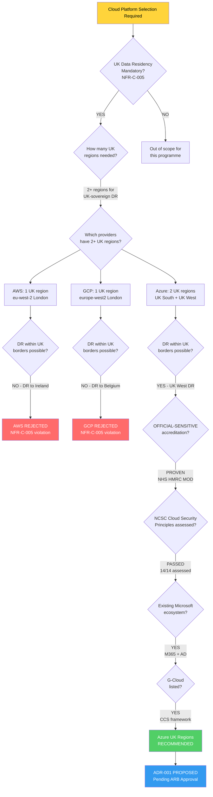

# Architecture Decision Record: Adopt Cloud-Native Platform on Azure UK Regions for Data Architecture

> **Template Origin**: Official | **ArcKit Version**: 4.6.3 | **Command**: `/arckit:adr`

## Document Control

| Field | Value |
|-------|-------|
| **Document ID** | ARC-001-ADR-001-v1.0 |
| **Document Type** | Architecture Decision Record (MADR v4.0) |
| **Project** | National Highways Data Architecture Modernization (Project 001) |
| **Classification** | OFFICIAL |
| **Status** | PROPOSED |
| **Version** | 1.0 |
| **ADR Number** | ADR-001 |
| **Escalation Level** | Department |
| **Governance Forum** | Architecture Review Board |
| **Created Date** | 2026-04-06 |
| **Last Modified** | 2026-04-06 |
| **Review Cycle** | Monthly |
| **Next Review Date** | 2026-05-06 |
| **Owner** | Enterprise Architect, Data Architecture Modernization |
| **Reviewed By** | PENDING |
| **Approved By** | PENDING |
| **Distribution** | Architecture Review Board, Programme Board, Executive Sponsors |

## Revision History

| Version | Date | Author | Changes | Approved By | Approval Date |
|---------|------|--------|---------|-------------|---------------|
| 1.0 | 2026-04-06 | ArcKit AI | Initial creation from `/arckit:adr` command | PENDING | PENDING |

---

## Stakeholders

### Decision Authority (RACI)

| Role | Stakeholder | Responsibility | Sign-Off Required |
|------|-------------|----------------|-------------------|
| **Decider** | Chief Data & Technology Officer (CDTO) | Executive Sponsor, final decision authority | YES |
| **Decider** | Chief Information Security Officer (CISO) | Security approval for OFFICIAL-SENSITIVE hosting | YES |
| **Decider** | Chief Financial Officer (CFO) | Budget authority for £28M 3-year commitment | YES |
| **Consulted** | Enterprise Architects | Architecture review and options analysis | Advisory |
| **Consulted** | Data Engineering Teams | Technical feasibility assessment | Advisory |
| **Consulted** | NCSC | Cloud Security Principles assessment review | Advisory |
| **Consulted** | DfT Digital | Department technology strategy alignment | Advisory |
| **Consulted** | Crown Commercial Service | G-Cloud framework compliance | Advisory |
| **Informed** | Programme Board | Decision outcome and implementation plan | N/A |
| **Informed** | Regional Control Room Managers (7 regions) | Operational impact awareness | N/A |
| **Informed** | GDS | Service Standard and TCoP alignment | N/A |
| **Informed** | Transport Minister | Strategic investment awareness | N/A |

### Stakeholder Drivers Addressed

| Stakeholder Driver | Description | How This Decision Addresses It |
|--------------------|-------------|-------------------------------|
| **SD-4** | CISO requires NCSC-compliant platform for OFFICIAL-SENSITIVE data | Azure UK regions have passed NCSC Cloud Security Principles assessment; OFFICIAL-SENSITIVE accredited |
| **SD-5** | CFO requires value for money | G-Cloud procurement via Crown Commercial Service; 3-year TCO analysis conducted; Azure reserved instances strategy |
| **SD-1** | CDTO requires modern data platform | Azure provides comprehensive PaaS services (Databricks, Event Hubs, Data Lake) for cloud-native data mesh |
| **SD-2** | Minister requires rapid visible delivery | Azure ecosystem aligns with existing Microsoft 365/AD reducing integration time |
| **SD-3** | COO requires operational continuity | Multi-region UK South + UK West enables 99.95% availability SLA |

---

## Context and Problem Statement

National Highways manages England's strategic road network (SRN) -- a £157.4 billion asset base comprising 4,500 miles of motorways and major A-roads. The organisation must select a cloud platform to host the data architecture modernization programme, which will replace legacy Oracle databases (10+ years old, approaching end of support) with a cloud-native data mesh architecture.

### Current State

The existing data infrastructure suffers from critical limitations:

- **Legacy Oracle databases** are 10+ years old, with support contracts expiring and escalating maintenance costs
- **15-minute data delays** prevent real-time journey planning for 45 million daily journeys
- **7 fragmented legacy systems** require manual data processing across regional control rooms
- **No public API** prevents third-party integration (Google Maps, Waze, TomTom)
- **No real-time streaming capability** for 10,000+ IoT sensor data (traffic flow, CCTV, weather)
- **OFFICIAL-SENSITIVE data** (ANPR vehicle registration, CCTV footage) requires enhanced security controls

### Target State

The selected cloud platform must host:

- **Real-time streaming data** from 10,000+ IoT sensors (5TB/day, growing to 20TB/day)
- **Data mesh products** across 5+ domains (Traffic, Incidents, Roadworks, Assets, Weather)
- **Public-facing Open Data API** serving 50M requests/month
- **OFFICIAL-SENSITIVE data processing** with NCSC-compliant security controls
- **500TB historical data** migrated from legacy Oracle with zero data loss
- **Multi-region disaster recovery** with < 15-minute RTO and < 5-minute RPO
- **Connected and autonomous vehicle (CAV)** data readiness for V2X communication

### Constraints

1. **UK Data Residency is mandatory** (NFR-C-005, Principle #11) -- all data must remain within UK sovereign territory
2. **OFFICIAL-SENSITIVE accreditation** required for ANPR and CCTV data processing
3. **NCSC Cloud Security Principles** (14 principles) must be satisfied (NFR-C-002)
4. **G-Cloud framework** procurement preferred for speed and compliance (TCoP Point 11)
5. **Multi-region disaster recovery** within UK borders for Critical National Infrastructure (CNI)
6. **Zero-trust security architecture** required (NFR-SEC-001)
7. **GDS Service Standard** and **Technology Code of Practice** compliance required

---

## Decision Drivers

### Requirements Traceability

| Driver | ID | Description | Priority | Impact on Decision |
|--------|----|-------------|----------|-------------------|
| Business Requirement | **BR-001** | Real-time journey planning with < 500ms p95 latency | MUST_HAVE | Platform must support low-latency streaming and in-memory processing |
| Business Requirement | **BR-002** | £15M annual operational savings by Year 3 (legacy Oracle decommissioning) | MUST_HAVE | TCO must demonstrate savings over legacy; platform pricing model critical |
| Business Requirement | **BR-004** | 99.95% availability during and after migration | MUST_HAVE | Multi-region deployment required; SLA must match or exceed target |
| Business Requirement | **BR-005** | UK GDPR compliance for OFFICIAL-SENSITIVE data | MUST_HAVE | Platform must be assessed against NCSC Cloud Security Principles |
| Non-Functional (Compliance) | **NFR-C-005** | UK data residency -- UK South + UK West regions | MUST_HAVE | **CRITICAL DISCRIMINATOR**: Platform must offer 2+ UK regions |
| Non-Functional (Security) | **NFR-SEC-001** | Zero-trust architecture | MUST_HAVE | Platform must support identity-based access, micro-segmentation |
| Non-Functional (Compliance) | **NFR-C-002** | NCSC Cloud Security Principles (14 principles) | MUST_HAVE | Platform must have completed NCSC assessment |
| Non-Functional (Security) | **NFR-SEC-002** | OFFICIAL-SENSITIVE data encryption at rest and in transit | MUST_HAVE | Platform-managed encryption with UK-resident key management |
| Non-Functional (Availability) | **NFR-A-001** | 99.95% platform availability (26 min/month max downtime) | MUST_HAVE | Multi-region active-passive or active-active required |
| Non-Functional (Scalability) | **NFR-S-001** | 5TB/day ingestion scaling to 20TB/day | MUST_HAVE | Elastic scaling for IoT data ingestion |
| Non-Functional (Scalability) | **NFR-S-002** | 50,000 concurrent API requests/second at peak | MUST_HAVE | Auto-scaling compute and API management |

### Architecture Principles Traceability

| Principle | ID | Relevance to Decision | Weight |
|-----------|----|-----------------------|--------|
| Scalability for National Coverage | **#2** | Platform must support 10x elastic scaling for major incident surges | HIGH |
| Resilience for Critical National Infrastructure | **#3** | Multi-region DR within UK borders for CNI designation | CRITICAL |
| Security by Design (NON-NEGOTIABLE) | **#4** | OFFICIAL-SENSITIVE accreditation, NCSC compliance, zero-trust | CRITICAL |
| Data Sovereignty and UK Residency | **#11** | All data processing and storage within UK sovereign regions | CRITICAL |
| Loose Coupling for Independent Evolution | **#15** | Mitigate vendor lock-in through containerization and open standards | HIGH |
| Sustainability and Carbon Efficiency | **#18** | Cloud provider sustainability credentials and carbon reporting | MEDIUM |

### Risk Traceability

| Risk | ID | Current Score | How Decision Addresses Risk |
|------|----|---------------|---------------------------|
| Vendor Lock-In (Azure) | **R-007** | 8 (Medium) | Accepted with mitigation: containerization, open standards, cloud exit strategy |
| Cloud Cost Overruns (40%) | **R-005** | 12 (High) | Mitigated: FinOps framework, Azure reserved instances, budget alerts |
| Security Breach (CNI) | **R-009** | 12 (High) | Mitigated: NCSC-assessed platform, zero-trust architecture, UK-sovereign data |
| GDPR Non-Compliance | **R-006** | 12 (High) | Mitigated: OFFICIAL-SENSITIVE accredited platform, UK data residency |

---

## Considered Options

### Option Comparison Matrix

| Criterion | Weight | Option 1: Do Nothing | Option 2: Azure UK | Option 3: AWS UK | Option 4: GCP UK |
|-----------|--------|---------------------|-------------------|-----------------|-----------------|
| UK Regions Available | CRITICAL | N/A (on-prem) | **2** (UK South, UK West) | **1** (eu-west-2 London) | **1** (europe-west2 London) |
| UK-Sovereign DR | CRITICAL | N/A | **YES** (UK West) | **NO** (DR to Ireland eu-west-1) | **NO** (DR to Belgium europe-west1) |
| OFFICIAL-SENSITIVE Accreditation | CRITICAL | N/A | **PROVEN** (NHS, HMRC, MOD) | **PARTIAL** (less established) | **LIMITED** (least established) |
| NCSC Assessment | MUST_HAVE | N/A | **PASSED** | **PASSED** | **PASSED** |
| G-Cloud Listed | MUST_HAVE | N/A | **YES** | **YES** | **YES** |
| UK Gov Adoption | HIGH | N/A | **HIGHEST** | HIGH | LOW |
| Data/Analytics Services | HIGH | NONE | **STRONG** (Databricks, Event Hubs, Data Lake) | **STRONGEST** (Kinesis, Redshift, S3, Glue) | **STRONGEST** (BigQuery, Dataflow) |
| Existing NH Relationship | HIGH | Oracle (ending) | **YES** (Microsoft 365, AD) | NO | NO |
| 3-Year TCO | HIGH | £32M+ (escalating) | **£28M** | **£26M** | **£25M** |
| Real-Time Streaming | HIGH | NONE | Event Hubs + Databricks | Kinesis + MSK | Pub/Sub + Dataflow |
| Zero-Trust Support | MUST_HAVE | NO | Azure AD + Entra ID | AWS IAM + SSO | Google IAM + BeyondCorp |
| Vendor Lock-In Risk | MEDIUM | Oracle lock-in (existing) | MEDIUM-HIGH | MEDIUM | MEDIUM |

### Scoring Summary

| Option | Mandatory Criteria (Pass/Fail) | Weighted Score (/100) | Rank |
|--------|-------------------------------|----------------------|------|
| Option 1: Do Nothing | **FAIL** (no real-time, no API, no scaling) | 15/100 | 4th |
| Option 2: Azure UK Regions | **PASS** (all mandatory met) | **82/100** | **1st** |
| Option 3: AWS UK Region | **FAIL** (single UK region -- no UK-sovereign DR) | 68/100 | 2nd |
| Option 4: Google Cloud UK Region | **FAIL** (single UK region -- no UK-sovereign DR) | 58/100 | 3rd |

---

### Option 1: Do Nothing (Baseline)

**Description**: Continue operating on existing on-premises Oracle database infrastructure with no cloud migration.

**Architecture Impact**: No change to current architecture. Legacy Oracle databases continue to serve regional control rooms via batch-processed data feeds.

#### Pros

| # | Advantage | Detail |
|---|-----------|--------|
| 1 | No migration risk | Avoids complexity and risk of migrating 500TB data and 7 legacy systems |
| 2 | No new vendor dependency | Continues with known Oracle platform and existing staff skills |
| 3 | No procurement overhead | No G-Cloud procurement, no business case approval needed |
| 4 | Known operational model | Existing support contracts and runbooks remain valid |

#### Cons

| # | Disadvantage | Detail | Severity |
|---|-------------|--------|----------|
| 1 | Legacy support ending | Oracle database versions approaching end of extended support; escalating licence costs | CRITICAL |
| 2 | No real-time capability | Cannot deliver < 500ms journey planning (BR-001 unmet); 15-minute data delays persist | CRITICAL |
| 3 | No public API | Cannot enable third-party integration or open data (GDS Service Standard unmet) | HIGH |
| 4 | Escalating maintenance costs | £32M+ projected 3-year cost with escalating Oracle licence fees and ageing hardware | HIGH |
| 5 | No horizontal scalability | Cannot handle 10x peak demand during major incidents | HIGH |
| 6 | Cannot meet GDS Service Standard | Fails TCoP Points 2 (cloud-first), 3 (open standards), 9 (scalable hosting) | HIGH |
| 7 | Increasing technical debt | Staff attrition as engineers leave for modern technology stacks | MEDIUM |
| 8 | No data mesh capability | Cannot implement domain-driven data products; data silos persist | HIGH |
| 9 | No CAV readiness | Cannot support connected vehicle data exchange at required latency | MEDIUM |

#### Cost Analysis

| Cost Element | Year 1 | Year 2 | Year 3 | 3-Year Total |
|-------------|--------|--------|--------|-------------|
| Oracle licence fees | £4.2M | £4.6M | £5.1M | £13.9M |
| Hardware maintenance | £2.8M | £3.2M | £3.5M | £9.5M |
| Operational staff | £3.0M | £3.0M | £3.0M | £9.0M |
| **Total** | **£10.0M** | **£10.8M** | **£11.6M** | **£32.4M** |

**Verdict**: **REJECTED** -- Fails to meet mandatory requirements BR-001, BR-002, BR-005, NFR-C-005, NFR-S-001, NFR-S-002. Legacy platform cannot deliver real-time capability, public API, or data mesh architecture. Escalating costs exceed cloud migration TCO by Year 3. Does not meet GDS Service Standard or Technology Code of Practice.

---

### Option 2: Azure UK Regions (RECOMMENDED)

**Description**: Deploy cloud-native data architecture on Microsoft Azure using UK South (London) as primary region and UK West (Cardiff) for disaster recovery and data redundancy. Leverage Azure PaaS services for data processing, streaming, and API management.

**Architecture Components**:

| Component | Azure Service | Purpose |
|-----------|--------------|---------|
| Data Processing | Azure Databricks | Data mesh domain processing, ETL, ML workloads |
| Real-Time Streaming | Azure Event Hubs | IoT sensor data ingestion (10,000+ devices, 5TB/day) |
| Data Lake Storage | Azure Data Lake Storage Gen2 | Raw and curated data zones (500TB+ historical) |
| API Management | Azure API Management | Public-facing Open Data API (50M requests/month) |
| Identity & Access | Azure Entra ID (formerly Azure AD) | Zero-trust identity, RBAC, conditional access |
| Key Management | Azure Key Vault | UK-resident encryption key management (OFFICIAL-SENSITIVE) |
| Container Orchestration | Azure Kubernetes Service (AKS) | Containerized microservices for portability |
| Monitoring | Azure Monitor + Log Analytics | Observability, security monitoring, compliance audit |
| Networking | Azure Virtual Network + Private Link | Network segmentation, private endpoints, zero-trust |
| Disaster Recovery | Azure Site Recovery | Cross-region failover UK South to UK West |
| Database | Azure Cosmos DB / Azure SQL | Domain data products with multi-region replication |
| DevOps | Azure DevOps | CI/CD pipelines, GitOps, Infrastructure as Code |

#### Pros

| # | Advantage | Detail |
|---|-----------|--------|
| 1 | **2 UK regions** enabling sovereign DR | UK South (London) + UK West (Cardiff) -- the **only** hyperscaler with 2 UK regions; enables UK-sovereign disaster recovery without data leaving UK borders (NFR-C-005, Principle #11) |
| 2 | Proven OFFICIAL-SENSITIVE accreditation | NHS, HMRC, MOD already run OFFICIAL-SENSITIVE workloads on Azure UK; established security posture verified by NCSC |
| 3 | Existing National Highways Microsoft ecosystem | Microsoft 365, Active Directory, Windows infrastructure already deployed; Azure Entra ID provides seamless SSO and identity federation |
| 4 | Strong G-Cloud presence | Extensive Azure services listed on G-Cloud 14 via Crown Commercial Service framework; simplified procurement |
| 5 | Comprehensive data platform services | Azure Databricks, Event Hubs, Data Lake Gen2, Synapse Analytics provide end-to-end data mesh capability |
| 6 | Highest UK government adoption | Widest UK public sector customer base among hyperscalers; established government account team and public sector support |
| 7 | Zero-trust native | Azure Entra ID + Conditional Access + Private Link provides comprehensive zero-trust architecture (NFR-SEC-001) |
| 8 | UK support and data handling | Azure UK support team; UK-resident data processing agreements; UK data handling addendums |
| 9 | AKS for portability | Azure Kubernetes Service enables containerized workloads portable to other clouds, mitigating vendor lock-in (R-007) |
| 10 | NCSC Cloud Security Principles passed | All 14 NCSC Cloud Security Principles assessed and published (NFR-C-002) |

#### Cons

| # | Disadvantage | Detail | Severity | Mitigation |
|---|-------------|--------|----------|------------|
| 1 | Vendor lock-in risk | Azure-specific PaaS services (Event Hubs, Databricks, Cosmos DB) create dependency | MEDIUM | Containerize workloads on AKS; use open standards (Apache Kafka protocol on Event Hubs, Delta Lake format); develop cloud exit strategy per R-007 |
| 2 | Premium UK region pricing | Azure UK regions typically 10-15% premium over US/EU regions | LOW | Offset by FinOps practices, reserved instances (3-year), UK data residency compliance value |
| 3 | Azure-specific IAM model | Entra ID / Azure RBAC differs from AWS IAM and GCP IAM | LOW | Staff already trained on Microsoft identity; reduces retraining cost |
| 4 | Less mature than AWS in some areas | Some niche services less feature-rich than AWS equivalents | LOW | Core data platform services (Databricks, Event Hubs, AKS) are mature and production-proven |

#### Cost Analysis (3-Year TCO)

| Cost Element | Year 1 | Year 2 | Year 3 | 3-Year Total |
|-------------|--------|--------|--------|-------------|
| **Infrastructure** | | | | |
| Compute (AKS, VMs, Databricks) | £2.5M | £3.0M | £3.5M | £9.0M |
| Storage (Data Lake, Cosmos DB) | £1.0M | £1.5M | £2.0M | £4.5M |
| Networking (ExpressRoute, VPN, Private Link) | £0.8M | £0.8M | £0.9M | £2.5M |
| Security (Entra ID, Sentinel, Key Vault) | £0.4M | £0.5M | £0.5M | £1.4M |
| DR (Site Recovery, UK West) | £0.2M | £0.2M | £0.2M | £0.6M |
| **Infrastructure Subtotal** | **£4.9M** | **£6.0M** | **£7.1M** | **£18.0M** |
| **Services** | | | | |
| Azure support (Premier) | £0.4M | £0.4M | £0.4M | £1.2M |
| Managed Databricks premium | £0.8M | £0.8M | £0.8M | £2.4M |
| API Management premium | £0.3M | £0.4M | £0.5M | £1.2M |
| Monitoring & compliance tooling | £0.3M | £0.4M | £0.5M | £1.2M |
| **Services Subtotal** | **£1.8M** | **£2.0M** | **£2.2M** | **£6.0M** |
| **Migration** | | | | |
| Data migration tooling & execution | £2.0M | £1.5M | £0.5M | £4.0M |
| **Migration Subtotal** | **£2.0M** | **£1.5M** | **£0.5M** | **£4.0M** |
| **Grand Total** | **£8.7M** | **£9.5M** | **£9.8M** | **£28.0M** |

**Savings vs. Do Nothing**: £32.4M - £28.0M = **£4.4M saving over 3 years**, plus £15M/year operational savings from Year 3 onwards (BR-002).

**Verdict**: **RECOMMENDED** -- Only option meeting all mandatory requirements. Two UK regions enable sovereign DR. Proven OFFICIAL-SENSITIVE accreditation. Existing Microsoft ecosystem reduces integration complexity and staff retraining. G-Cloud procurement route established.

---

### Option 3: AWS UK Region

**Description**: Deploy on Amazon Web Services using eu-west-2 (London) region. AWS offers only one UK region; disaster recovery would require failover to eu-west-1 (Ireland).

**Architecture Components**:

| Component | AWS Service | Purpose |
|-----------|------------|---------|
| Data Processing | AWS Glue / Amazon EMR | Data processing and ETL |
| Real-Time Streaming | Amazon Kinesis / Amazon MSK | IoT sensor data ingestion |
| Data Lake Storage | Amazon S3 | Raw and curated data zones |
| API Management | Amazon API Gateway | Public-facing API |
| Identity & Access | AWS IAM + AWS SSO | Access management |
| Container Orchestration | Amazon EKS | Containerized workloads |

#### Pros

| # | Advantage | Detail |
|---|-----------|--------|
| 1 | Most mature cloud platform | Widest global service portfolio; most mature IaaS and PaaS offerings |
| 2 | Strongest data analytics breadth | Kinesis, Redshift, Glue, Athena, S3, Lake Formation provide comprehensive analytics |
| 3 | Competitive pricing | Typically 5-10% lower than Azure UK for comparable workloads |
| 4 | G-Cloud listed | AWS services available on G-Cloud via Crown Commercial Service |
| 5 | Large partner ecosystem | Widest consulting partner network for implementation support |

#### Cons

| # | Disadvantage | Detail | Severity |
|---|-------------|--------|----------|
| 1 | **Only 1 UK region** | eu-west-2 (London) only; DR failover to eu-west-1 (Ireland) | **CRITICAL** |
| 2 | **UK data residency violation** | OFFICIAL-SENSITIVE DR data in Ireland violates NFR-C-005 and Principle #11 | **CRITICAL** |
| 3 | No existing Microsoft relationship | National Highways Microsoft 365/AD ecosystem not integrated; requires separate identity federation | HIGH |
| 4 | Less UK government adoption for OFFICIAL-SENSITIVE | Fewer UK government OFFICIAL-SENSITIVE reference deployments than Azure | MEDIUM |
| 5 | AWS IAM complexity | AWS IAM model more complex than Azure Entra ID for Microsoft-ecosystem organisations | LOW |

#### Cost Analysis (3-Year TCO)

| Cost Element | Year 1 | Year 2 | Year 3 | 3-Year Total |
|-------------|--------|--------|--------|-------------|
| Infrastructure | £4.2M | £5.2M | £6.2M | £15.6M |
| Services | £1.5M | £1.8M | £2.0M | £5.3M |
| Migration | £2.2M | £1.8M | £1.1M | £5.1M |
| **Grand Total** | **£7.9M** | **£8.8M** | **£9.3M** | **£26.0M** |

**Verdict**: **REJECTED** -- **Fails mandatory requirement NFR-C-005 (UK data residency)**. Single UK region means disaster recovery must fail to Ireland (eu-west-1), placing OFFICIAL-SENSITIVE data (ANPR, CCTV) outside UK sovereign territory. This violates Principle #11 (Data Sovereignty and UK Residency) and is incompatible with National Highways' Critical National Infrastructure designation. Despite competitive pricing and strong analytics services, the single UK region is a disqualifying constraint.

---

### Option 4: Google Cloud UK Region

**Description**: Deploy on Google Cloud Platform using europe-west2 (London) region. GCP offers only one UK region; disaster recovery would require failover to europe-west1 (Belgium).

**Architecture Components**:

| Component | GCP Service | Purpose |
|-----------|------------|---------|
| Data Processing | Google Dataflow / Dataproc | Data processing and ETL |
| Real-Time Streaming | Google Pub/Sub | IoT sensor data ingestion |
| Data Warehouse | BigQuery | Large-scale analytical queries |
| API Management | Apigee | Public-facing API |
| Identity & Access | Google IAM + BeyondCorp | Access management |
| Container Orchestration | Google Kubernetes Engine (GKE) | Containerized workloads |

#### Pros

| # | Advantage | Detail |
|---|-----------|--------|
| 1 | Strongest data analytics | BigQuery market-leading for large-scale analytics; Dataflow for streaming; Pub/Sub for messaging |
| 2 | Competitive pricing | Typically lowest list pricing among the three hyperscalers; sustained use discounts |
| 3 | BeyondCorp zero-trust | Google pioneered zero-trust architecture; BeyondCorp is industry-leading |
| 4 | Kubernetes leadership | GKE is the most mature managed Kubernetes offering (Google created Kubernetes) |
| 5 | G-Cloud listed | GCP services available on G-Cloud via Crown Commercial Service |

#### Cons

| # | Disadvantage | Detail | Severity |
|---|-------------|--------|----------|
| 1 | **Only 1 UK region** | europe-west2 (London) only; DR failover to europe-west1 (Belgium) | **CRITICAL** |
| 2 | **UK data residency violation** | OFFICIAL-SENSITIVE DR data in Belgium violates NFR-C-005 and Principle #11 | **CRITICAL** |
| 3 | Least UK government adoption | Fewest UK government customers among the three hyperscalers; limited public sector references | HIGH |
| 4 | OFFICIAL-SENSITIVE accreditation less established | Fewer proven OFFICIAL-SENSITIVE deployments in UK government than Azure | HIGH |
| 5 | No existing relationship | No current Google/GCP relationship with National Highways; new vendor onboarding required | MEDIUM |
| 6 | Limited G-Cloud presence | Fewer services listed on G-Cloud compared to Azure and AWS | MEDIUM |
| 7 | Smaller UK partner ecosystem | Fewer UK-based GCP consulting partners for implementation support | MEDIUM |

#### Cost Analysis (3-Year TCO)

| Cost Element | Year 1 | Year 2 | Year 3 | 3-Year Total |
|-------------|--------|--------|--------|-------------|
| Infrastructure | £3.8M | £4.8M | £5.8M | £14.4M |
| Services | £1.4M | £1.6M | £1.8M | £4.8M |
| Migration | £2.5M | £2.0M | £1.3M | £5.8M |
| **Grand Total** | **£7.7M** | **£8.4M** | **£8.9M** | **£25.0M** |

**Note on higher migration costs**: No existing Microsoft ecosystem integration; requires identity federation, directory synchronization, and staff retraining on entirely new platform.

**Verdict**: **REJECTED** -- **Fails mandatory requirement NFR-C-005 (UK data residency)**. Single UK region means disaster recovery must fail to Belgium (europe-west1), placing OFFICIAL-SENSITIVE data outside UK sovereign territory. Additionally, least UK government adoption and least established OFFICIAL-SENSITIVE accreditation create additional compliance risk. Despite strongest analytics capabilities and lowest pricing, the single UK region and limited government adoption are disqualifying.

---

## Decision Outcome

### Chosen Option: Option 2 -- Azure UK Regions

**Status**: PROPOSED (pending Architecture Review Board approval)

### Y-Statement

> In the context of **hosting OFFICIAL-SENSITIVE data for Critical National Infrastructure** (England's strategic road network, £157.4 billion asset base, 10,000+ IoT sensors),
> facing the constraint of **mandatory UK data residency with multi-region disaster recovery** (NFR-C-005, Principle #11),
> we decided for **Azure UK Regions (UK South + UK West)**,
> and neglected AWS UK (single region), GCP UK (single region), and Do Nothing (legacy),
> to achieve **NCSC-compliant multi-region deployment with proven OFFICIAL-SENSITIVE accreditation and existing Microsoft ecosystem integration**,
> accepting **vendor lock-in risk (R-007) and premium UK pricing** versus AWS/GCP,
> because **Azure is the only hyperscaler offering 2 UK regions enabling UK-sovereign disaster recovery**, has proven OFFICIAL-SENSITIVE accreditation (NHS, HMRC, MOD), and integrates with the existing National Highways Microsoft ecosystem.

### Key Justification

| # | Justification | Evidence |
|---|---------------|----------|
| 1 | **Only cloud provider with 2 UK regions** enabling UK-sovereign DR | Azure UK South (London) + UK West (Cardiff); AWS and GCP each have only 1 UK region, requiring DR failover outside UK borders | 
| 2 | **Proven OFFICIAL-SENSITIVE accreditation** | NHS, HMRC, MOD run OFFICIAL-SENSITIVE workloads on Azure UK; established security posture verified by NCSC Cloud Security Principles assessment |
| 3 | **Existing Microsoft ecosystem** reduces integration complexity | National Highways already uses Microsoft 365, Active Directory; Azure Entra ID provides seamless identity federation without new vendor onboarding |
| 4 | **G-Cloud listed** on Crown Commercial Service framework | Simplified procurement via G-Cloud 14; pre-negotiated terms and conditions; compliant with TCoP Point 11 |
| 5 | **NCSC Cloud Security Principles** assessment passed | All 14 principles assessed with published results; meets NFR-C-002 and satisfies CISO requirements (SD-4) |
| 6 | **Comprehensive data platform PaaS** | Azure Databricks, Event Hubs, Data Lake Gen2, Cosmos DB provide end-to-end data mesh capability without extensive custom infrastructure |
| 7 | **Multi-region SLA** meets availability target | Azure multi-region deployment provides 99.95%+ availability SLA, meeting NFR-A-001 and BR-004 |

### Conditions and Constraints

| # | Condition | Owner | Due Date | Status |
|---|-----------|-------|----------|--------|
| 1 | Cloud exit strategy must be developed and approved before contract signature | Enterprise Architect | 2026-06-30 | NOT STARTED |
| 2 | FinOps framework must be established within 30 days of deployment | CFO / Cloud FinOps Lead | 2026-08-30 | NOT STARTED |
| 3 | All stateful workloads must be containerized on AKS using open standards | Lead Data Engineer | Ongoing | NOT STARTED |
| 4 | Data formats must use open standards (Delta Lake, Parquet, Apache Avro) not Azure-proprietary | Data Architect | Ongoing | NOT STARTED |
| 5 | Azure reserved instances (3-year) must be procured within 90 days for cost optimization | Cloud FinOps Lead | 2026-10-30 | NOT STARTED |
| 6 | NCSC Cloud Security Principles re-assessment at each major platform upgrade | CISO | Annual | NOT STARTED |
| 7 | Strategic Outline Business Case (SOBC) must be approved before major procurement (R-002) | CFO | 2026-05-31 | NOT STARTED |

---

## Consequences

### Positive Consequences

| # | Consequence | Beneficiary | Traceability |
|---|-----------|-------------|-------------|
| 1 | UK data residency requirement fully met with multi-region sovereign DR | CISO, DPO, NCSC | NFR-C-005, Principle #11 |
| 2 | NCSC Cloud Security Principles compliance achieved | CISO, SIRO | NFR-C-002, Principle #4 |
| 3 | Existing Microsoft ecosystem reduces identity integration complexity | IT Operations, Data Engineers | Reduced migration risk (R-008) |
| 4 | Multi-region active-passive DR provides 99.95%+ availability | COO, Regional Control Rooms | NFR-A-001, BR-004, Principle #3 |
| 5 | G-Cloud procurement reduces time-to-contract by 8-12 weeks vs. open tender | Procurement, Programme Director | TCoP Point 11 |
| 6 | Comprehensive PaaS reduces infrastructure management overhead | Data Engineers, Platform Team | BR-002 (operational savings) |
| 7 | Azure Databricks enables data mesh domain processing with Delta Lake open format | Data Domain Owners | Principle #8, Principle #15 |
| 8 | Staff retraining minimized due to existing Microsoft skills base | HR, 120 engineers | Reduced cost for skills programme |
| 9 | Proven public sector reference deployments de-risk implementation | Programme Board, NAO | Risk mitigation for R-009 |

### Negative Consequences

| # | Consequence | Impact | Mitigation |
|---|-----------|--------|------------|
| 1 | Vendor lock-in to Microsoft/Azure ecosystem | Medium-term dependency on Azure-specific services | Containerize on AKS; use open data formats (Delta Lake, Parquet); develop cloud exit strategy (R-007 mitigation); apply Principle #15 (loose coupling) |
| 2 | Premium UK region pricing (10-15% above US/EU regions) | Higher infrastructure costs than non-UK deployment | Offset by FinOps practices; Azure reserved instances (3-year); optimize via right-sizing; UK residency is mandatory so premium is unavoidable |
| 3 | Single-vendor dependency for identity + infrastructure + data | Concentration risk if Azure experiences UK-wide outage | Multi-region deployment (UK South + UK West) mitigates single-region failure; offline operational procedures for control rooms |
| 4 | Azure service roadmap dependency | Feature delivery tied to Microsoft product roadmap | Engage Microsoft via public sector account team; participate in Azure Advisory Board; use open-source alternatives where available |

### Risk Impact Assessment

| Risk ID | Risk | Pre-Decision Score | Post-Decision Score | Change | Notes |
|---------|------|--------------------|---------------------|--------|-------|
| R-005 | Cloud Cost Overruns | 12 (High) | 9 (Medium) | -3 | FinOps framework + reserved instances reduce likelihood |
| R-007 | Vendor Lock-In | 8 (Medium) | 10 (Medium) | +2 | Increased by Azure selection; mitigated by containerization and open standards |
| R-009 | Security Breach | 12 (High) | 8 (Medium) | -4 | NCSC-assessed platform with proven OFFICIAL-SENSITIVE controls |
| R-006 | GDPR Non-Compliance | 12 (High) | 8 (Medium) | -4 | UK-sovereign data residency; Azure DPA with UK-specific provisions |
| R-008 | Legacy Migration Data Loss | 8 (Medium) | 6 (Medium) | -2 | Azure Database Migration Service provides validated migration tooling |

---

## Validation & Compliance

### GDS Service Standard Impact Assessment

| GDS Point | Standard | Impact of Azure Decision | Compliance Status |
|-----------|----------|------------------------|-------------------|
| 1 | Understand users and their needs | No direct impact; platform-agnostic | COMPLIANT |
| 2 | Solve a whole problem for users | Azure PaaS enables end-to-end data mesh; public API capability | COMPLIANT |
| 3 | Provide a joined-up experience across channels | Azure API Management supports multi-channel delivery | COMPLIANT |
| 4 | Make the service simple to use | No direct impact; platform-agnostic UX concern | COMPLIANT |
| 5 | Make sure everyone can use the service | Azure CDN + multi-region ensures geographic accessibility | COMPLIANT |
| 6 | Have a multidisciplinary team | No direct impact; organisational concern | COMPLIANT |
| 7 | Use agile ways of working | Azure DevOps supports agile delivery practices | COMPLIANT |
| 8 | Iterate and improve frequently | Azure CI/CD pipelines enable rapid iteration | COMPLIANT |
| 9 | Create a secure service | Azure NCSC-assessed; zero-trust architecture; OFFICIAL-SENSITIVE accredited | **STRONG COMPLIANCE** |
| 10 | Define what success looks like | Azure Monitor provides metrics and KPI dashboards | COMPLIANT |
| 11 | Choose the right tools and technology | Azure selected via structured ADR with options analysis | **STRONG COMPLIANCE** |
| 12 | Make new source code open | Azure DevOps / GitHub supports open-source publishing | COMPLIANT |
| 13 | Use and contribute to open standards | Azure supports open standards (OpenAPI, OAuth 2.0, Delta Lake, Parquet) | COMPLIANT |
| 14 | Operate a reliable service | Azure multi-region UK South + UK West provides 99.95%+ SLA | **STRONG COMPLIANCE** |

### Technology Code of Practice (TCoP) Compliance

| TCoP Point | Requirement | Azure Decision Alignment | Status |
|------------|-------------|-------------------------|--------|
| 1 | Define user needs | Platform supports user-facing API and dashboard delivery | ALIGNED |
| 2 | Make things accessible | Azure CDN and multi-region deployment support accessibility | ALIGNED |
| 3 | Be open and use open source | AKS (Kubernetes), Delta Lake, Apache Kafka protocol on Event Hubs | ALIGNED |
| 4 | Make use of open standards | OpenAPI 3.x, OAuth 2.0, SAML, Apache Parquet, Delta Lake | ALIGNED |
| 5 | Use cloud first | Azure cloud deployment directly satisfies cloud-first mandate | **FULLY ALIGNED** |
| 6 | Make things secure | NCSC Cloud Security Principles assessed; zero-trust; OFFICIAL-SENSITIVE | **FULLY ALIGNED** |
| 7 | Make privacy integral | Azure DPA, UK data residency, UK GDPR compliance tools | ALIGNED |
| 8 | Share and reuse technology | G-Cloud listed; reusable platform patterns for DfT family | ALIGNED |
| 9 | Integrate and adapt technology | Azure PaaS integrates with existing Microsoft ecosystem; API-first | **FULLY ALIGNED** |
| 10 | Make better use of data | Azure Databricks, Data Lake, Synapse enable data-driven decisions | **FULLY ALIGNED** |
| 11 | Define your purchasing strategy | G-Cloud procurement via Crown Commercial Service framework | **FULLY ALIGNED** |
| 12 | Meet the Service Standard | Azure supports all 14 GDS points as assessed above | ALIGNED |
| 13 | Spend controls | Azure Cost Management + FinOps framework for spend governance | ALIGNED |

### Architecture Principles Alignment

| Principle | # | Alignment | Evidence |
|-----------|---|-----------|----------|
| Real-Time First Architecture | 1 | **STRONG** | Azure Event Hubs supports millions of events/sec with < 10ms ingestion latency; Databricks Structured Streaming for real-time processing |
| Scalability for National Coverage | 2 | **STRONG** | Azure auto-scaling, AKS horizontal pod autoscaler, Event Hubs throughput units scale to 50,000+ events/sec |
| Resilience for Critical National Infrastructure | 3 | **STRONG** | Multi-region UK South + UK West with Azure Site Recovery; 99.95%+ SLA; automated failover |
| Security by Design (NON-NEGOTIABLE) | 4 | **STRONG** | NCSC-assessed, OFFICIAL-SENSITIVE accredited, Azure Entra ID zero-trust, Private Link, Key Vault |
| Open by Default for Public Benefit | 5 | **ALIGNED** | Azure API Management for open data API; supports OpenAPI 3.x specification |
| Interoperability with Transport Ecosystem | 6 | **ALIGNED** | Azure supports REST/SOAP/GraphQL APIs; integration with emergency services CAD systems |
| Observability for Operational Excellence | 7 | **STRONG** | Azure Monitor, Log Analytics, Application Insights, Azure Sentinel for security observability |
| Data Mesh Architecture for Domain Ownership | 8 | **STRONG** | Azure Databricks Unity Catalog for federated data governance; domain-level data products |
| Single Source of Truth per Domain | 9 | **ALIGNED** | Azure Cosmos DB multi-region consistency; Data Lake zones for golden datasets |
| Data Quality as a First-Class Requirement | 10 | **ALIGNED** | Databricks data quality rules; Azure Purview for data cataloguing |
| Data Sovereignty and UK Residency | 11 | **STRONG** | 2 UK regions (UK South + UK West); all data remains within UK sovereign territory |
| Data Minimization and Retention | 12 | **ALIGNED** | Azure data lifecycle management policies; automated ANPR 24-hour deletion |
| Event-Driven Architecture for Real-Time Data | 13 | **STRONG** | Azure Event Hubs, Event Grid, Service Bus for event-driven patterns |
| API-First Design for Service Integration | 14 | **STRONG** | Azure API Management with developer portal, OpenAPI support, rate limiting |
| Loose Coupling for Independent Evolution | 15 | **ALIGNED** | AKS containerization, Event-driven decoupling, open data formats mitigate lock-in |
| Performance Optimization for User Experience | 16 | **STRONG** | Azure CDN, Front Door, Redis Cache for sub-500ms query latency |
| Accessibility for Inclusive Services | 17 | **ALIGNED** | Platform supports accessible web applications; no platform-level barrier |
| Sustainability and Carbon Efficiency | 18 | **ALIGNED** | Microsoft committed to carbon negative by 2030; Azure Emissions Dashboard for reporting |
| Infrastructure as Code for Repeatability | 19 | **STRONG** | Azure Bicep / Terraform for IaC; ARM templates; Azure DevOps pipelines |
| Automated Testing for Quality Assurance | 20 | **ALIGNED** | Azure DevOps Test Plans; integration with standard testing frameworks |
| Continuous Integration and Deployment | 21 | **STRONG** | Azure DevOps CI/CD; GitHub Actions integration; GitOps with Flux |
| GitOps for Declarative Operations | 22 | **STRONG** | AKS GitOps with Flux v2; Azure Arc for hybrid management |
| Connected Roads & CAV Data Readiness | 23 | **ALIGNED** | Azure IoT Hub for V2X device management; Event Hubs for CAV data streams |
| Asset Intelligence & Lifecycle Data Management | 24 | **ALIGNED** | Azure Digital Twins for asset modelling; Databricks for predictive analytics |
| Regulatory Transparency & Statutory Reporting | 25 | **ALIGNED** | Azure Power BI for ORR dashboard; automated report generation |

---

## Implementation Plan

### Phase 1: Foundation (Months 1-3)

| Activity | Description | Owner | Dependencies |
|----------|-------------|-------|-------------|
| Azure landing zone deployment | Hub-spoke network topology, identity federation, security baselines | Platform Team | SOBC approval, G-Cloud contract |
| Entra ID federation | Integrate existing Active Directory with Azure Entra ID | Identity Team | Azure subscription active |
| Network architecture | ExpressRoute, Virtual Networks, Private Link, NSGs | Network Team | Azure landing zone |
| Security baseline | Azure Policy, Defender for Cloud, Sentinel, Key Vault | Security Team | CISO approval |
| IaC repository setup | Terraform/Bicep modules for all infrastructure | DevOps Team | Azure DevOps/GitHub |
| FinOps framework | Cost management policies, budget alerts, tagging strategy | Cloud FinOps Lead | CFO approval |

### Phase 2: Data Platform (Months 3-9)

| Activity | Description | Owner | Dependencies |
|----------|-------------|-------|-------------|
| Data Lake deployment | ADLS Gen2 with raw/curated/presentation zones | Data Platform Team | Azure landing zone |
| Databricks workspace | Unity Catalog, domain workspaces, cluster policies | Data Engineering | Data Lake |
| Event Hubs deployment | IoT sensor ingestion, streaming pipelines | Data Engineering | Network architecture |
| API Management setup | Public API gateway, developer portal, rate limiting | API Team | Network architecture |
| First data product (Traffic) | Traffic flow domain data product as pilot | Traffic Domain Owner | Databricks, Data Lake |

### Phase 3: Migration (Months 6-18)

| Activity | Description | Owner | Dependencies |
|----------|-------------|-------|-------------|
| Legacy Oracle assessment | Schema analysis, data profiling, dependency mapping | Migration Team | Oracle database access |
| Data migration execution | 500TB historical data migration using Azure DMS | Migration Team | Data Lake, Databricks |
| Application migration | 7 legacy systems migrated or replaced | Application Teams | Data platform ready |
| Parallel running | Dual-run legacy + cloud for validation | Operations Team | Migration complete |
| Legacy decommissioning | Oracle database retirement after validation | Infrastructure Team | Parallel run sign-off |

### Phase 4: Optimization (Months 18-24)

| Activity | Description | Owner | Dependencies |
|----------|-------------|-------|-------------|
| Remaining data products | Incidents, Roadworks, Assets, Weather domains | Domain Owners | Data platform mature |
| Public API launch | Open data API for third-party developers | API Team | Data products ready |
| Performance optimization | Latency tuning, caching, CDN configuration | Platform Team | Production workloads |
| Cloud exit strategy | Documented exit procedures and portability testing | Enterprise Architect | AKS containerization |
| FinOps optimization | Reserved instances, right-sizing, cost anomaly detection | Cloud FinOps Lead | 6+ months cost data |

---

## Review Schedule

| Review Type | Frequency | Forum | Attendees | Focus |
|-------------|-----------|-------|-----------|-------|
| Decision validation | Monthly | Architecture Review Board | Enterprise Architects, CDTO | Confirm decision remains valid; no new UK regions from AWS/GCP |
| Cost review | Monthly | FinOps Board | CFO, Cloud FinOps Lead, Platform Team | TCO tracking vs. forecast; reserved instance utilization |
| Security review | Quarterly | Security Governance Board | CISO, Security Team, NCSC liaison | NCSC compliance; threat landscape changes; security incidents |
| Vendor relationship | Quarterly | Commercial Review | Procurement, Microsoft Account Team | Contract performance; roadmap alignment; pricing changes |
| Full ADR review | Annually | Architecture Review Board | All stakeholders | Reassess decision against market changes; new UK regions; pricing evolution |
| Cloud exit readiness | Annually | Programme Board | Enterprise Architect, Platform Team | Portability testing; exit procedure validation; lock-in assessment |

### Decision Reassessment Triggers

This decision should be reassessed if any of the following occur:

1. **AWS or GCP announce a second UK region** -- reassess multi-cloud or alternative provider options
2. **Azure UK region outage exceeding SLA** -- reassess resilience strategy and DR approach
3. **NCSC revokes or downgrades Azure assessment** -- immediate reassessment required
4. **Azure pricing increase > 20%** over contracted rates -- reassess TCO and negotiate or evaluate alternatives
5. **National Highways divests from Microsoft 365** -- reassess ecosystem alignment advantage
6. **UK Government mandates multi-cloud** -- reassess for multi-cloud architecture
7. **Vendor lock-in assessment indicates > 60% proprietary service dependency** -- trigger portability remediation

---

## Related Decisions

| Decision | Status | Relationship |
|----------|--------|-------------|
| ADR-002: Data Mesh Domain Decomposition (planned) | DRAFT | Depends on this ADR (Azure PaaS services inform domain platform design) |
| ADR-003: API Gateway Strategy (planned) | NOT STARTED | Depends on this ADR (Azure API Management selected as gateway) |
| ADR-004: Identity and Access Management Model (planned) | NOT STARTED | Depends on this ADR (Azure Entra ID selected as identity provider) |
| ADR-005: Data Lake Architecture and Zone Design (planned) | NOT STARTED | Depends on this ADR (Azure Data Lake Storage Gen2 selected) |
| ADR-006: Streaming Architecture for IoT Sensors (planned) | NOT STARTED | Depends on this ADR (Azure Event Hubs selected for streaming) |
| ADR-007: Cloud Exit Strategy (planned) | NOT STARTED | Required by this ADR condition #1 |

### Cross-References to Project Artifacts

| Artifact | Document ID | Relevance |
|----------|-------------|-----------|
| Requirements | ARC-001-REQ-v2.0 | Source requirements BR-001, BR-002, BR-004, BR-005, NFR-C-005, NFR-SEC-001, NFR-C-002 |
| Architecture Principles | ARC-000-PRIN-v2.0 | Principles #2, #3, #4, #11, #15, #18 referenced as decision drivers |
| Risk Register | ARC-001-RISK-v1.0 | Risks R-005, R-006, R-007, R-008, R-009 addressed by this decision |
| Stakeholder Drivers | ARC-001-STKE-v1.0 | Stakeholder drivers SD-1 through SD-5 addressed |
| Secure by Design | ARC-001-SECD-v1.0 | NCSC CAF assessment informs security requirements for platform selection |
| TCoP Assessment | ARC-001-TCOP-v1.0 | TCoP Points 5, 6, 9, 11 directly addressed by cloud platform selection |
| Wardley Maps | ARC-001-WARD-001-v1.0 | Cloud platform positioning on evolution axis (commodity/utility) |

---

## Appendix A: Decision Flow Diagram

## Appendix B: Requirements Traceability Matrix

| Requirement ID | Description | Option 1 | Option 2 (Azure) | Option 3 (AWS) | Option 4 (GCP) |
|---------------|-------------|----------|-------------------|-----------------|-----------------|
| BR-001 | Real-time journey planning < 500ms p95 | FAIL | PASS | PASS | PASS |
| BR-002 | £15M annual savings by Year 3 | FAIL | PASS | PASS | PASS |
| BR-004 | 99.95% availability during migration | FAIL | PASS | PARTIAL | PARTIAL |
| BR-005 | UK GDPR compliance (OFFICIAL-SENSITIVE) | FAIL | PASS | PARTIAL | PARTIAL |
| NFR-C-002 | NCSC Cloud Security Principles | N/A | PASS | PASS | PASS |
| NFR-C-005 | UK data residency (UK South + UK West) | N/A | **PASS** | **FAIL** | **FAIL** |
| NFR-SEC-001 | Zero-trust architecture | FAIL | PASS | PASS | PASS |
| NFR-SEC-002 | Encryption at rest and in transit | FAIL | PASS | PASS | PASS |
| NFR-A-001 | 99.95% platform availability | FAIL | PASS | PARTIAL | PARTIAL |
| NFR-S-001 | 5TB/day ingestion scaling to 20TB/day | FAIL | PASS | PASS | PASS |
| NFR-S-002 | 50,000 concurrent API requests/sec peak | FAIL | PASS | PASS | PASS |
| **Total PASS** | | **0/11** | **11/11** | **8/11** | **8/11** |

## Appendix C: UK Region Comparison

| Attribute | Azure UK South | Azure UK West | AWS eu-west-2 | GCP europe-west2 |
|-----------|---------------|--------------|---------------|-------------------|
| Location | London | Cardiff | London | London |
| Full services | YES | Reduced (DR) | YES | YES |
| Paired region | UK West | UK South | N/A (no UK pair) | N/A (no UK pair) |
| DR failover target | UK West (Cardiff) | UK South (London) | eu-west-1 (Ireland) | europe-west1 (Belgium) |
| DR data residency | UK | UK | **Ireland (non-UK)** | **Belgium (non-UK)** |
| OFFICIAL-SENSITIVE | Accredited | Accredited | Accredited | Limited evidence |
| Availability zones | 3 | 3 | 3 | 3 |

## Appendix D: Glossary

| Term | Definition |
|------|-----------|
| ADR | Architecture Decision Record -- a document capturing an important architectural decision and its context |
| AKS | Azure Kubernetes Service -- managed Kubernetes container orchestration |
| ANPR | Automatic Number Plate Recognition -- vehicle identification system |
| CAV | Connected and Autonomous Vehicles |
| CCS | Crown Commercial Service -- UK Government procurement body |
| CNI | Critical National Infrastructure -- assets essential to functioning of society |
| DR | Disaster Recovery |
| Entra ID | Microsoft Entra ID (formerly Azure Active Directory) -- cloud identity and access management |
| FinOps | Financial Operations -- cloud cost management discipline |
| G-Cloud | UK Government cloud procurement framework |
| GDS | Government Digital Service |
| MADR | Markdown Any Decision Records -- lightweight ADR format (v4.0) |
| NCSC | National Cyber Security Centre |
| NFR | Non-Functional Requirement |
| OFFICIAL-SENSITIVE | UK Government security classification for sensitive data |
| PaaS | Platform as a Service |
| RPO | Recovery Point Objective -- maximum tolerable data loss duration |
| RTO | Recovery Time Objective -- maximum tolerable downtime duration |
| SOBC | Strategic Outline Business Case |
| SRN | Strategic Road Network -- England's motorways and major A-roads |
| TCO | Total Cost of Ownership |
| TCoP | Technology Code of Practice -- 13-point UK Government technology standard |
| V2X | Vehicle-to-Everything -- communication between vehicles and infrastructure |
| Y-Statement | A structured decision justification format: context, constraint, decision, outcome, trade-off |

---

**Generated by**: ArcKit `/arckit:adr` command
**Generated on**: 2026-04-06 GMT
**ArcKit Version**: 4.6.3
**Project**: National Highways Data Architecture Modernization (Project 001)
**AI Model**: claude-opus-4-6
**Generation Context**: ADR-001 created from ARC-001-REQ-v2.0, ARC-000-PRIN-v2.0, ARC-001-RISK-v1.0, ARC-001-STKE-v1.0
