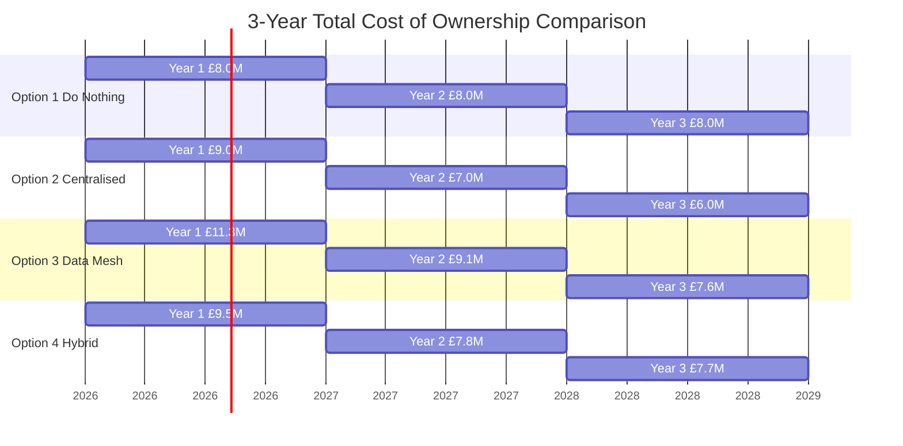
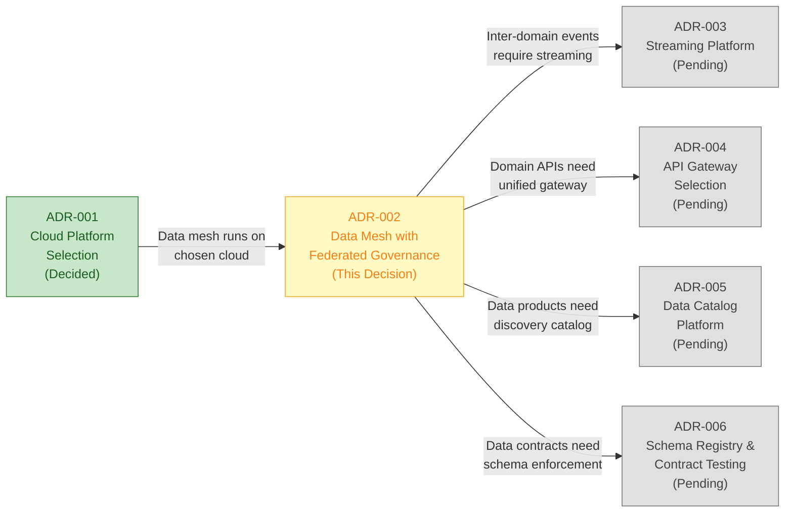

# Architecture Decision Record: Adopt Data Mesh Architecture with Federated Governance

> **Template Origin**: Official | **ArcKit Version**: 4.6.3 | **Command**: `/arckit:adr`

## Document Control

| Field | Value |
|-------|-------|
| **Document ID** | ARC-001-ADR-002-v1.0 |
| **Document Type** | Architecture Decision Record (MADR v4.0) |
| **Project** | National Highways Data Architecture Modernization (Project 001) |
| **Classification** | OFFICIAL |
| **Status** | Proposed |
| **Version** | 1.0 |
| **Created Date** | 2026-04-06 |
| **Last Modified** | 2026-04-06 |
| **Review Cycle** | Monthly |
| **Next Review Date** | 2026-05-06 |
| **Owner** | Enterprise Architect, Data Architecture Modernization |
| **Reviewed By** | PENDING |
| **Approved By** | PENDING |
| **Distribution** | Architecture Review Board, Programme Board, Data Domain Owners |

## Revision History

| Version | Date | Author | Changes | Approved By | Approval Date |
|---------|------|--------|---------|-------------|---------------|
| 1.0 | 2026-04-06 | ArcKit AI | Initial creation from `/arckit:adr` command | PENDING | PENDING |

---

## ADR Metadata

| Field | Value |
|-------|-------|
| **ADR Number** | ADR-002 |
| **Title** | Adopt Data Mesh Architecture with Federated Governance |
| **Status** | Proposed |
| **Escalation Level** | Department |
| **Governance Forum** | Architecture Review Board |
| **Date Proposed** | 2026-04-06 |
| **Date Decided** | PENDING |
| **Decision Makers** | CDTO (Executive Sponsor), Programme Director |
| **Related ADRs** | ADR-001 (Cloud Platform Selection), ADR-003 (Streaming Platform) |

---

## 1. Context and Problem Statement

National Highways manages England's strategic road network (4,500 miles) serving over 4 million daily customers and 45 million daily journeys. The network has a total asset value of £157.4 billion and supports £410 billion GVA from SRN-reliant sectors. The current data architecture consists of **7 legacy Oracle databases** operating as isolated data silos, each managed independently by different teams with no standardised interfaces, no published APIs, and no cross-domain data integration.

### Current State Challenges

| Challenge | Impact | Affected Stakeholders |
|-----------|--------|-----------------------|
| 15-minute data delays | No real-time journey planning capability | 4M daily road users, navigation apps |
| 7 disconnected Oracle databases | No cross-domain insights (e.g., traffic + weather correlation) | Regional control rooms, planners |
| Manual data integration | Operational staff time wasted on data reconciliation | Data domain owners, control room managers |
| No published APIs | Third-party developers cannot access road data | Navigation app providers, local authorities |
| Oracle license costs £8M/year | Escalating costs with no modernization benefit | CFO, HM Treasury |
| No unified schema or data contracts | Inconsistent data quality across domains | Emergency services, ORR |
| Single-vendor lock-in | No competitive tension on infrastructure costs | Procurement, CFO |

### Strategic Context

The programme must choose an overall data architecture pattern that will:

1. Support **5 core data domains**: Traffic Flow, Incidents, Roadworks, Assets, Weather
2. Scale to accommodate **3 new domains** identified in v2.0 requirements: Environmental, Freight, Safety
3. Ingest **5TB/day** from **10,000+ IoT sensors** with sub-second latency requirements
4. Serve **diverse consumer groups**: 7 regional control rooms, public API users, emergency services, 152 local authorities, navigation apps (Google Maps, Waze, TomTom)
5. Enable **phased migration** from legacy Oracle databases with zero data loss and operational continuity
6. Comply with UK Government frameworks: GDS Service Standard, Technology Code of Practice, NCSC Secure by Design

### Problem Statement

> Which data architecture pattern should National Highways adopt to modernize 7 legacy Oracle database silos into a scalable, domain-oriented data platform that enables real-time data sharing, public API access, and independent evolution of 8+ data domains while maintaining operational continuity for critical national infrastructure?

---

## 2. Decision Drivers

### 2.1 Requirements Drivers

| Requirement ID | Description | Priority | Relevance to Decision |
|----------------|-------------|----------|----------------------|
| **FR-006** | 5 domain-driven data products with published APIs, SLAs, quality metrics | MUST_HAVE | Directly defines domain-oriented data product structure |
| **DR-005** | Data mesh domain data products (Traffic, Incidents, Roadworks, Assets, Weather) | MUST_HAVE | Specifies the data mesh pattern and initial domains |
| **BR-001** | Real-time journey planning (cross-domain data consumption) | MUST_HAVE | Requires efficient cross-domain data access patterns |
| **BR-003** | Open Data API (public consumption of multiple domains) | MUST_HAVE | Requires standardised API publication across domains |
| **BR-007** | Staff upskilling (120 engineers trained on cloud/data engineering) | MUST_HAVE | Requires distributed data engineering capability in domain teams |
| **BR-010** | Asset intelligence for £157.4B infrastructure base | MUST_HAVE | New domain demonstrating scalability requirement |
| **NFR-P-002** | Sensor-to-API latency < 2 seconds | MUST_HAVE | Constrains architecture to support real-time streaming |
| **NFR-O-001** | 99.95% availability for critical systems | MUST_HAVE | Requires independent failure domains per data product |

### 2.2 Architecture Principles Drivers

| Principle | Description | Relevance to Decision |
|-----------|-------------|----------------------|
| **#8** | Data Mesh Architecture for Domain Ownership | Primary architectural principle mandating data mesh |
| **#9** | Single Source of Truth per Domain | Each domain owns its authoritative data product |
| **#10** | Data Quality as First-Class Requirement | Domain teams accountable for their data quality |
| **#13** | Event-Driven Architecture | Inter-domain communication via events, not shared databases |
| **#14** | API-First Design | All data products expose standardised APIs |
| **#15** | Loose Coupling for Independent Evolution | Domains can evolve, deploy, and scale independently |
| **#24** | Asset Intelligence | Data-driven decision-making requires federated domain expertise |

### 2.3 Risk Drivers

| Risk ID | Description | Inherent Rating | Relevance |
|---------|-------------|-----------------|-----------|
| **R-012** | Operational disruption during migration | HIGH | Architecture must enable phased migration to reduce risk |
| **R-005** | Cloud cost overruns (£28M to £39M risk) | HIGH | Architecture choice impacts TCO significantly |
| **R-008** | Legacy migration data loss | HIGH | Architecture must support parallel-run and rollback |
| **R-001** | Ministerial patience exhausted | CRITICAL | Architecture must enable early visible delivery |

### 2.4 Stakeholder Drivers

| Stakeholder ID | Stakeholder | Driver | Implication |
|----------------|-------------|--------|-------------|
| **SD-3** | CDTO (Executive Sponsor) | Domain autonomy and modern architecture | Favours data mesh for organizational agility |
| **SD-6** | COO | Operational continuity | Requires phased migration, not big-bang |
| **SD-1** | Transport Minister | Rapid visible delivery | Architecture must enable incremental value delivery |
| **SD-5** | CFO | Budget control and ROI | TCO comparison critical to decision |
| **SD-10** | HM Treasury | Value for money | Must demonstrate cost-effectiveness over 3-5 years |
| **SD-9** | GDS | Service Standard compliance | Architecture must support user-centred, iterative delivery |

---

## 3. Considered Options

| Option | Name | 3-Year TCO | Recommendation |
|--------|------|-----------|----------------|
| **Option 1** | Do Nothing (Baseline) | £24M (Oracle licenses only) | Not recommended |
| **Option 2** | Centralised Data Warehouse / Data Lakehouse | £22M | Not recommended |
| **Option 3** | Data Mesh with Federated Governance | £28M | **RECOMMENDED** |
| **Option 4** | Hybrid Centralised + Federated | £25M | Not recommended |

---

### 3.1 Option 1: Do Nothing (Baseline)

**Description**: Continue operating with the existing 7 Oracle database silos. No architectural change. Manual data integration continues. No published APIs.

**How It Works**:
- Existing Oracle databases remain as independent silos
- Data shared between domains via manual extracts, CSV files, or ad-hoc SQL queries
- No standardised APIs or data contracts
- Each database managed by its own DBA team with no cross-domain governance
- Oracle license renewal continues at £8M/year

**Pros**:
- No migration risk or operational disruption
- Familiar technology stack (existing team skills)
- No upfront investment required
- No organizational change management needed

**Cons**:
- 15-minute data delays persist; no real-time journey planning capability
- Cannot deliver Open Data API (fails BR-003)
- Cannot meet GDS Service Standard (fails BR-006)
- Oracle license costs continue at £8M/year with annual escalation
- No cross-domain insights (traffic + weather, incidents + roadworks correlation impossible)
- Cannot scale to new domains (Environmental, Freight, Safety)
- Increasing technical debt and vendor lock-in risk
- Cannot support CAV data readiness or Digital Roads strategy
- Fails to meet ORR statutory monitoring automation requirements
- Contradicts Principles #8, #9, #10, #13, #14, #15

**3-Year TCO**: £24M (£8M/year Oracle licenses + operational costs, no capital investment)

**Assessment**: This option fails to meet 6 MUST_HAVE requirements (FR-006, DR-005, BR-001, BR-003, NFR-P-002, BR-010) and contradicts 6 architecture principles. It is included only as a baseline comparator per HM Treasury Green Book requirements.

---

### 3.2 Option 2: Centralised Data Warehouse / Data Lakehouse

**Description**: Migrate all 7 Oracle databases into a single centralised data repository using a data lakehouse pattern (e.g., Azure Synapse + Databricks). A central data engineering team manages all ETL/ELT pipelines, schema design, and data quality across all domains.

**How It Works**:
- All domains consolidated into one unified data platform
- Central data engineering team (15-20 engineers) manages all data pipelines
- Unified schema design controlled by central team
- Single set of ETL/ELT jobs move data from sources to lakehouse
- Central API layer exposes unified endpoints
- One governance model, one technology stack, one team

**Pros**:
- Simpler governance model (single team, single platform)
- Single technology stack reduces operational complexity
- Easier cross-domain queries (all data in one place)
- Lower initial complexity and faster time-to-first-delivery
- Familiar pattern (well-understood by industry)
- Lower 3-year TCO (£22M) due to centralised efficiency

**Cons**:
- **Central team bottleneck**: All changes must go through central data engineering team, creating delivery queues
- **Slow delivery cadence**: Domain teams cannot independently evolve their data products
- **Domain disengagement**: Domain experts (Traffic, Incidents, etc.) lose ownership and accountability for data quality
- **Scalability limitation**: Adding new domains (Environmental, Freight, Safety) requires central team capacity expansion
- **Single point of failure**: Central team becomes critical path for all data delivery
- **Violates Principle #8** (Data Mesh Architecture) and **Principle #15** (Loose Coupling)
- **Does not align with organizational structure**: National Highways already has domain-specific teams
- **Talent risk**: Central team model makes it harder to attract distributed data engineering talent

**3-Year TCO**: £22M

| Cost Category | Year 1 | Year 2 | Year 3 | Total |
|---------------|--------|--------|--------|-------|
| Platform infrastructure | £3.0M | £2.5M | £2.5M | £8.0M |
| Central team (20 FTE) | £2.5M | £2.5M | £2.5M | £7.5M |
| Migration and integration | £3.0M | £1.5M | £0.5M | £5.0M |
| Governance and operations | £0.5M | £0.5M | £0.5M | £1.5M |
| **Total** | **£9.0M** | **£7.0M** | **£6.0M** | **£22.0M** |

**Assessment**: While this option has the lowest TCO and simplest governance model, it creates a central team bottleneck that prevents domain-level agility and contradicts Principles #8 and #15. It does not scale to 8+ domains without proportionally growing the central team. Domain expertise is lost when domain teams are disengaged from data product ownership.

---

### 3.3 Option 3: Data Mesh with Federated Governance (RECOMMENDED)

**Description**: Implement a domain-oriented data mesh architecture where each data domain (Traffic, Incidents, Roadworks, Assets, Weather, Environmental, Freight, Safety) owns and publishes its own data products through standardised APIs. A central platform team provides self-serve data infrastructure, and a federated governance council defines cross-domain standards.

**How It Works**:

**Domain Data Products**:
- Each domain team owns, develops, and operates its data product(s)
- Domain teams define schemas, SLAs, quality metrics, and access policies for their data
- Data products are discoverable through a central data catalog
- Data contracts between producer and consumer teams define interface guarantees

**Central Platform Team (Self-Serve Infrastructure)**:
- Provides shared infrastructure: API gateway, data catalog, event streaming (Kafka/Event Hubs), security scanning
- Maintains platform templates, CI/CD pipelines, and monitoring
- Operates the "paved road" — pre-built patterns that domain teams can adopt
- Does NOT own domain data or domain business logic

**Federated Governance Council**:
- Cross-domain governance body with representatives from each domain team
- Defines interoperability standards: naming conventions, schema versioning, quality thresholds
- Automated policy enforcement via platform (schema validation, access controls, quality checks)
- Governs data classification and compliance (OFFICIAL-SENSITIVE handling)

**Inter-Domain Communication**:
- Event-driven architecture (Principle #13): domain events published to shared event bus
- Consumers subscribe to events from other domains (e.g., control room dashboard consumes Traffic + Incidents + Weather)
- No shared databases between domains — all access via APIs or events
- Data contracts ensure backward compatibility and versioning

**Pros**:
- **Domain ownership and accountability**: Teams closest to the data own its quality and evolution
- **Independent evolution and deployment**: Each domain can release on its own cadence without blocking others
- **Scalable to new domains**: Adding Environmental, Freight, or Safety domains does not require central team expansion
- **Aligns with Principles #8, #9, #10, #13, #14, #15**: Full alignment with 6 architecture principles
- **Enables organizational scaling**: Domain teams can grow independently as programme expands
- **Phased migration**: Low-risk domains (Weather, Roadworks) can migrate first; high-risk domains (Traffic, Incidents) follow
- **Talent model**: Domain expertise and data engineering skills co-located in domain teams
- **Resilience**: Failure in one domain does not cascade to others (independent failure domains)
- **GDS alignment**: Supports iterative, domain-at-a-time delivery model

**Cons**:
- **Higher initial complexity**: Requires investment in platform team and governance framework before domain teams can start
- **Data engineering maturity required**: Domain teams need data engineering skills (training programme per BR-007)
- **Governance overhead**: Federated governance council adds coordination cost
- **Eventual consistency**: Cross-domain queries may face eventual consistency rather than strong consistency
- **Cultural change**: Requires shift from centralised DBA mindset to domain ownership culture
- **Higher 3-year TCO**: £28M (higher than centralised due to distributed team investment)
- **Cross-domain query complexity**: Queries spanning multiple domains require API composition or read-optimised projections

**3-Year TCO**: £28M

| Cost Category | Year 1 | Year 2 | Year 3 | Total |
|---------------|--------|--------|--------|-------|
| Platform team infrastructure | £3.5M | £3.0M | £3.0M | £9.5M |
| Domain team investment (8 domains) | £2.0M | £2.5M | £2.5M | £7.0M |
| Training programme (120 engineers) | £1.5M | £0.5M | £0.2M | £2.2M |
| Migration and integration | £3.0M | £2.0M | £1.0M | £6.0M |
| Governance and operations | £0.8M | £0.8M | £0.7M | £2.3M |
| Data catalog and tooling | £0.5M | £0.3M | £0.2M | £1.0M |
| **Total** | **£11.3M** | **£9.1M** | **£7.6M** | **£28.0M** |

**Assessment**: This is the recommended option. Despite higher initial complexity and TCO, data mesh aligns with all 6 relevant architecture principles, scales to 8+ domains without central bottleneck, enables phased migration (reducing risk R-012), and creates organizational capability for long-term data-driven decision-making. The £6M additional cost over 3 years compared to centralised (Option 2) is offset by scalability, domain agility, and alignment with Digital Roads strategy.

---

### 3.4 Option 4: Hybrid Centralised + Federated

**Description**: Adopt a hybrid model where high-frequency real-time operational data (Traffic, Incidents) is managed centrally for performance optimization, while lower-frequency analytical/planning data (Assets, Weather, Environmental) is federated as domain-owned data products.

**How It Works**:
- **Centralised tier**: Traffic Flow and Incidents data managed by a central real-time data team with dedicated streaming infrastructure, optimised for sub-second latency
- **Federated tier**: Assets, Weather, Roadworks, Environmental, Freight, Safety data owned by domain teams as data products
- Two governance models operating in parallel: centralised for real-time, federated for analytical
- Integration layer bridges centralised and federated tiers

**Pros**:
- Pragmatic balance between performance optimization and domain autonomy
- Real-time performance optimised centrally where latency requirements are strictest
- Domain autonomy preserved for less time-sensitive data products
- Lower risk for critical real-time data than full federation

**Cons**:
- **Ambiguous ownership boundaries**: Traffic domain team vs. central real-time team creates confusion
- **Complex governance**: Two governance models (centralised + federated) increase coordination overhead
- **Migration path unclear**: How domains move between centralised and federated tiers is undefined
- **Doesn't fully align with Principle #8**: Data mesh principle expects all domains to own their data products
- **Inconsistent experience**: Different patterns for different domains creates cognitive load for engineers
- **Boundary disputes**: Inevitable arguments about which domains are "real-time enough" to be centralised
- **Limited scalability**: New domains must be categorised into tiers, adding decision overhead

**3-Year TCO**: £25M

| Cost Category | Year 1 | Year 2 | Year 3 | Total |
|---------------|--------|--------|--------|-------|
| Central real-time platform | £3.0M | £2.5M | £2.5M | £8.0M |
| Domain platform infrastructure | £2.0M | £1.5M | £1.5M | £5.0M |
| Central team (10 FTE) | £1.5M | £1.5M | £1.5M | £4.5M |
| Domain team investment (6 domains) | £1.5M | £1.5M | £1.5M | £4.5M |
| Integration layer | £1.0M | £0.5M | £0.5M | £2.0M |
| Governance and operations | £0.5M | £0.3M | £0.2M | £1.0M |
| **Total** | **£9.5M** | **£7.8M** | **£7.7M** | **£25.0M** |

**Assessment**: While pragmatic, this option introduces boundary ambiguity between centralised and federated tiers. It creates two governance models, two sets of patterns, and ongoing disputes about domain categorisation. It does not fully align with Principle #8 and adds complexity without the clean organizational model of either pure centralised or pure data mesh.

---

## 4. Comparative Analysis

### 4.1 Options Comparison Matrix

| Criteria | Weight | Option 1: Do Nothing | Option 2: Centralised | Option 3: Data Mesh | Option 4: Hybrid |
|----------|--------|---------------------|----------------------|--------------------|--------------------|
| Alignment with Principles | 20% | 0/10 | 4/10 | 9/10 | 6/10 |
| Scalability (8+ domains) | 15% | 1/10 | 4/10 | 9/10 | 6/10 |
| Domain Ownership | 15% | 2/10 | 3/10 | 9/10 | 6/10 |
| Cross-Domain Integration | 10% | 1/10 | 9/10 | 7/10 | 7/10 |
| Operational Risk | 10% | 8/10 | 5/10 | 6/10 | 5/10 |
| 3-Year TCO | 10% | 6/10 | 8/10 | 5/10 | 7/10 |
| Time to First Value | 10% | 0/10 | 7/10 | 6/10 | 6/10 |
| Organizational Fit | 5% | 3/10 | 4/10 | 8/10 | 5/10 |
| Governance Simplicity | 5% | 2/10 | 8/10 | 6/10 | 3/10 |
| **Weighted Score** | **100%** | **2.35** | **5.45** | **7.55** | **5.85** |
| **Rank** | | 4th | 3rd | **1st** | 2nd |

### 4.2 Architecture Principles Alignment

| Principle | Option 1: Do Nothing | Option 2: Centralised | Option 3: Data Mesh | Option 4: Hybrid |
|-----------|---------------------|----------------------|--------------------|--------------------|
| #8 Data Mesh Architecture | CONFLICTS | CONFLICTS | **SUPPORTS** | PARTIAL |
| #9 Single Source of Truth | CONFLICTS | SUPPORTS | **SUPPORTS** | SUPPORTS |
| #10 Data Quality as First-Class | CONFLICTS | PARTIAL | **SUPPORTS** | PARTIAL |
| #13 Event-Driven Architecture | CONFLICTS | PARTIAL | **SUPPORTS** | PARTIAL |
| #14 API-First Design | CONFLICTS | SUPPORTS | **SUPPORTS** | SUPPORTS |
| #15 Loose Coupling | CONFLICTS | CONFLICTS | **SUPPORTS** | PARTIAL |
| #24 Asset Intelligence | CONFLICTS | SUPPORTS | **SUPPORTS** | SUPPORTS |
| **Principles Supported** | **0 / 7** | **3 / 7** | **7 / 7** | **4 / 7** |
| **Principles Conflicted** | **7 / 7** | **2 / 7** | **0 / 7** | **0 / 7** |

### 4.3 Requirements Coverage

| Requirement | Option 1 | Option 2 | Option 3 | Option 4 |
|-------------|----------|----------|----------|----------|
| FR-006 (Domain data products) | NOT MET | PARTIAL | **FULLY MET** | PARTIAL |
| DR-005 (Data mesh domains) | NOT MET | NOT MET | **FULLY MET** | PARTIAL |
| BR-001 (Real-time journey planning) | NOT MET | FULLY MET | **FULLY MET** | FULLY MET |
| BR-003 (Open Data API) | NOT MET | FULLY MET | **FULLY MET** | FULLY MET |
| BR-007 (Staff upskilling) | NOT MET | PARTIAL | **FULLY MET** | PARTIAL |
| BR-010 (Asset intelligence) | NOT MET | FULLY MET | **FULLY MET** | FULLY MET |
| NFR-P-002 (Latency < 2s) | NOT MET | FULLY MET | **FULLY MET** | FULLY MET |
| NFR-O-001 (99.95% availability) | PARTIAL | FULLY MET | **FULLY MET** | FULLY MET |
| **Requirements Fully Met** | **0 / 8** | **5 / 8** | **8 / 8** | **6 / 8** |

### 4.4 GDS Service Standard Impact

| GDS Service Standard Point | Option 1 | Option 2 | Option 3 | Option 4 |
|---------------------------|----------|----------|----------|----------|
| 1. Understand users and their needs | No impact | Neutral | **Positive** - domain teams closer to users | Partial |
| 2. Solve a whole problem for users | Fails | Partial | **Positive** - cross-domain data products | Partial |
| 3. Provide a joined-up experience | Fails | Positive | **Positive** - data contracts ensure consistency | Partial |
| 4. Make the service simple to use | No change | Positive | **Positive** - standardised APIs per domain | Neutral |
| 5. Make sure everyone can use it | No change | Positive | **Positive** - API-first enables accessibility | Positive |
| 6. Have a multidisciplinary team | Fails | Partial | **Positive** - domain teams are multidisciplinary | Partial |
| 7. Use agile ways of working | No change | Partial | **Positive** - independent domain sprints | Partial |
| 8. Iterate and improve frequently | Fails | Limited | **Positive** - independent domain releases | Partial |
| 9. Create a secure service | Unchanged risk | Positive | **Positive** - security scanning in platform | Positive |
| 10. Define what success looks like | No metrics | Positive | **Positive** - domain SLAs and quality metrics | Partial |
| 11. Choose the right tools and technology | Legacy lock-in | Partial | **Positive** - domain-appropriate tooling | Partial |
| 12. Make new source code open | Not applicable | Positive | **Positive** - open APIs per domain | Positive |
| 13. Use and contribute to open standards | No standards | Positive | **Positive** - data contracts, OpenAPI specs | Positive |
| 14. Operate a reliable service | Degrading | Positive | **Positive** - independent failure domains | Positive |
| **Points Positively Impacted** | **0 / 14** | **9 / 14** | **14 / 14** | **9 / 14** |

---

## 5. Decision Outcome

### 5.1 Chosen Option

**Option 3: Data Mesh with Federated Governance**

### 5.2 Y-Statement

> In the context of modernizing 7 legacy Oracle databases into a scalable data platform,
> facing diverse data domains with different owners, lifecycles, and quality requirements,
> we decided for data mesh architecture with federated governance,
> to achieve domain ownership, independent evolution, and scalability to 8+ domains,
> accepting higher initial complexity and the need for domain team data engineering maturity.

### 5.3 Key Justification

| # | Justification | Evidence |
|---|---------------|----------|
| 1 | **Full alignment with architecture principles** | Supports all 7 relevant principles (#8, #9, #10, #13, #14, #15, #24) — no other option achieves this |
| 2 | **Enables organizational scaling** | New domains (Environmental, Freight, Safety from SRN Initial Report 2025-2030) can be onboarded without central team expansion |
| 3 | **Domain teams accountable for data quality** | Domain ownership ensures teams closest to the data manage its quality (Principle #10), not a central team with less domain context |
| 4 | **Independent deployment enables phased migration** | Low-risk domains (Weather, Roadworks) migrate first; high-risk domains (Traffic, Incidents) follow — reducing Risk R-012 |
| 5 | **Platform team provides "paved road" infrastructure** | Central platform team reduces domain team burden by providing self-serve templates, CI/CD, security scanning, and monitoring |
| 6 | **Full GDS Service Standard alignment** | Only option that positively impacts all 14 points of the GDS Service Standard |
| 7 | **Supports Digital Roads strategy** | Domain-oriented architecture enables CAV data domain and V2X integration as new data products |
| 8 | **Resilience through isolation** | Independent failure domains mean Traffic data product outage does not cascade to Incidents or Weather |

### 5.4 Rejected Options — Rationale

| Option | Primary Rejection Reason |
|--------|-------------------------|
| **Option 1: Do Nothing** | Fails 6 MUST_HAVE requirements, conflicts with all 7 principles, cannot deliver programme objectives |
| **Option 2: Centralised** | Creates central team bottleneck, violates Principles #8 and #15, does not scale to 8+ domains without proportional central team growth |
| **Option 4: Hybrid** | Ambiguous ownership boundaries, two governance models increase complexity, does not fully align with Principle #8, boundary disputes inevitable |

---

## 6. Consequences

### 6.1 Positive Consequences

| # | Consequence | Beneficiary | Measurement |
|---|------------|-------------|-------------|
| 1 | Domain teams own and are accountable for their data quality | Domain owners, consumers | Data quality scores per domain (target: > 95%) |
| 2 | Domains can evolve and deploy independently | Domain teams, delivery | Deployment frequency per domain (target: weekly) |
| 3 | New domains can be onboarded without central bottleneck | Programme, new domain teams | Time to onboard new domain (target: < 8 weeks) |
| 4 | Full alignment with 7 architecture principles | Architecture Review Board | Principles compliance score (target: 100%) |
| 5 | Phased migration reduces operational disruption risk | COO, control rooms | Zero disruption incidents during migration |
| 6 | Independent failure domains improve resilience | Operations, public users | 99.95% per-domain availability target |
| 7 | Data contracts ensure cross-domain interoperability | Cross-domain consumers | Contract compliance rate (target: 100%) |
| 8 | Standardised APIs enable Open Data delivery | Public, third-party developers | API adoption (target: 50M requests/month by Month 18) |

### 6.2 Negative Consequences

| # | Consequence | Impact | Mitigation |
|---|------------|--------|------------|
| 1 | Higher initial complexity | Longer time to establish platform and governance framework | Start platform team in Month 1; first domain product by Month 6 |
| 2 | Domain teams need data engineering skills | Training investment required (BR-007: 120 engineers) | £2.2M training programme over 18 months; Azure, Databricks, Kafka certifications |
| 3 | Federated governance overhead | Coordination cost for cross-domain standards | Automate governance via platform (schema validation, quality checks); council meets monthly |
| 4 | Eventual consistency between domains | Cross-domain queries may not reflect real-time state | Read-optimised projections for cross-domain dashboards; clear SLAs on propagation delay |
| 5 | Cultural change required | Shift from centralised DBA to domain ownership | Change management programme; executive sponsorship from CDTO; early wins build confidence |
| 6 | Higher 3-year TCO (£28M vs. £22M) | £6M additional investment over centralised option | Offset by scalability to new domains, avoidance of central bottleneck costs, long-term talent retention |
| 7 | Cross-domain query complexity | Queries spanning domains require API composition | Platform team provides query composition patterns and read-optimised projections |

### 6.3 Risks

| Risk | Likelihood | Impact | Mitigation Strategy |
|------|-----------|--------|---------------------|
| Domain teams lack data engineering maturity | MEDIUM | HIGH | Central platform team provides "paved road" templates and hands-on support; training programme (BR-007) delivers 120 certified engineers |
| Governance becomes bureaucratic | MEDIUM | MEDIUM | Automate governance via platform (schema validation, access controls, quality checks); minimise manual governance processes |
| Cross-domain data inconsistency | LOW | HIGH | Data contracts with versioning; automated contract testing in CI/CD; propagation SLAs defined per domain pair |
| Platform team becomes a bottleneck | LOW | HIGH | Self-serve infrastructure; platform team builds capabilities, not features; clear boundary between platform and domain responsibilities |
| Cultural resistance to domain ownership | MEDIUM | MEDIUM | CDTO executive sponsorship; early wins (Weather domain) demonstrate benefits; celebrate domain team achievements |

---

## 7. Implementation Guidance

### 7.1 Phased Migration Approach

| Phase | Timeline | Domains | Rationale |
|-------|----------|---------|-----------|
| **Phase 0: Foundation** | Months 1-4 | Platform team setup | Establish self-serve infrastructure, API gateway, data catalog, event streaming |
| **Phase 1: Low Risk** | Months 3-8 | Weather, Roadworks | Low consumer count, well-understood data, low regulatory complexity |
| **Phase 2: Medium Risk** | Months 6-14 | Assets, Environmental | Asset data supports £157.4B valuation; Environmental is new domain |
| **Phase 3: High Risk** | Months 10-18 | Traffic Flow, Incidents | Highest consumer count, real-time requirements, safety-critical |
| **Phase 4: Extension** | Months 14-24 | Freight, Safety | New domains from v2.0 requirements; onboarded using established patterns |

### 7.2 Data Mesh Pillars Implementation

| Pillar | Implementation | Owner |
|--------|---------------|-------|
| **Domain Ownership** | Each domain team (3-5 engineers + domain expert) owns data product lifecycle | Domain Data Product Owners |
| **Data as a Product** | Published APIs with SLAs, quality metrics, schema documentation per domain | Domain Teams |
| **Self-Serve Platform** | Central platform: API gateway, data catalog, event streaming, CI/CD templates, security scanning | Platform Team |
| **Federated Governance** | Governance council defines standards; platform enforces automatically | Governance Council + Platform Team |

### 7.3 Key Technical Decisions Required

This ADR establishes the overall architecture pattern. The following subsequent decisions are required:

| Decision | ADR | Status | Dependency |
|----------|-----|--------|------------|
| Cloud platform selection | ADR-001 | Decided | This ADR depends on ADR-001 |
| Streaming platform (Kafka vs. Event Hubs) | ADR-003 | Pending | Depends on this ADR (inter-domain events) |
| API gateway selection | ADR-004 | Pending | Depends on this ADR (domain API publication) |
| Data catalog platform | ADR-005 | Pending | Depends on this ADR (data product discovery) |
| Schema registry and contract testing | ADR-006 | Pending | Depends on this ADR (data contracts) |

---

## 8. Stakeholders

### 8.1 RACI Matrix

| Stakeholder | Role | RACI | Rationale |
|-------------|------|------|-----------|
| CDTO (Executive Sponsor) | Decision authority | **Accountable** | Executive sponsor with architecture approval authority |
| Programme Director | Delivery authority | **Responsible** | Leads programme delivery and architecture implementation |
| Data Domain Owners (Traffic, Incidents, Roadworks, Assets, Weather) | Domain expertise | **Consulted** | Will own data products under chosen architecture |
| Enterprise Architects | Architecture expertise | **Responsible** | Authored ADR and will oversee implementation conformance |
| COO | Operational authority | **Consulted** | Operational continuity requirements (SD-6) |
| CFO | Financial authority | **Informed** | TCO implications (£28M 3-year investment) |
| Regional Control Room Managers | End users | **Informed** | Primary consumers of cross-domain data products |
| Data Engineers (120 staff) | Implementation | **Informed** | Will implement domain data products; training programme impacts |
| GDS | Standards authority | **Informed** | Service Standard alignment implications |
| NCSC | Security authority | **Informed** | Security architecture implications of federated model |

### 8.2 Communication Plan

| Audience | Communication | Frequency | Channel |
|----------|--------------|-----------|---------|
| Architecture Review Board | ADR review and decision | One-time | Board meeting |
| Programme Board | Decision outcome briefing | One-time | Programme Board meeting |
| Domain Owners | Implementation implications workshop | One-time then monthly | Workshop + monthly sync |
| Data Engineers | Technical briefing on data mesh patterns | One-time then quarterly | Tech talk + documentation |
| Executive Sponsors | Progress on phased migration | Monthly | Steering Committee |

---

## 9. Requirements Traceability

### 9.1 Requirements Addressed

| Requirement ID | Requirement Title | How This Decision Addresses It |
|----------------|-------------------|-------------------------------|
| **FR-006** | Domain-driven data products with APIs, SLAs, quality metrics | Data mesh directly implements domain-oriented data products with published APIs and quality SLAs |
| **DR-005** | Data mesh domain data products | Architecture decision selects data mesh as the target pattern for all 5+ domains |
| **BR-001** | Real-time journey planning | Cross-domain event streaming enables real-time data composition for journey planning APIs |
| **BR-003** | Open Data API | Standardised API-first approach (Principle #14) enables consistent public API publication per domain |
| **BR-007** | Staff upskilling programme | Domain team model requires and drives 120-engineer cloud training programme (Azure, Databricks, Kafka) |
| **BR-010** | Asset intelligence | Assets domain data product enables data-driven renewals prioritisation for £157.4B infrastructure |
| **NFR-P-002** | Sensor-to-API latency < 2 seconds | Event-driven architecture (Principle #13) with streaming platform enables sub-second data propagation |
| **NFR-O-001** | 99.95% availability | Independent failure domains per data product enable per-domain availability targets without cascading failures |

### 9.2 Principles Referenced

| Principle | Title | Alignment |
|-----------|-------|-----------|
| **#8** | Data Mesh Architecture | FULLY ALIGNED — this ADR implements Principle #8 |
| **#9** | Single Source of Truth per Domain | FULLY ALIGNED — each domain owns its authoritative data |
| **#10** | Data Quality as First-Class Requirement | FULLY ALIGNED — domain teams accountable for quality metrics |
| **#13** | Event-Driven Architecture | FULLY ALIGNED — inter-domain communication via events |
| **#14** | API-First Design | FULLY ALIGNED — all data products expose standardised APIs |
| **#15** | Loose Coupling for Independent Evolution | FULLY ALIGNED — domains evolve and deploy independently |
| **#24** | Asset Intelligence | FULLY ALIGNED — domain data products enable data-driven asset management |

---

## 10. Related Decisions

| Relationship | ADR | Title | Description |
|-------------|-----|-------|-------------|
| **Depends on** | ADR-001 | Cloud Platform Selection | Data mesh architecture runs on the cloud platform selected in ADR-001. Platform team builds self-serve infrastructure on chosen cloud provider. |
| **Depended on by** | ADR-003 | Streaming Platform Selection | Event streaming platform (e.g., Kafka, Azure Event Hubs) supports inter-domain communication as defined by data mesh architecture. |
| **Depended on by** | ADR-004 | API Gateway Selection | API gateway provides the unified entry point for domain data product APIs as mandated by data mesh. |
| **Depended on by** | ADR-005 | Data Catalog Platform | Data catalog enables data product discovery and self-serve consumption as required by data mesh. |
| **Depended on by** | ADR-006 | Schema Registry and Contract Testing | Schema registry and contract testing enforce data contracts between domain data products. |

---

## 11. Compliance Considerations

### 11.1 UK Government Framework Alignment

| Framework | Impact | Notes |
|-----------|--------|-------|
| **GDS Service Standard** | Positive — all 14 points positively impacted | Domain teams enable multidisciplinary delivery, iterative improvement, and user-centered design |
| **Technology Code of Practice** | Positive — aligns with points on open standards, cloud-first, and shared platforms | Data contracts use open standards (OpenAPI, AsyncAPI); cloud-native platform |
| **NCSC Secure by Design** | Neutral to positive — security scanning in platform layer | Federated model requires per-domain security assessment; platform provides security tooling |
| **UK GDPR / DPA 2018** | Consideration — domain ownership requires clear data controller/processor designations | Each domain team must define data classification and retention; platform enforces access controls |
| **HM Treasury Orange Book** | Aligned — phased migration reduces inherent risk | Independent domains reduce blast radius of failures; phased approach enables risk management per domain |
| **HM Treasury Green Book** | Aligned — TCO analysis demonstrates value for money over 3 years | £28M investment offset by £15M annual savings from Year 3; scalability avoids future re-architecture costs |

### 11.2 Data Classification Impact

| Data Domain | Classification | Data Mesh Consideration |
|-------------|---------------|------------------------|
| Traffic Flow | OFFICIAL | Public API eligible; open data candidate |
| Incidents | OFFICIAL-SENSITIVE | Restricted access; ANPR anonymisation required within 24 hours |
| Roadworks | OFFICIAL | Public API eligible; open data candidate |
| Assets | OFFICIAL | Internal use; asset valuation data restricted |
| Weather | OFFICIAL | Public API eligible; open data candidate |
| Environmental | OFFICIAL | Public API eligible; environmental reporting data |
| Freight | OFFICIAL | Commercial sensitivity considerations for logistics data |
| Safety | OFFICIAL-SENSITIVE | iRAP data and safety records require controlled access |

---

## 12. Review and Governance

### 12.1 Decision Review Schedule

| Review Point | Date | Trigger | Reviewer |
|-------------|------|---------|----------|
| Initial approval | 2026-04-06 | ADR creation | Architecture Review Board |
| Post-Phase 1 review | 2026-11-06 | Weather + Roadworks domains live | Enterprise Architect + Domain Owners |
| Post-Phase 2 review | 2027-04-06 | Assets + Environmental domains live | Architecture Review Board |
| Annual review | 2027-04-06 | 12-month anniversary | Programme Board |

### 12.2 Decision Reversal Criteria

This decision should be revisited if any of the following occur:

1. **Domain team maturity fails to reach acceptable level** after 12 months despite training programme — consider reverting to centralised (Option 2)
2. **Cross-domain data consistency issues** cause operational incidents in regional control rooms — consider hybrid (Option 4)
3. **Governance overhead exceeds 20% of domain team capacity** — simplify governance model or increase automation
4. **Platform team becomes a delivery bottleneck** for > 3 months — increase platform team capacity or simplify self-serve offerings
5. **Organizational restructure** removes domain team structure — re-evaluate architecture pattern alignment

### 12.3 Success Metrics

| Metric | Target | Measurement Point |
|--------|--------|-------------------|
| Domain data products live | 5 core domains + 3 new domains | Month 24 |
| Per-domain deployment frequency | Weekly or better per domain | Month 12 onwards |
| Data quality score per domain | > 95% across all quality dimensions | Month 12 onwards |
| Cross-domain API response latency | < 500ms p95 | Month 12 onwards |
| New domain onboarding time | < 8 weeks from decision to first data product | Phase 4 onwards |
| Data contract compliance | 100% automated contract testing in CI/CD | Month 10 onwards |
| Domain team satisfaction | > 4.0/5.0 on domain autonomy survey | Quarterly from Month 6 |

---

## Appendix A: Data Mesh Domain Architecture Diagram

```mermaid
graph TB
    subgraph Consumers ["Data Consumers"]
        RC["7 Regional<br>Control Rooms"]
        API["Public API<br>Users"]
        ES["Emergency<br>Services"]
        LA["152 Local<br>Authorities"]
        NAV["Navigation Apps<br>(Google, Waze, TomTom)"]
        ORR["Office of Rail<br>and Road"]
    end

    subgraph Platform ["Self-Serve Data Platform (Central Platform Team)"]
        GW["API Gateway<br>(Unified Entry Point)"]
        CAT["Data Catalog<br>(Discovery & Metadata)"]
        EVT["Event Streaming<br>(Inter-Domain Events)"]
        SEC["Security Scanning<br>& Access Control"]
        MON["Monitoring &<br>Observability"]
        CICD["CI/CD Templates<br>& Pipelines"]
        GOV["Automated Governance<br>(Schema Validation,<br>Quality Checks)"]
    end

    subgraph CoreDomains ["Core Data Domains (Domain Teams)"]
        subgraph TD ["Traffic Flow Domain"]
            TDP["Traffic Data Product<br>API + SLA + Quality"]
            TDS["10,000+ IoT Sensors<br>5TB/day ingestion"]
        end
        subgraph ID ["Incidents Domain"]
            IDP["Incidents Data Product<br>API + SLA + Quality"]
            IDS["CAD Systems<br>CCTV Feeds"]
        end
        subgraph RD ["Roadworks Domain"]
            RDP["Roadworks Data Product<br>API + SLA + Quality"]
            RDS["Planning Systems<br>Contractor Data"]
        end
        subgraph AD ["Assets Domain"]
            ADP["Assets Data Product<br>API + SLA + Quality"]
            ADS["Asset Register<br>Condition Data"]
        end
        subgraph WD ["Weather Domain"]
            WDP["Weather Data Product<br>API + SLA + Quality"]
            WDS["Met Office Feeds<br>Road Sensors"]
        end
    end

    subgraph NewDomains ["New Domains (v2.0 Expansion)"]
        subgraph ED ["Environmental Domain"]
            EDP["Environmental<br>Data Product"]
        end
        subgraph FD ["Freight Domain"]
            FDP["Freight<br>Data Product"]
        end
        subgraph SD2 ["Safety Domain"]
            SDP["Safety<br>Data Product"]
        end
    end

    subgraph Legacy ["Legacy Systems (Migration Source)"]
        ORA["7 Oracle<br>Databases"]
    end

    %% Consumer connections
    RC --> GW
    API --> GW
    ES --> GW
    LA --> GW
    NAV --> GW
    ORR --> GW

    %% Gateway to domains
    GW --> TDP
    GW --> IDP
    GW --> RDP
    GW --> ADP
    GW --> WDP
    GW --> EDP
    GW --> FDP
    GW --> SDP

    %% Domain to platform services
    TDP --> EVT
    IDP --> EVT
    RDP --> EVT
    ADP --> EVT
    WDP --> EVT
    EDP --> EVT
    FDP --> EVT
    SDP --> EVT

    %% Data sources
    TDS --> TDP
    IDS --> IDP
    RDS --> RDP
    ADS --> ADP
    WDS --> WDP

    %% Legacy migration
    ORA -.->|"Phased<br>Migration"| TDP
    ORA -.->|"Phased<br>Migration"| IDP
    ORA -.->|"Phased<br>Migration"| RDP
    ORA -.->|"Phased<br>Migration"| ADP
    ORA -.->|"Phased<br>Migration"| WDP

    %% Platform services
    CAT -.-> TDP
    CAT -.-> IDP
    CAT -.-> RDP
    CAT -.-> ADP
    CAT -.-> WDP
    SEC -.-> GW
    GOV -.-> TDP
    GOV -.-> IDP
    GOV -.-> RDP
    GOV -.-> ADP
    GOV -.-> WDP

    %% Styling
    classDef consumer fill:#E8F5E9,stroke:#2E7D32,color:#1B5E20
    classDef platform fill:#E3F2FD,stroke:#1565C0,color:#0D47A1
    classDef domain fill:#FFF3E0,stroke:#E65100,color:#BF360C
    classDef newdomain fill:#F3E5F5,stroke:#6A1B9A,color:#4A148C
    classDef legacy fill:#FFEBEE,stroke:#B71C1C,color:#B71C1C

    class RC,API,ES,LA,NAV,ORR consumer
    class GW,CAT,EVT,SEC,MON,CICD,GOV platform
    class TDP,TDS,IDP,IDS,RDP,RDS,ADP,ADS,WDP,WDS domain
    class EDP,FDP,SDP newdomain
    class ORA legacy
```



---

## Appendix B: Data Contract Example

The following illustrates the data contract pattern that will be used between domain data products:

```yaml
# Example: Traffic Flow Domain Data Contract
dataContract:
  domain: traffic-flow
  version: "1.0.0"
  owner: Traffic Domain Team
  classification: OFFICIAL
  
  schema:
    type: event
    format: avro
    fields:
      - name: sensor_id
        type: string
        description: Unique sensor identifier
        required: true
      - name: timestamp
        type: timestamp
        description: UTC timestamp of measurement
        required: true
      - name: vehicle_count
        type: integer
        description: Vehicles counted in measurement interval
        required: true
      - name: average_speed_mph
        type: float
        description: Average speed in miles per hour
        required: true
      - name: road_reference
        type: string
        description: Road identifier (e.g., M25, A1M)
        required: true

  sla:
    availability: "99.95%"
    latency: "< 2 seconds sensor-to-API"
    freshness: "< 2 minutes"
    throughput: "> 50,000 events/second"

  quality:
    completeness: "> 99%"
    accuracy: "> 99.5%"
    timeliness: "< 2 seconds"
    uniqueness: "100% (deduplicated by sensor_id + timestamp)"

  consumers:
    - name: Regional Control Room Dashboard
      access: internal
      pattern: streaming
    - name: Public Journey Planning API
      access: public
      pattern: request-response
    - name: Incidents Domain
      access: internal
      pattern: event-subscription
```

---

## Appendix C: Federated Governance Model

### Governance Council Structure

| Role | Responsibility | Representatives |
|------|---------------|-----------------|
| **Chair** | Governance council leadership, escalation authority | Enterprise Architect |
| **Domain Representatives** | Domain-specific standards and quality advocacy | 1 per domain (8 total) |
| **Platform Representative** | Platform capability and enforcement updates | Platform Team Lead |
| **Security Representative** | Data classification and access policy | CISO delegate |
| **Data Protection Representative** | UK GDPR compliance and DPIA oversight | DPO delegate |

### Governance Responsibilities

| Responsibility | Governance Council | Platform Team | Domain Teams |
|---------------|-------------------|---------------|--------------|
| Cross-domain standards | **Defines** | Enforces | Implements |
| Schema versioning policy | **Defines** | Enforces via registry | Follows |
| Data quality thresholds | **Defines** minimums | Monitors | Meets or exceeds |
| Access control policy | **Defines** | Enforces via gateway | Configures per product |
| Data classification | **Defines** framework | Enforces controls | Classifies domain data |
| Naming conventions | **Defines** | Validates | Follows |
| API standards (OpenAPI 3.x) | **Defines** | Validates and publishes | Implements |
| Incident response | **Escalation** authority | Platform incidents | Domain incidents |

### Automated Governance via Platform

| Check | Automation | Enforcement Point |
|-------|-----------|-------------------|
| Schema validation | JSON Schema / Avro validation on publish | CI/CD pipeline |
| API specification compliance | OpenAPI 3.x linting | Pull request gate |
| Data quality scoring | Automated quality checks on data products | Continuous monitoring |
| Access control verification | Policy-as-code (OPA/Rego) | API gateway |
| Data classification tagging | Mandatory metadata fields | Data catalog registration |
| Contract testing | Consumer-driven contract tests | CI/CD pipeline |
| Security scanning | SAST/DAST on data product services | CI/CD pipeline |

---

## Appendix D: TCO Comparison Summary



| Option | Year 1 | Year 2 | Year 3 | 3-Year TCO | Annual Run-Rate (Year 3) |
|--------|--------|--------|--------|-----------|--------------------------|
| **Option 1: Do Nothing** | £8.0M | £8.0M | £8.0M | £24.0M | £8.0M (no savings) |
| **Option 2: Centralised** | £9.0M | £7.0M | £6.0M | £22.0M | £6.0M |
| **Option 3: Data Mesh** | £11.3M | £9.1M | £7.6M | £28.0M | £7.6M |
| **Option 4: Hybrid** | £9.5M | £7.8M | £7.7M | £25.0M | £7.7M |

**Note**: Option 3 (Data Mesh) has the highest 3-year TCO but also delivers the highest value through organizational scalability, full principles alignment, and capability to onboard new domains without re-architecture. When combined with £15M annual operational savings from legacy decommissioning (BR-002), Option 3 achieves net positive ROI by Year 3.

---

## Appendix E: Decision Dependencies Map



---

## Generation Footer

```
**Generated by**: ArcKit `/arckit:adr` command
**Generated on**: 2026-04-06 GMT
**ArcKit Version**: 4.6.3
**Project**: National Highways Data Architecture Modernization (Project 001)
**AI Model**: claude-opus-4-6
**Generation Context**: ADR-002 created from ARC-001-REQ-v2.0, ARC-000-PRIN-v2.0, ARC-001-RISK-v1.0, ARC-001-STKE-v1.0
```
