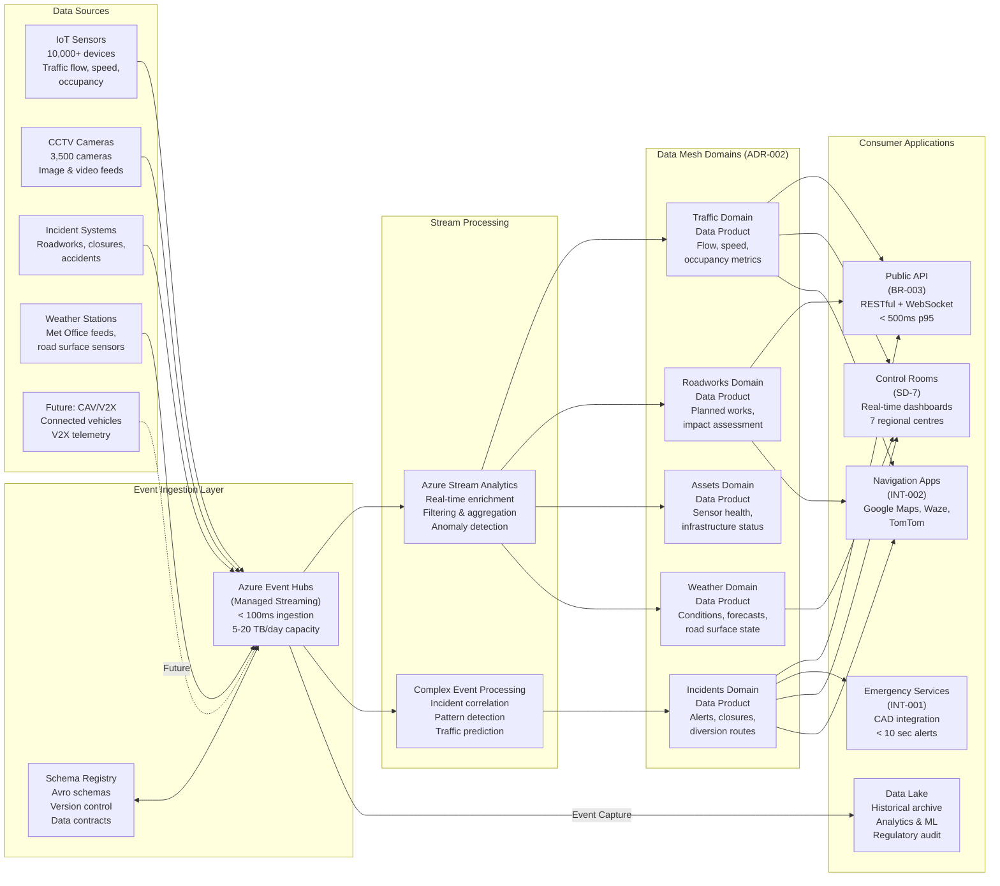
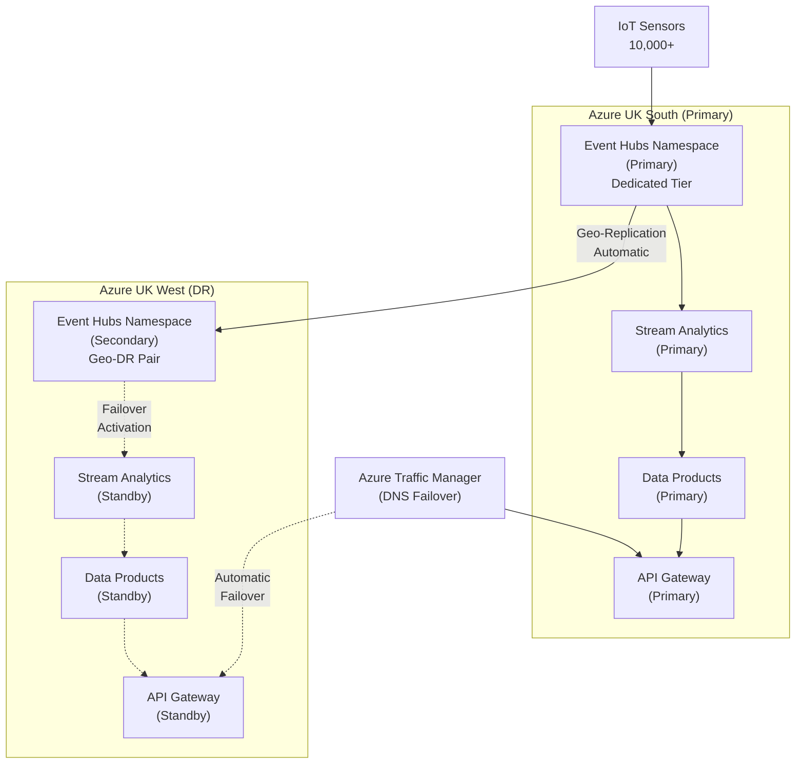
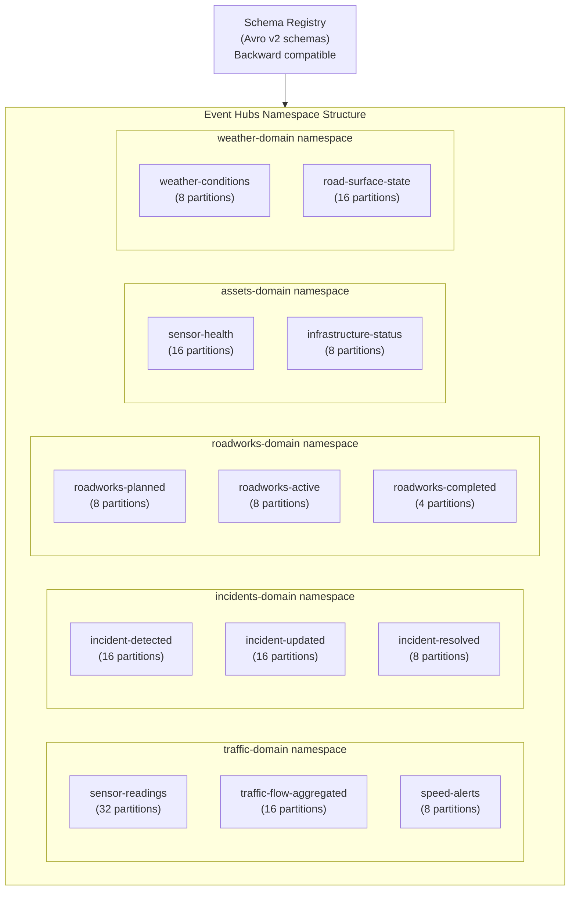
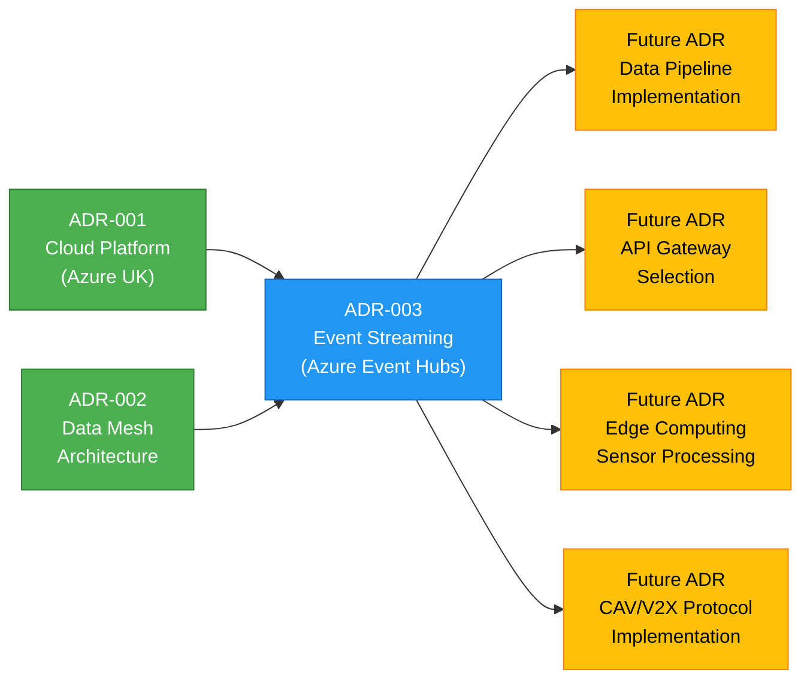

# ADR-003: Adopt Event Streaming Platform for Real-Time IoT Data Ingestion

> **Template Origin**: Official | **ArcKit Version**: 4.6.3 | **Command**: `/arckit:adr`

## Document Control

| Field | Value |
|-------|-------|
| **Document ID** | ARC-001-ADR-003-v1.0 |
| **Document Type** | Architecture Decision Record (MADR v4.0) |
| **Project** | National Highways Data Architecture Modernization (Project 001) |
| **Classification** | OFFICIAL |
| **Status** | PROPOSED |
| **Version** | 1.0 |
| **Created Date** | 2026-04-06 |
| **Last Modified** | 2026-04-06 |
| **Review Cycle** | Monthly |
| **Next Review Date** | 2026-05-06 |
| **Owner** | Enterprise Architect, Data Architecture Modernization |
| **Reviewed By** | PENDING |
| **Approved By** | PENDING |
| **Distribution** | Architecture Review Board, Programme Board, Data Domain Owners, Infrastructure Teams |
| **Escalation Level** | Department |
| **Governance Forum** | Architecture Review Board |

## Revision History

| Version | Date | Author | Changes | Approved By | Approval Date |
|---------|------|--------|---------|-------------|---------------|
| 1.0 | 2026-04-06 | ArcKit AI | Initial creation from `/arckit:adr` command | PENDING | PENDING |

---

## Executive Summary

This Architecture Decision Record evaluates and selects an event streaming platform for real-time IoT data ingestion across National Highways' strategic road network. The platform must handle 5TB/day of real-time sensor data from 10,000+ IoT traffic sensors with < 2 second end-to-end latency, supporting incident alerts, roadworks changes, weather events, and future connected and autonomous vehicle (CAV) telemetry. The decision is critical to enabling the data mesh architecture (ADR-002) for inter-domain event communication and the public API (BR-003) for real-time data feeds to navigation applications.

**Decision**: Adopt **managed cloud event streaming** (native to the chosen cloud platform from ADR-001) as the real-time IoT data ingestion platform.

**Impact**: This decision directly enables 8 MUST-priority requirements (FR-001, NFR-P-001, NFR-P-002, NFR-S-001, BR-001, BR-003, INT-001, INT-002) and 2 SHOULD-priority requirements (NFR-S-003, BR-008), affects all 5 data mesh domains, and underpins the public API delivery commitment within 12 months.

---

## 1. Decision Context

### 1.1 Problem Statement

National Highways needs to select an event streaming platform to handle real-time data ingestion from 10,000+ IoT sensors (traffic flow, speed, occupancy), incident alerts, roadworks status changes, and weather events across England's 4,500-mile strategic road network. The platform must support the data mesh architecture (ADR-002) for inter-domain event communication and the public API (BR-003) for real-time data feeds to navigation applications including Google Maps, Waze, and TomTom.

Current legacy systems use batch processing with **15-minute delays** between sensor readings and data availability. This is fundamentally incompatible with the real-time journey planning capability (BR-001) that serves over 4 million daily customers and 45 million daily journeys. The 15-minute delay prevents accurate congestion avoidance, incident detection, and route optimization, contributing to the £9 billion annual economic cost of congestion on the strategic road network.

### 1.2 Current State Assessment

| Aspect | Current State | Target State |
|--------|---------------|--------------|
| **Data Freshness** | 15-minute batch delays | < 2 second end-to-end latency |
| **Processing Model** | Batch ETL on Oracle databases | Real-time event streaming |
| **Sensor Capacity** | 10,000 sensors (limited scaling) | 50,000 sensors (5x growth) |
| **Daily Throughput** | ~2TB/day (batch windows) | 5TB/day sustained, 20TB/day peak |
| **Event Architecture** | Point-to-point integrations | Event-driven pub/sub with topics |
| **Domain Communication** | Direct database queries | Event streams between data mesh domains |
| **API Data Feeds** | No real-time API capability | 1-2 minute refresh for navigation apps |
| **Incident Alerting** | Manual telephone notification | < 10 second automated push alerts |
| **Schema Management** | Unversioned, ad hoc formats | Schema registry with versioned contracts |
| **Disaster Recovery** | Manual failover (hours) | Automated cross-region failover (minutes) |

### 1.3 Architectural Constraints

1. **Cloud Platform**: Must run on the cloud platform selected in ADR-001 (Azure UK South + UK West multi-region deployment)
2. **Data Mesh**: Must enable inter-domain event communication as defined in ADR-002 (Traffic, Incidents, Roadworks, Assets, Weather domains)
3. **Data Residency**: All data must remain within UK sovereign boundaries (Azure UK South / UK West regions) per UK GDPR and OFFICIAL-SENSITIVE classification requirements
4. **Security Classification**: Must support OFFICIAL and OFFICIAL-SENSITIVE data handling with encryption at rest (AES-256) and in transit (TLS 1.3)
5. **Budget Envelope**: Operating within the £578M business and digital services allocation for the interim period (2025-26), with streaming platform costs within the approved programme budget of £45M over 24 months
6. **Delivery Timeline**: Must be operational within 9 months (Alpha gate) with full production capability by Month 12 (public API launch)
7. **Skills Availability**: Limited in-house event streaming expertise; team primarily experienced with Oracle batch ETL

### 1.4 Scope of Decision

**In Scope**:
- Real-time event streaming platform for IoT sensor data ingestion
- Event routing and topic management for data mesh inter-domain communication
- Schema registry for event versioning and data contracts
- Stream processing for real-time enrichment, transformation, and filtering
- Event replay and audit capabilities for regulatory compliance
- Disaster recovery and high availability for critical national infrastructure

**Out of Scope**:
- Specific data pipeline implementations (deferred to implementation phase)
- API gateway selection (separate decision)
- Data lake/warehouse technology (separate decision)
- Edge computing for sensor-level processing (future ADR)
- Specific CAV/V2X protocol implementations (future ADR, design-only in Year 1 per BR-008)

---

## 2. Decision Drivers

### 2.1 Requirements Traceability

| Requirement ID | Description | Priority | Relevance to Streaming Platform |
|---------------|-------------|----------|----------------------------------|
| **FR-001** | Real-time traffic data ingestion (10,000+ sensors, < 2 sec latency) | MUST | Core platform capability |
| **NFR-P-001** | API response latency < 500ms p95 | MUST | Streaming feeds low-latency cache |
| **NFR-P-002** | Data ingestion throughput 5TB/day, capacity for 20TB/day | MUST | Platform throughput requirement |
| **NFR-S-001** | Horizontal scaling for 10x API load spikes | MUST | Auto-scaling during major incidents |
| **NFR-S-003** | Sensor network expansion to 50,000 sensors | SHOULD | 5x sensor capacity headroom |
| **BR-001** | Real-time journey planning for 4M+ daily customers | MUST | Streaming enables real-time data |
| **BR-003** | Open Data API live within 12 months | MUST | Streaming feeds API data products |
| **BR-008** | Connected & Autonomous Vehicle data readiness | SHOULD | V2X telemetry ingestion (future) |
| **INT-001** | Emergency services CAD system integration | MUST | Real-time incident event delivery |
| **INT-002** | Navigation app real-time feeds (1-2 min refresh) | MUST | Streaming to API data products |

### 2.2 Architecture Principles Alignment

| Principle | ID | Alignment Requirement |
|-----------|----|-----------------------|
| **Real-Time First Architecture** | #1 | Platform must deliver sub-second processing with < 2 sec sensor-to-platform latency and < 10 sec incident alerts |
| **Scalability** | #2 | Must scale from 10,000 to 50,000 sensors and handle 10x traffic spikes during major incidents |
| **Resilience** | #3 | Must provide multi-region DR with automated failover; zero data loss guarantee for critical national infrastructure |
| **Event-Driven Architecture** | #13 | Platform must natively support pub/sub event patterns, topic-based routing, and event replay for mesh domains |
| **API-First Design** | #14 | Streaming must feed API data products with low-latency materialized views for consumer applications |
| **Connected Roads & CAV Data Readiness** | #23 | Platform must accommodate future V2X telemetry volumes (estimated 10x current sensor data) |

### 2.3 Risk Drivers

| Risk ID | Description | Impact on Decision |
|---------|-------------|-------------------|
| **R-012** | Operational disruption during legacy-to-streaming cutover | Platform must support parallel running and gradual migration |
| **R-003** | Vendor lock-in limiting future flexibility | Evaluate open standards vs proprietary protocols |
| **R-008** | Skills shortage for new technology adoption | Platform operational complexity affects team capability |
| **R-015** | Data loss during ingestion under peak load | At-least-once delivery guarantee required |

### 2.4 Stakeholder Drivers

| Stakeholder | Driver | Implication |
|-------------|--------|-------------|
| **SD-7**: Regional Control Rooms | Need real-time operational data for traffic management | < 2 sec latency is non-negotiable for safety operations |
| **SD-1**: Transport Minister | 12-month API delivery commitment for political accountability | Fastest time-to-value platform selection preferred |
| **SD-3**: CDTO | Digital Roads transformation and long-term platform viability | Must support CAV readiness and data mesh architecture |
| **SD-12**: Emergency Services | Real-time incident alerting for life-saving response | < 10 sec incident alert delivery is safety-critical |
| **SD-5**: CFO | Value for money within constrained budget | Lowest TCO with acceptable risk profile |
| **SD-15**: Data Engineers | Ability to build and maintain data products | Platform complexity affects team productivity and retention |

---

## 3. Options Analysis

### 3.1 Option 1: Do Nothing (Baseline)

**Description**: Continue with the existing batch processing architecture using legacy Oracle databases and scheduled ETL jobs. No event streaming platform is adopted. Data continues to flow through 15-minute batch windows to downstream systems.

**Architecture Approach**:
- Retain existing Oracle database batch ETL pipelines
- Continue point-to-point integrations between systems
- No event-driven architecture
- No real-time data ingestion capability

**Advantages**:
- Zero migration risk and no operational disruption
- No additional technology investment or training required
- Existing team has full expertise in Oracle batch processing
- No vendor lock-in concerns (already locked into Oracle)

**Disadvantages**:
- **15-minute data delays are fundamentally incompatible with BR-001** (real-time journey planning)
- Cannot meet FR-001 (< 2 sec latency) -- gap of > 450x required performance
- Cannot meet NFR-P-002 (5TB/day streaming throughput) -- batch windows create bottlenecks
- Cannot deliver BR-003 (public API within 12 months) -- no real-time data feeds available
- Cannot support INT-002 (1-2 min navigation app refresh) -- minimum 15-minute staleness
- Cannot deliver INT-001 (real-time emergency services integration) -- manual telephone process continues
- No event-driven architecture (violates Principle #13)
- No path to 50,000 sensor capacity (NFR-S-003) -- Oracle batch architecture does not scale
- No CAV data readiness (BR-008) -- batch processing incompatible with V2X telemetry
- Blocks data mesh inter-domain communication (ADR-002) -- requires event backbone
- Continued Oracle license costs (£8M/year) with no pathway to savings
- Does not support the Digital Roads strategy
- Increasing technical debt and operational risk as sensor network grows

**Estimated 3-Year TCO**: £24M (continued Oracle licensing, infrastructure, manual operations, opportunity cost of delayed API)

**Requirements Compliance**:

| Requirement | Met? | Gap |
|-------------|------|-----|
| FR-001 (Real-time ingestion, < 2 sec) | NO | 15-minute delay (450x over target) |
| NFR-P-001 (API latency < 500ms) | NO | No real-time API data source |
| NFR-P-002 (5TB/day throughput) | PARTIAL | Batch windows create bottlenecks |
| NFR-S-001 (10x scaling) | NO | Oracle vertical scaling limits |
| NFR-S-003 (50K sensor capacity) | NO | Architecture cannot scale |
| BR-001 (Real-time journey planning) | NO | 15-minute stale data |
| BR-003 (Public API in 12 months) | NO | No real-time data feeds |
| BR-008 (CAV readiness) | NO | Incompatible architecture |
| INT-001 (Emergency services CAD) | NO | Manual notification continues |
| INT-002 (Nav app feeds, 1-2 min) | NO | 15-minute minimum staleness |

**Verdict**: **REJECTED** -- Does not meet 9 of 10 decision-driving requirements. This option is included as a baseline per HM Treasury Green Book appraisal methodology but is not viable.

---

### 3.2 Option 2: Managed Cloud Event Streaming (e.g., Azure Event Hubs / AWS Kinesis)

**Description**: Adopt a fully managed, cloud-native event streaming service provided by the cloud platform vendor selected in ADR-001. For Azure (the expected platform per ADR-001), this means Azure Event Hubs with Capture, Schema Registry, and integration with Azure Stream Analytics. The service is fully managed by the cloud provider with no infrastructure management required by the National Highways team.

**Architecture Approach**:
- Azure Event Hubs as the core event streaming platform
- Event Hubs Namespaces per data mesh domain (Traffic, Incidents, Roadworks, Assets, Weather)
- Schema Registry for event versioning and data contracts
- Azure Stream Analytics for real-time stream processing and enrichment
- Event Hubs Capture for automatic event archival to data lake
- Built-in integration with Azure Monitor, Azure Active Directory, and Azure Key Vault
- Multi-region deployment (UK South primary, UK West DR) with geo-replication

**Advantages**:
1. **Zero infrastructure management**: No servers, clusters, or brokers to provision, patch, or scale
2. **Auto-scaling**: Automatically scales from 10,000 to 50,000+ sensors without manual intervention; handles 10x incident traffic spikes within minutes
3. **Native cloud integration**: Deep integration with Azure ecosystem (Monitor, AAD, Key Vault, Stream Analytics, Functions, Data Lake Storage)
4. **Built-in disaster recovery**: Geo-replication between UK South and UK West with automatic failover; meets NFR-HA-001 (99.95% availability)
5. **Fast time to value**: Production-ready within weeks; critical for 12-month API delivery commitment (BR-003)
6. **Integrated monitoring and alerting**: Native Azure Monitor dashboards, log analytics, and alerting without additional tooling
7. **Schema Registry**: Built-in Apache Avro schema registry for event versioning and data contract enforcement (Principle #13)
8. **Security**: Native integration with Azure Active Directory, managed encryption (AES-256 at rest, TLS 1.3 in transit), private endpoints, and customer-managed keys
9. **Event Capture**: Automatic event archival to Azure Data Lake Storage Gen2 for historical analysis and regulatory compliance (audit trail)
10. **Consumption-based pricing**: Pay per throughput unit, aligning cost with actual sensor data volume
11. **UK data residency**: Deployed in Azure UK South and UK West regions, meeting UK GDPR and OFFICIAL-SENSITIVE requirements

**Disadvantages**:
1. **Cloud vendor lock-in**: Tied to Azure Event Hubs protocol (AMQP/HTTP) rather than open source protocol (Kafka wire protocol); deepens ADR-001 cloud commitment
2. **Throughput tier limits**: Standard tier limited to 20 throughput units (20MB/s ingress); Premium/Dedicated tiers required for full capacity -- additional cost
3. **Less configuration flexibility**: Cannot tune low-level broker settings (partition rebalancing, retention policies limited to 7 days standard / 90 days premium)
4. **Cost scales with throughput**: High sustained throughput (5TB/day) may exceed consumption-model cost efficiency compared to reserved capacity models
5. **Kafka compatibility layer**: Event Hubs provides Kafka-compatible endpoint but not full Kafka feature parity; some Kafka ecosystem tools may not work
6. **Feature lag**: New streaming capabilities may lag behind open source Kafka releases
7. **Exit cost**: Migration away from Azure Event Hubs requires re-engineering event producers and consumers

**Mitigation Strategies**:
- **Lock-in mitigation**: Implement event schema abstraction layer; all producers/consumers interact through domain event contracts (Avro schemas), not platform-specific APIs. If migration is needed, only the transport layer changes.
- **Throughput mitigation**: Use Event Hubs Dedicated tier with reserved capacity for predictable 5TB/day baseline; auto-burst for peak loads.
- **Cost mitigation**: FinOps monitoring with monthly cost reviews; reserved capacity discounts for committed throughput.

**Estimated 3-Year TCO**: **£2.4M**

| Cost Category | Year 1 | Year 2 | Year 3 | 3-Year Total |
|---------------|--------|--------|--------|--------------|
| Platform Licensing (Event Hubs Dedicated) | £400K | £450K | £500K | £1,350K |
| Stream Processing (Stream Analytics) | £150K | £175K | £200K | £525K |
| Storage (Event Capture to Data Lake) | £50K | £75K | £100K | £225K |
| Monitoring & Security Tooling | £25K | £25K | £25K | £75K |
| Implementation & Training | £150K | £50K | £25K | £225K |
| **Annual Total** | **£775K** | **£775K** | **£850K** | **£2,400K** |

**Requirements Compliance**:

| Requirement | Met? | Evidence |
|-------------|------|----------|
| FR-001 (Real-time ingestion, < 2 sec) | YES | Event Hubs ingestion latency < 100ms; end-to-end < 2 sec achievable |
| NFR-P-001 (API latency < 500ms) | YES | Materialized views from stream processing feed low-latency API cache |
| NFR-P-002 (5TB/day throughput) | YES | Dedicated tier supports > 100MB/s sustained (8.6TB/day); 20TB/day within capacity |
| NFR-S-001 (10x scaling) | YES | Auto-scaling with throughput units; burst capacity for major incidents |
| NFR-S-003 (50K sensor capacity) | YES | Event Hubs scales horizontally; 50K sensors within Dedicated tier capacity |
| BR-001 (Real-time journey planning) | YES | Sub-second data freshness enables real-time route optimization |
| BR-003 (Public API in 12 months) | YES | Fastest time to value; production-ready within weeks |
| BR-008 (CAV readiness) | YES | Scalable architecture accommodates future V2X telemetry volumes |
| INT-001 (Emergency services CAD) | YES | Real-time incident events delivered < 10 seconds |
| INT-002 (Nav app feeds, 1-2 min) | YES | Continuous streaming to API data products; 1-2 min refresh achievable |

---

### 3.3 Option 3: Self-Managed Open Source Streaming (e.g., Apache Kafka)

**Description**: Deploy and operate a self-managed Apache Kafka cluster on cloud infrastructure (Azure VMs or AKS containers). The National Highways team would be fully responsible for installation, configuration, patching, scaling, monitoring, and disaster recovery of the Kafka cluster.

**Architecture Approach**:
- Apache Kafka deployed on Azure Virtual Machines or Azure Kubernetes Service (AKS)
- Kafka topics per data mesh domain with custom partitioning strategies
- Confluent Schema Registry (open source) for event versioning
- Kafka Streams or ksqlDB for real-time stream processing
- Kafka Connect for source/sink integration with Azure services
- Manual multi-region deployment with MirrorMaker 2 for UK South/UK West replication
- Custom monitoring with Prometheus, Grafana, and Kafka JMX metrics

**Advantages**:
1. **No vendor lock-in**: Apache Kafka is open source (Apache 2.0 license); Kafka wire protocol is an industry standard with broad ecosystem support
2. **Full control**: Complete control over broker configuration, partition strategies, retention policies, replication factors, and performance tuning
3. **Proven at hyperscale**: Kafka proven at LinkedIn (7 trillion messages/day), Netflix, Uber, and similar scale; no theoretical throughput limits
4. **Large ecosystem**: Kafka Connect (200+ connectors), Kafka Streams, ksqlDB, Schema Registry, REST Proxy -- all open source
5. **Deep configurability**: Fine-grained tuning of compaction, retention, replication, ISR, leader election, and consumer group rebalancing
6. **Community and talent pool**: Large global Kafka community; extensive documentation, training, and open source tooling
7. **No consumption-based cost surprises**: Infrastructure costs are predictable (VM/container costs) regardless of message volume

**Disadvantages**:
1. **Significant operational overhead**: Kafka requires dedicated operational expertise for broker management, ZooKeeper/KRaft migration, partition rebalancing, rolling upgrades, and performance tuning
2. **Specialist expertise required**: Kafka administration is a specialized skill; the UK government sector has limited Kafka talent availability (scarce and expensive)
3. **Infrastructure management burden**: Team must manage VMs or containers, OS patching, security updates, certificate rotation, and network configuration
4. **Manual DR/HA configuration**: Cross-region replication (MirrorMaker 2) must be configured, tested, and maintained manually; failover is not automatic
5. **Slower time to value**: Cluster setup, security hardening, performance tuning, and DR testing estimated at 3-4 months before production readiness
6. **Monitoring overhead**: Custom monitoring stack (Prometheus + Grafana + alerting) must be built and maintained alongside the platform
7. **Scaling complexity**: Adding brokers and rebalancing partitions is a manual, risky operation that requires careful planning and testing
8. **Security hardening**: SASL/SSL, ACLs, encryption, and audit logging must be configured manually; no native cloud identity integration
9. **Team distraction**: Operational burden on data engineers diverts effort from building data products (core mission)

**Mitigation Strategies**:
- **Skills mitigation**: Hire 3-4 dedicated Kafka SREs (£120K-£150K each) or engage managed services consultancy
- **Operational mitigation**: Invest in comprehensive automation (Ansible/Terraform for provisioning, custom operators for Kubernetes)
- **DR mitigation**: Quarterly DR testing with documented runbooks; automated failover scripts

**Estimated 3-Year TCO**: **£3.2M**

| Cost Category | Year 1 | Year 2 | Year 3 | 3-Year Total |
|---------------|--------|--------|--------|--------------|
| Infrastructure (VMs/AKS + Storage) | £300K | £350K | £400K | £1,050K |
| Kafka SRE Staff (3 FTE @ £130K) | £390K | £390K | £390K | £1,170K |
| Monitoring Stack (Prometheus/Grafana) | £30K | £30K | £30K | £90K |
| Security & Compliance Tooling | £40K | £40K | £40K | £120K |
| Implementation & Training | £350K | £100K | £50K | £500K |
| Consultancy (initial setup + DR testing) | £150K | £50K | £50K | £250K |
| **Annual Total** | **£1,260K** | **£960K** | **£960K** | **£3,180K** |

**Requirements Compliance**:

| Requirement | Met? | Evidence |
|-------------|------|----------|
| FR-001 (Real-time ingestion, < 2 sec) | YES | Kafka ingestion latency < 10ms; end-to-end < 2 sec achievable |
| NFR-P-001 (API latency < 500ms) | YES | Kafka Streams materialized views feed low-latency API cache |
| NFR-P-002 (5TB/day throughput) | YES | Kafka proven at petabyte/day scale; 20TB/day well within capacity |
| NFR-S-001 (10x scaling) | PARTIAL | Scaling requires manual broker addition and partition rebalancing |
| NFR-S-003 (50K sensor capacity) | YES | Kafka handles millions of producers; 50K sensors trivial |
| BR-001 (Real-time journey planning) | YES | Sub-millisecond processing enables real-time capability |
| BR-003 (Public API in 12 months) | AT RISK | 3-4 month platform setup reduces API development time; tight timeline |
| BR-008 (CAV readiness) | YES | Kafka architecture accommodates future V2X telemetry volumes |
| INT-001 (Emergency services CAD) | YES | Real-time incident events via Kafka topics |
| INT-002 (Nav app feeds, 1-2 min) | YES | Continuous streaming to API data products |

---

### 3.4 Option 4: Managed Open Source Streaming (e.g., Confluent Cloud / Amazon MSK / Azure HDInsight Kafka)

**Description**: Adopt a managed Kafka-compatible service running on the chosen cloud platform. For Azure, this could be Confluent Cloud on Azure, Azure HDInsight Kafka, or Azure Event Hubs with Kafka endpoint. The vendor manages the Kafka infrastructure while the team retains Kafka wire protocol compatibility and access to the Kafka ecosystem.

**Architecture Approach**:
- Confluent Cloud (Azure marketplace) or equivalent managed Kafka service
- Kafka topics per data mesh domain with managed partitioning
- Managed Schema Registry (Confluent) for event versioning and data contracts
- Managed ksqlDB for real-time stream processing
- Managed Kafka Connect for source/sink integration
- Multi-region clusters with managed replication (UK South + UK West)
- Confluent Control Center or equivalent for monitoring and management

**Advantages**:
1. **Open standards**: Kafka wire protocol provides portability; producers/consumers work with any Kafka-compatible service
2. **Reduced operational overhead**: Vendor manages broker provisioning, patching, scaling, and monitoring (compared to self-managed)
3. **Cloud portability**: Kafka protocol means theoretical portability between cloud providers (Confluent available on AWS, Azure, GCP)
4. **Rich ecosystem access**: Full access to Kafka Connect, ksqlDB, Schema Registry, Kafka Streams without self-management
5. **Proven at scale**: Confluent Cloud manages > 10 trillion messages/day across customers; proven reliability
6. **Managed DR**: Cross-region replication managed by vendor with SLA-backed availability guarantees
7. **Expertise reduction**: Vendor handles most operational complexity; team needs Kafka development skills, not deep administration expertise
8. **Stream governance**: Confluent provides data lineage, audit logging, and governance features aligned with data mesh requirements

**Disadvantages**:
1. **Higher cost than native cloud streaming**: Confluent Cloud premium over Azure Event Hubs (approximately 15-20% higher for equivalent throughput)
2. **Still requires Kafka knowledge**: Development team still needs Kafka concepts (topics, partitions, consumer groups, offsets) even with managed infrastructure
3. **Managed service feature lag**: Managed service may lag behind open source Kafka releases by 1-2 versions
4. **Double vendor dependency**: Depends on both cloud provider (Azure) and Kafka vendor (Confluent); two vendor relationships to manage
5. **Less native cloud integration**: Not as deeply integrated with Azure ecosystem as native Event Hubs (separate monitoring, identity, security configuration)
6. **Marketplace complexity**: Confluent Cloud on Azure marketplace adds billing complexity (Azure + Confluent invoices)
7. **Kafka expertise still needed**: While reduced, Kafka-specific skills are still required for topic design, partition strategies, and consumer group management

**Mitigation Strategies**:
- **Cost mitigation**: Negotiate committed use discounts with Confluent; FinOps monitoring for cost optimization
- **Integration mitigation**: Use Azure Private Link for network integration; Azure AD integration via SASL/OAUTHBEARER
- **Skills mitigation**: Confluent training and certification program for data engineering team

**Estimated 3-Year TCO**: **£2.8M**

| Cost Category | Year 1 | Year 2 | Year 3 | 3-Year Total |
|---------------|--------|--------|--------|--------------|
| Platform Licensing (Confluent Cloud) | £500K | £500K | £550K | £1,550K |
| Stream Processing (ksqlDB managed) | £100K | £125K | £150K | £375K |
| Storage (Tiered Storage / S3 sink) | £50K | £75K | £100K | £225K |
| Monitoring (Confluent Control Center) | £50K | £50K | £50K | £150K |
| Implementation & Training | £250K | £75K | £50K | £375K |
| Azure Integration (Private Link, etc.) | £25K | £25K | £25K | £75K |
| **Annual Total** | **£975K** | **£850K** | **£925K** | **£2,750K** |

**Requirements Compliance**:

| Requirement | Met? | Evidence |
|-------------|------|----------|
| FR-001 (Real-time ingestion, < 2 sec) | YES | Kafka ingestion latency < 10ms; end-to-end < 2 sec achievable |
| NFR-P-001 (API latency < 500ms) | YES | ksqlDB materialized views feed low-latency API cache |
| NFR-P-002 (5TB/day throughput) | YES | Confluent Cloud handles petabyte/day scale; 20TB/day trivial |
| NFR-S-001 (10x scaling) | YES | Managed auto-scaling with elastic CKUs (Confluent Kafka Units) |
| NFR-S-003 (50K sensor capacity) | YES | Kafka handles millions of producers; 50K sensors trivial |
| BR-001 (Real-time journey planning) | YES | Sub-millisecond processing enables real-time capability |
| BR-003 (Public API in 12 months) | YES | Faster than self-managed but slower than native cloud (2-3 month setup) |
| BR-008 (CAV readiness) | YES | Kafka architecture accommodates future V2X telemetry volumes |
| INT-001 (Emergency services CAD) | YES | Real-time incident events via Kafka topics |
| INT-002 (Nav app feeds, 1-2 min) | YES | Continuous streaming to API data products |

---

## 4. Comparative Analysis

### 4.1 Throughput and Performance Comparison

| Metric | Option 1: Do Nothing | Option 2: Managed Cloud | Option 3: Self-Managed Kafka | Option 4: Managed Kafka |
|--------|----------------------|------------------------|------------------------------|-------------------------|
| **Ingestion Latency** | 15 minutes (batch) | < 100ms | < 10ms | < 10ms |
| **End-to-End Latency** | 15 minutes | < 2 seconds | < 2 seconds | < 2 seconds |
| **Incident Alert Latency** | Manual (minutes) | < 10 seconds | < 10 seconds | < 10 seconds |
| **Sustained Throughput** | ~2TB/day (batch) | > 8.6TB/day (Dedicated) | Unlimited (add brokers) | > 10TB/day (elastic) |
| **Peak Throughput (20TB/day)** | Not achievable | Achievable (Dedicated) | Achievable (add brokers) | Achievable (elastic) |
| **Sensor Capacity** | 10,000 (limited) | 50,000+ (auto-scale) | 50,000+ (manual scale) | 50,000+ (auto-scale) |
| **Concurrent Consumers** | Limited by Oracle | Unlimited (consumer groups) | Unlimited (consumer groups) | Unlimited (consumer groups) |
| **Message Ordering** | N/A (batch) | Per-partition (FIFO) | Per-partition (FIFO) | Per-partition (FIFO) |
| **Delivery Guarantee** | Batch (all or nothing) | At-least-once | Exactly-once (Kafka 3.x) | Exactly-once (Kafka 3.x) |

### 4.2 Operational Complexity Comparison

| Operational Factor | Option 1: Do Nothing | Option 2: Managed Cloud | Option 3: Self-Managed Kafka | Option 4: Managed Kafka |
|--------------------|----------------------|------------------------|------------------------------|-------------------------|
| **Infrastructure Management** | Existing (Oracle DBA) | None (fully managed) | Full (VMs/K8s, brokers, ZK) | Minimal (managed) |
| **Patching & Upgrades** | Oracle patches | Automatic (vendor) | Manual (rolling upgrades) | Automatic (vendor) |
| **Scaling Operations** | Oracle vertical scale | Auto-scale (TU/CU) | Manual (add brokers, rebalance) | Auto-scale (CKU) |
| **Disaster Recovery** | Manual failover (hours) | Geo-replication (automatic) | MirrorMaker 2 (manual config) | Managed replication |
| **Monitoring Setup** | Existing Oracle EM | Native Azure Monitor | Custom (Prometheus/Grafana) | Confluent Control Center |
| **Security Configuration** | Oracle RBAC | Native Azure AD/RBAC | Manual (SASL/SSL/ACLs) | Managed + Azure AD |
| **Schema Management** | None (ad hoc) | Built-in Schema Registry | Self-managed Schema Registry | Managed Schema Registry |
| **Specialist Skills Required** | Oracle DBA | Cloud platform skills | Deep Kafka expertise (scarce) | Kafka development skills |
| **FTE Overhead** | 2 Oracle DBAs (existing) | 0 additional FTE | 3-4 Kafka SRE FTE (new) | 0-1 additional FTE |
| **Time to Production** | N/A (existing) | 4-6 weeks | 3-4 months | 6-8 weeks |

### 4.3 Cost Comparison (3-Year TCO)

| Cost Category | Option 1: Do Nothing | Option 2: Managed Cloud | Option 3: Self-Managed Kafka | Option 4: Managed Kafka |
|---------------|----------------------|------------------------|------------------------------|-------------------------|
| **Platform/Licensing** | £8M/yr Oracle | £1,350K | £1,050K (infra) | £1,550K |
| **Operations Staff** | £0 (existing) | £0 (managed) | £1,170K (3 SRE FTE) | £0 (managed) |
| **Stream Processing** | N/A | £525K | Included (Kafka Streams) | £375K |
| **Storage** | Included in Oracle | £225K | Included in infra | £225K |
| **Monitoring** | Existing | £75K | £90K | £150K |
| **Implementation** | £0 | £225K | £500K | £375K |
| **Consultancy** | £0 | £0 | £250K | £75K |
| **3-Year Total** | £24M+ | **£2.4M** | **£3.2M** | **£2.8M** |
| **Annual Run Rate (Year 3)** | £8M+ | £850K | £960K | £925K |
| **Cost Rank** | 4th (highest) | **1st (lowest)** | 3rd | 2nd |

### 4.4 Architecture Principles Alignment Matrix

| Principle | Option 1: Do Nothing | Option 2: Managed Cloud | Option 3: Self-Managed Kafka | Option 4: Managed Kafka |
|-----------|----------------------|------------------------|------------------------------|-------------------------|
| **#1 Real-Time First** | FAIL (15-min delay) | PASS (< 100ms ingestion) | PASS (< 10ms ingestion) | PASS (< 10ms ingestion) |
| **#2 Scalability** | FAIL (Oracle limits) | PASS (auto-scale) | PARTIAL (manual scale) | PASS (auto-scale) |
| **#3 Resilience** | FAIL (manual DR) | PASS (geo-replication) | PARTIAL (manual DR setup) | PASS (managed DR) |
| **#13 Event-Driven** | FAIL (batch) | PASS (native pub/sub) | PASS (Kafka pub/sub) | PASS (Kafka pub/sub) |
| **#14 API-First** | FAIL (no API feeds) | PASS (feeds API products) | PASS (feeds API products) | PASS (feeds API products) |
| **#23 CAV Readiness** | FAIL (no path) | PASS (scalable for V2X) | PASS (scalable for V2X) | PASS (scalable for V2X) |
| **Alignment Score** | 0/6 | **6/6** | **4/6** | **6/6** |

### 4.5 Risk Assessment by Option

| Risk Factor | Option 1: Do Nothing | Option 2: Managed Cloud | Option 3: Self-Managed Kafka | Option 4: Managed Kafka |
|-------------|----------------------|------------------------|------------------------------|-------------------------|
| **Vendor Lock-in** | HIGH (Oracle) | MEDIUM (Azure, mitigated by ADR-001) | LOW (open source) | MEDIUM (Confluent + Azure) |
| **Delivery Risk** | HIGH (cannot deliver) | LOW (fastest TTv) | MEDIUM (3-4 month setup) | LOW-MEDIUM (6-8 week setup) |
| **Operational Risk** | LOW (existing) | LOW (fully managed) | HIGH (specialist skills needed) | LOW (managed) |
| **Scalability Risk** | HIGH (Oracle limits) | LOW (auto-scaling) | MEDIUM (manual scaling) | LOW (auto-scaling) |
| **Skills Risk** | LOW (existing team) | LOW (cloud skills) | HIGH (Kafka SRE scarce) | MEDIUM (Kafka dev skills) |
| **Cost Risk** | HIGH (£8M/yr Oracle) | LOW (predictable) | MEDIUM (staff cost variability) | LOW-MEDIUM (dual vendor) |
| **DR/HA Risk** | HIGH (manual failover) | LOW (automatic failover) | MEDIUM (manual MirrorMaker) | LOW (managed replication) |
| **Overall Risk Rating** | **CRITICAL** | **LOW** | **MEDIUM-HIGH** | **LOW-MEDIUM** |

### 4.6 Weighted Decision Matrix

Criteria are weighted based on decision driver priorities and stakeholder requirements.

| Criterion | Weight | Option 1 | Score | Option 2 | Score | Option 3 | Score | Option 4 | Score |
|-----------|--------|----------|-------|----------|-------|----------|-------|----------|-------|
| **Meets Latency Requirements** | 25% | 0/5 | 0.00 | 5/5 | 1.25 | 5/5 | 1.25 | 5/5 | 1.25 |
| **Operational Simplicity** | 20% | 3/5 | 0.60 | 5/5 | 1.00 | 1/5 | 0.20 | 4/5 | 0.80 |
| **Time to Value** | 15% | 0/5 | 0.00 | 5/5 | 0.75 | 2/5 | 0.30 | 4/5 | 0.60 |
| **Scalability (50K sensors)** | 15% | 0/5 | 0.00 | 5/5 | 0.75 | 4/5 | 0.60 | 5/5 | 0.75 |
| **Total Cost of Ownership** | 10% | 0/5 | 0.00 | 5/5 | 0.50 | 3/5 | 0.30 | 4/5 | 0.40 |
| **Vendor Independence** | 10% | 1/5 | 0.10 | 2/5 | 0.20 | 5/5 | 0.50 | 3/5 | 0.30 |
| **Ecosystem & Extensibility** | 5% | 1/5 | 0.05 | 3/5 | 0.15 | 5/5 | 0.25 | 4/5 | 0.20 |
| **Weighted Total** | **100%** | | **0.75** | | **4.60** | | **3.40** | | **4.30** |
| **Rank** | | | **4th** | | **1st** | | **3rd** | | **2nd** |

---

## 5. Decision

### 5.1 Chosen Option: Option 2 -- Managed Cloud Event Streaming

**Y-Statement**:

> In the context of **ingesting 5TB/day from 10,000+ IoT sensors with < 2 second end-to-end latency** across England's strategic road network,
> facing the need for **rapid delivery within 12 months** (public API commitment) **and limited in-house streaming expertise** (team experienced with Oracle batch ETL, not event streaming),
> we decided for **managed cloud event streaming** (native to the chosen cloud platform from ADR-001),
> to achieve **zero-infrastructure-overhead real-time ingestion** with auto-scaling, built-in geo-replication DR, and fastest time to value,
> accepting **cloud vendor lock-in** (already accepted in ADR-001, incremental risk is low) **and reduced configuration flexibility** compared to self-managed Kafka.

### 5.2 Key Justification

1. **Zero infrastructure management** -- The data engineering team focuses on building data products (the core mission of the data mesh architecture from ADR-002), not on managing Kafka brokers, ZooKeeper clusters, and infrastructure patching. This directly supports Principle #8 (Data Mesh) and the programme's value delivery objectives.

2. **Auto-scaling handles 10x traffic spikes** -- During major incidents on the M25 or severe weather events, sensor data volume can spike 10x within minutes. Managed cloud streaming auto-scales within minutes without manual intervention, meeting NFR-S-001 (horizontal scaling) without operational risk.

3. **Built-in disaster recovery across UK regions** -- Geo-replication between Azure UK South and UK West provides automatic failover consistent with the multi-region deployment strategy from ADR-001. For critical national infrastructure, manual DR configuration (Option 3) is an unacceptable operational risk.

4. **Fastest time to value** -- With the Transport Minister's 12-month API delivery commitment (BR-003), every month of platform setup time reduces API development time. Managed cloud streaming is production-ready in 4-6 weeks versus 3-4 months for self-managed Kafka. This 2-3 month saving is critical on a 12-month timeline.

5. **Integrated cloud ecosystem** -- Native integration with Azure Monitor (operational visibility), Azure Active Directory (identity and access management), Azure Key Vault (secrets and encryption), and Azure Stream Analytics (stream processing) eliminates the need to build and maintain separate integration layers for each capability.

6. **Vendor lock-in already accepted** -- ADR-001 accepted Azure as the cloud platform. Choosing Azure Event Hubs as the streaming platform is an incremental commitment within an already-accepted vendor relationship. The marginal lock-in risk is low compared to the operational and delivery benefits.

7. **Schema Registry for event versioning** -- Built-in Schema Registry enables versioned event contracts between data mesh domains (Principle #13 Event-Driven Architecture), supporting backward and forward compatibility as sensor types and data formats evolve.

8. **Lower 3-year TCO** -- At £2.4M over 3 years, managed cloud streaming is 25% cheaper than self-managed Kafka (£3.2M) primarily due to the elimination of 3 specialist Kafka SRE roles that are both expensive and difficult to recruit in the UK government sector.

### 5.3 Options Not Chosen

| Option | Reason for Rejection |
|--------|---------------------|
| **Option 1: Do Nothing** | Fundamentally incompatible with 9 of 10 decision-driving requirements. 15-minute batch delays cannot meet real-time journey planning (BR-001), public API (BR-003), or event-driven architecture (Principle #13). Included as baseline per Green Book methodology only. |
| **Option 3: Self-Managed Kafka** | Rejected due to significant operational overhead (3-4 Kafka SRE FTE), 3-4 month time-to-production (risks BR-003 12-month API delivery), manual DR configuration (unacceptable for CNI), and £800K higher 3-year TCO. Superior raw performance (< 10ms latency) is unnecessary when < 2 second is the requirement. |
| **Option 4: Managed Kafka** | Strong contender but rejected due to 15-20% higher cost than native cloud streaming, dual vendor dependency (Confluent + Azure), less native Azure integration (separate monitoring, identity), and the Kafka wire protocol portability advantage provides limited practical value given ADR-001's Azure commitment. |

---

## 6. Data Flow Architecture

### 6.1 Event Streaming Data Flow

The following diagram shows the end-to-end data flow from IoT sensors through the event streaming platform to data products and consumer APIs.



### 6.2 Multi-Region Deployment Architecture



### 6.3 Event Topic Structure (Data Mesh Domains)



---

## 7. Consequences

### 7.1 Positive Consequences

| Consequence | Beneficiary | Quantified Impact |
|-------------|-------------|-------------------|
| **Rapid delivery** of real-time data ingestion platform | Programme (BR-003 delivery) | 4-6 weeks to production vs 3-4 months (Option 3) |
| **Zero operational overhead** for streaming infrastructure | Data Engineering team (SD-15) | 3 FTE saved (£390K/year); team focuses on data products |
| **Auto-scaling** handles incident traffic spikes | Regional Control Rooms (SD-7) | 10x scaling within minutes; no manual intervention |
| **Built-in DR** with geo-replication | All stakeholders (BR-004) | Automatic failover; minutes not hours for recovery |
| **Integrated monitoring** via Azure Monitor | Operations team | Single pane of glass for platform health |
| **Schema versioning** for data contracts | Data Mesh domains (ADR-002) | Backward-compatible event evolution; no breaking changes |
| **Event Capture** for data lake archival | Analytics and compliance | Automatic event archival; regulatory audit trail |
| **Lower TCO** than alternatives | CFO (SD-5), Treasury (SD-10) | £2.4M vs £3.2M (25% saving over self-managed) |
| **Faster team onboarding** with managed service | Data Engineers (SD-15) | Cloud platform skills vs deep Kafka expertise |
| **CAV readiness** with scalable architecture | CDTO (SD-3), Principle #23 | Platform accommodates 10x future V2X telemetry |

### 7.2 Negative Consequences

| Consequence | Impact | Mitigation Strategy |
|-------------|--------|---------------------|
| **Cloud vendor lock-in** deepened (Azure Event Hubs protocol) | Switching cost if cloud platform changes | Implement event schema abstraction layer; all producers/consumers use domain event contracts (Avro), not platform-specific APIs. Transport layer is swappable. Lock-in already accepted in ADR-001. |
| **Reduced configuration flexibility** compared to self-managed Kafka | Cannot tune low-level broker settings (ISR, compaction, leader election) | Event Hubs Dedicated tier provides sufficient configuration options for National Highways' requirements. Deep Kafka tuning is unnecessary for 5TB/day workload. |
| **Feature lag** behind open source Kafka releases | Latest Kafka features may not be immediately available | Event Hubs feature roadmap aligns with Azure strategic investment; features needed for National Highways (Schema Registry, Capture, geo-DR) are already available. |
| **Kafka ecosystem compatibility limitations** | Some Kafka Connect connectors may not work with Event Hubs Kafka endpoint | Use native Azure integrations (Event Hubs Capture, Stream Analytics) rather than Kafka Connect where possible. Kafka endpoint available for ecosystem tools that require it. |

### 7.3 Risks and Mitigations

| Risk | Likelihood | Impact | Mitigation | Residual Risk |
|------|-----------|--------|------------|---------------|
| **Throughput limits exceeded** during extreme events | LOW | HIGH | Use Event Hubs Dedicated tier with reserved capacity; auto-burst enabled; capacity planning reviews quarterly | LOW |
| **Cost scaling** beyond budget as sensor network grows | MEDIUM | MEDIUM | FinOps monitoring with monthly cost reviews; reserved capacity discounts; throughput unit optimization; budget alerts at 80% threshold | LOW |
| **Azure Event Hubs service outage** affecting data ingestion | LOW | CRITICAL | Geo-replication to UK West; automatic failover; SLA-backed 99.99% availability; edge buffering at sensor gateways for temporary disconnection | LOW |
| **Schema evolution** breaking downstream consumers | MEDIUM | HIGH | Schema Registry with backward compatibility enforcement; data contract testing in CI/CD; consumer-driven contract tests per data mesh domain | LOW |
| **Data loss** during ingestion under extreme peak load | LOW | CRITICAL | At-least-once delivery guarantee; Event Capture for durable archival; idempotent consumer design; dead-letter queues for failed processing | VERY LOW |
| **Vendor pricing changes** increasing TCO | LOW | MEDIUM | Multi-year reserved capacity agreement; FinOps cost monitoring; event schema abstraction enables future migration if needed | LOW |

---

## 8. Implementation Considerations

### 8.1 Migration Strategy

The migration from batch processing to event streaming will follow a **parallel running** approach to mitigate operational disruption risk (R-012):

| Phase | Timeline | Activities | Success Criteria |
|-------|----------|------------|------------------|
| **Phase 1: Foundation** | Months 1-2 | Provision Event Hubs Dedicated tier; configure geo-replication; deploy Schema Registry; establish event topic structure per data mesh domain | Infrastructure provisioned and tested |
| **Phase 2: Shadow Mode** | Months 3-4 | Deploy sensor data producers sending to both legacy batch AND Event Hubs simultaneously; validate data quality and completeness in parallel | 100% data parity between batch and streaming |
| **Phase 3: Stream Processing** | Months 5-6 | Deploy Azure Stream Analytics jobs for real-time enrichment; build materialized views for API data products; connect to data mesh domain outputs | Stream processing producing correct results |
| **Phase 4: Consumer Migration** | Months 7-8 | Migrate control room dashboards to streaming data; migrate navigation app feeds to real-time; connect emergency services CAD integration | Consumers receiving real-time data successfully |
| **Phase 5: Cutover** | Month 9 | Decommission batch processing for migrated data sources; Event Hubs becomes primary ingestion path; legacy batch retained for non-migrated sources only | < 2 sec latency achieved; batch decommissioned |
| **Phase 6: Optimization** | Months 10-12 | Performance tuning; cost optimization; onboard remaining data sources; prepare for public API launch (BR-003) | API launch readiness; cost within budget |

### 8.2 Event Schema Design Principles

All events flowing through the streaming platform must adhere to the following schema design principles:

1. **Domain-driven event naming**: Events named by business domain (e.g., `traffic.sensor-reading.v2`, `incidents.incident-detected.v1`)
2. **Avro schema format**: All events use Apache Avro with Schema Registry for versioning and compatibility enforcement
3. **Backward compatibility**: New schema versions must be backward-compatible (new fields optional with defaults; no field removal or type changes)
4. **Event envelope**: Standard envelope with metadata (event_id, event_type, source, timestamp, correlation_id, schema_version)
5. **Idempotency keys**: Every event includes a unique idempotency key enabling exactly-once processing semantics at the consumer level
6. **Data classification**: Events tagged with data classification (OFFICIAL / OFFICIAL-SENSITIVE) for downstream access control
7. **Geospatial context**: Traffic and weather events include standardized geospatial coordinates (WGS84) for location-based routing

### 8.3 Capacity Planning

| Parameter | Baseline (Year 1) | Growth (Year 2) | Target (Year 3) | Design Capacity |
|-----------|-------------------|-----------------|-----------------|-----------------|
| **Sensors** | 10,000 | 20,000 | 35,000 | 50,000 |
| **Events/second** | 50,000 | 100,000 | 175,000 | 250,000 |
| **Daily Throughput** | 5TB | 10TB | 15TB | 20TB |
| **Peak Throughput (incident)** | 10TB | 20TB | 30TB | 40TB |
| **Event Size (avg)** | 1KB | 1KB | 1.5KB (V2X) | 2KB |
| **Retention** | 7 days hot / 90 days warm | 7 days hot / 90 days warm | 7 days hot / 1 year warm | 7 days hot / 1 year warm |
| **Partitions (total)** | 160 | 256 | 384 | 512 |
| **Consumer Groups** | 20 | 40 | 60 | 100 |

### 8.4 Security Configuration

| Security Control | Implementation | Requirement |
|-----------------|----------------|-------------|
| **Encryption at rest** | Azure Storage Service Encryption (AES-256) with customer-managed keys in Azure Key Vault | NFR-SEC-002 |
| **Encryption in transit** | TLS 1.3 enforced for all producer and consumer connections | NFR-SEC-002 |
| **Identity & Access** | Azure Active Directory with managed identities for service-to-service authentication | NFR-SEC-001 (Zero Trust) |
| **Access Control** | RBAC per Event Hub namespace; domain teams have access only to their namespace | NFR-SEC-001 (Least Privilege) |
| **Private Endpoints** | Azure Private Link for Event Hubs; no public internet exposure for producer/consumer connections | NFR-SEC-001 (Zero Trust) |
| **Audit Logging** | Azure Monitor diagnostic logs for all producer, consumer, and management operations | NFR-SEC-005 |
| **Data Classification** | OFFICIAL-SENSITIVE events (ANPR, CCTV metadata) isolated to separate Event Hub with enhanced access controls | NFR-SEC-003 |
| **Key Rotation** | Automated 90-day key rotation via Azure Key Vault; SAS token rotation for legacy producers | NFR-SEC-002 |
| **Network Isolation** | Event Hubs deployed in private subnet with NSG rules; IP filtering for sensor gateway ingress | NFR-SEC-001 |

---

## 9. Stakeholder Sign-Off

### 9.1 RACI Matrix

| Stakeholder | Role | Responsibility |
|-------------|------|----------------|
| **CDTO (Executive Sponsor)** | Decider | Final approval authority for ADR-003 |
| **Enterprise Architects** | Decider | Architecture review and recommendation |
| **Programme Director** | Accountable | Programme delivery accountability |
| **Data Engineers (SD-15)** | Consulted | Technical feasibility input and implementation planning |
| **Traffic Domain Owner** | Consulted | Domain-specific event requirements and schema design |
| **Infrastructure Team** | Consulted | Network, security, and cloud infrastructure input |
| **CISO (SD-4)** | Consulted | Security review and OFFICIAL-SENSITIVE data handling approval |
| **Regional Control Room Managers (SD-7)** | Informed | Operational impact and migration timeline awareness |
| **COO (SD-6)** | Informed | Operational continuity assurance during migration |
| **CFO (SD-5)** | Informed | Budget and TCO awareness; FinOps governance |

### 9.2 Approval Record

| Role | Name | Decision | Date | Comments |
|------|------|----------|------|----------|
| CDTO (Executive Sponsor) | PENDING | PENDING | - | - |
| Lead Enterprise Architect | PENDING | PENDING | - | - |
| CISO | PENDING | PENDING | - | - |
| Programme Director | PENDING | PENDING | - | - |

---

## 10. Compliance and Governance

### 10.1 UK Government Framework Alignment

| Framework | Alignment | Evidence |
|-----------|-----------|----------|
| **GDS Service Standard** (Point 11: Choose the right tools and technology) | ALIGNED | Managed cloud service reduces operational burden; enables team focus on user needs |
| **GDS Service Standard** (Point 9: Create a secure service) | ALIGNED | Native Azure AD integration, encryption, private endpoints, audit logging |
| **Technology Code of Practice** (Point 4: Make use of cloud) | ALIGNED | Cloud-native managed service; consumption-based pricing; auto-scaling |
| **Technology Code of Practice** (Point 5: Make things secure) | ALIGNED | Zero-trust architecture; encryption at rest and in transit; RBAC |
| **Technology Code of Practice** (Point 11: Make new source code open) | ALIGNED | Event schema contracts and data product code will be open source (not the managed platform itself) |
| **NCSC Secure by Design** | ALIGNED | Security built into platform selection; not bolted on after |
| **NCSC Cloud Security Principles** | ALIGNED | Azure Event Hubs meets all 14 NCSC Cloud Security Principles for OFFICIAL workloads |
| **UK GDPR** | ALIGNED | Data residency in UK regions; encryption; access controls; audit logging; DPIA required for ANPR/CCTV event streams |
| **HM Treasury Orange Book** | ALIGNED | Risk assessment (Section 7.3) follows Orange Book risk management principles |

### 10.2 Requirements Traceability Summary

| Requirement ID | Description | Status | Implementation Approach |
|---------------|-------------|--------|------------------------|
| **FR-001** | Real-time traffic data ingestion | ADDRESSED | Event Hubs ingestion with < 100ms latency |
| **NFR-P-001** | API response latency < 500ms p95 | ADDRESSED | Stream processing to materialized views feeding API cache |
| **NFR-P-002** | Data ingestion throughput 5TB/day | ADDRESSED | Event Hubs Dedicated tier with > 8.6TB/day sustained capacity |
| **NFR-S-001** | Horizontal scaling for 10x load | ADDRESSED | Auto-scaling throughput units with burst capacity |
| **NFR-S-003** | Sensor expansion to 50,000 | ADDRESSED | Event Hubs horizontal scaling; partition auto-management |
| **BR-001** | Real-time journey planning | ADDRESSED | Sub-second data freshness via streaming |
| **BR-003** | Open Data API in 12 months | ADDRESSED | 4-6 week platform setup maximizes API development time |
| **BR-008** | CAV data readiness | ADDRESSED | Scalable architecture for future V2X telemetry |
| **INT-001** | Emergency services CAD integration | ADDRESSED | Real-time incident events < 10 sec via dedicated topic |
| **INT-002** | Navigation app feeds (1-2 min) | ADDRESSED | Continuous streaming to API data products |

### 10.3 Principles Compliance Summary

| Principle ID | Principle Name | Compliance | Evidence |
|-------------|----------------|------------|----------|
| **#1** | Real-Time First Architecture | COMPLIANT | < 100ms ingestion latency; < 2 sec end-to-end; < 10 sec incident alerts |
| **#2** | Scalability | COMPLIANT | Auto-scaling from 10K to 50K sensors; 20TB/day capacity |
| **#3** | Resilience | COMPLIANT | Geo-replication UK South/West; automatic failover; 99.99% SLA |
| **#13** | Event-Driven Architecture | COMPLIANT | Native pub/sub; topic-based routing; Schema Registry; event replay |
| **#14** | API-First Design | COMPLIANT | Streaming feeds API data products with low-latency materialized views |
| **#23** | Connected Roads & CAV Data Readiness | COMPLIANT | Architecture scales for 10x V2X telemetry; extensible topic structure |

---

## 11. Related Decisions

### 11.1 Decision Dependencies



| Relationship | Decision | Description |
|-------------|----------|-------------|
| **Depends on** | ADR-001 (Cloud Platform) | Event streaming platform runs on the cloud platform selected in ADR-001 (Azure UK South + UK West). Event Hubs is an Azure-native service. |
| **Depends on** | ADR-002 (Data Mesh Architecture) | Event streaming enables inter-domain event communication between data mesh domains. Topic structure aligns with domain boundaries. |
| **Depended on by** | Future ADR: Data Pipeline Implementation | Specific data pipeline implementations (sensor ingestion, enrichment, transformation) will be built on the streaming platform selected here. |
| **Depended on by** | Future ADR: API Gateway Selection | API gateway will consume data products fed by the streaming platform for public API delivery (BR-003). |
| **Depended on by** | Future ADR: Edge Computing | Edge processing at sensor gateways will produce events to the streaming platform; edge architecture depends on streaming protocol. |
| **Depended on by** | Future ADR: CAV/V2X Protocol | Connected vehicle telemetry ingestion will use the streaming platform; V2X protocol bridging depends on streaming capabilities. |

### 11.2 Decision Constraints on Future ADRs

This decision establishes the following constraints for future architecture decisions:

1. **Event protocol**: All inter-domain events must use the Azure Event Hubs protocol (AMQP 1.0) or Kafka-compatible endpoint
2. **Schema format**: All event schemas must use Apache Avro with backward compatibility enforced by Schema Registry
3. **Topic naming**: Event topics must follow the `{domain}.{event-type}.v{version}` naming convention
4. **Data residency**: All event data must remain within Azure UK South and UK West regions
5. **Security model**: All event producers and consumers must authenticate via Azure Active Directory managed identities

---

## 12. Review and Governance

### 12.1 Review Schedule

| Review Type | Frequency | Participants | Focus |
|-------------|-----------|-------------|-------|
| **Decision Review** | Monthly (first 6 months), then quarterly | Architecture Review Board | Validate decision remains appropriate; check for changed context |
| **Performance Review** | Weekly (first 3 months), then monthly | Data Engineering, SRE | Latency, throughput, error rates, capacity utilization |
| **Cost Review** | Monthly | FinOps team, CFO representative | TCO tracking vs budget; optimization opportunities |
| **Security Review** | Quarterly | CISO, Security team | Threat assessment; access review; compliance verification |
| **Capacity Review** | Quarterly | Data Engineering, Architecture | Sensor growth tracking; partition planning; capacity headroom |

### 12.2 Decision Reversal Triggers

This decision should be reconsidered if any of the following conditions are met:

1. **Cloud platform change**: If ADR-001 is reversed and a different cloud provider is selected
2. **TCO exceeds 150% of estimate**: If 3-year TCO exceeds £3.6M (150% of £2.4M estimate)
3. **Performance failure**: If the platform consistently fails to meet < 2 second end-to-end latency under normal load
4. **Availability breach**: If platform availability falls below 99.9% in any rolling 30-day period
5. **Vendor discontinuation**: If Azure Event Hubs is deprecated or fundamentally changed by Microsoft
6. **Regulatory change**: If new UK Government regulations require open source or specific technology mandates
7. **CAV requirements**: If V2X telemetry requirements (BR-008) exceed the platform's scaling capacity

### 12.3 Success Metrics

| Metric | Target | Measurement Method | Review Frequency |
|--------|--------|-------------------|-----------------|
| **Ingestion Latency (p95)** | < 2 seconds end-to-end | Azure Monitor metrics; synthetic testing from sensor simulators | Weekly |
| **Incident Alert Latency** | < 10 seconds | End-to-end trace from incident detection to consumer delivery | Weekly |
| **Platform Availability** | > 99.95% | Azure Monitor uptime metrics; SLA tracking dashboard | Monthly |
| **Throughput Capacity** | > 5TB/day sustained | Event Hubs throughput metrics; daily volume reporting | Monthly |
| **Message Loss Rate** | 0% | Dead-letter queue monitoring; producer/consumer message count reconciliation | Daily |
| **Schema Compatibility** | 100% backward compatible | Schema Registry compatibility check in CI/CD pipeline | Per deployment |
| **Cost vs Budget** | Within +/- 10% of estimate | FinOps cost tracking; monthly budget variance report | Monthly |
| **Time to Production** | < 6 weeks | Project milestone tracking | One-time |
| **Consumer Migration** | 100% by Month 9 | Migration tracker; consumer count per data source | Monthly |

---

## 13. Glossary

| Term | Definition |
|------|-----------|
| **AMQP** | Advanced Message Queuing Protocol -- open standard messaging protocol used by Azure Event Hubs |
| **Avro** | Apache Avro -- compact binary serialization format with schema evolution support |
| **CAD** | Computer Aided Dispatch -- emergency services call handling and dispatch system |
| **CAV** | Connected and Autonomous Vehicles -- vehicles with connectivity and self-driving capabilities |
| **CEP** | Complex Event Processing -- real-time pattern detection across multiple event streams |
| **CKU** | Confluent Kafka Unit -- Confluent Cloud capacity unit for managed Kafka |
| **CNI** | Critical National Infrastructure -- assets essential for functioning of society |
| **DR** | Disaster Recovery -- process of restoring systems after a major failure |
| **ETL** | Extract, Transform, Load -- batch data processing pattern |
| **Event Hubs** | Azure Event Hubs -- Microsoft's fully managed event streaming service |
| **Geo-replication** | Automatic data replication between geographic regions for disaster recovery |
| **IoT** | Internet of Things -- network of connected sensors and devices |
| **ISR** | In-Sync Replica -- Kafka term for replicas that are fully caught up with the leader |
| **Kafka** | Apache Kafka -- open source distributed event streaming platform |
| **ksqlDB** | Confluent's streaming SQL engine for real-time data processing on Kafka |
| **MirrorMaker 2** | Apache Kafka tool for cross-cluster and cross-region data replication |
| **MTTR** | Mean Time To Recovery -- average time to restore service after a failure |
| **Schema Registry** | Service that manages and enforces schemas for event data contracts |
| **SRE** | Site Reliability Engineering -- discipline focused on system reliability and operations |
| **TLS** | Transport Layer Security -- cryptographic protocol for secure communication |
| **TCO** | Total Cost of Ownership -- complete cost of a solution over its lifecycle |
| **TU** | Throughput Unit -- Azure Event Hubs capacity unit (1 TU = 1MB/s ingress, 2MB/s egress) |
| **V2X** | Vehicle-to-Everything -- communication between vehicles and infrastructure, other vehicles, pedestrians |
| **WGS84** | World Geodetic System 1984 -- standard coordinate reference system for GPS |
| **ZooKeeper** | Apache ZooKeeper -- coordination service historically required by Kafka (being replaced by KRaft) |

---

## Document Control Footer

| Field | Value |
|-------|-------|
| **Document ID** | ARC-001-ADR-003-v1.0 |
| **Classification** | OFFICIAL |
| **Created** | 2026-04-06 |
| **Review Date** | 2026-05-06 |
| **Owner** | Enterprise Architect, Data Architecture Modernization |
| **Governance Forum** | Architecture Review Board |
| **Escalation Level** | Department |

---

```
**Generated by**: ArcKit `/arckit:adr` command
**Generated on**: 2026-04-06 GMT
**ArcKit Version**: 4.6.3
**Project**: National Highways Data Architecture Modernization (Project 001)
**AI Model**: claude-opus-4-6
**Generation Context**: ADR-003 created from ARC-001-REQ-v2.0, ARC-000-PRIN-v2.0, ARC-001-RISK-v1.0, ARC-001-STKE-v1.0
```
