# Project Plan: National Highways Data Architecture Modernization

## Document Control

| Field | Value |
|-------|-------|
| **Document ID** | ARC-001-PLAN-v1.0 |
| **Project** | National Highways Data Architecture Modernization (Project 001) |
| **Document Type** | Project Plan |
| **Classification** | OFFICIAL |
| **Status** | DRAFT |
| **Version** | 1.0 |
| **Created Date** | 2025-11-13 |
| **Last Modified** | 2025-11-13 |
| **Review Cycle** | Monthly |
| **Next Review Date** | 2025-12-13 |
| **Owner** | Programme Director, Data Architecture Modernization |
| **Approved By** | [PENDING] |

## Revision History

| Version | Date | Author | Changes | Approved By | Approval Date |
|---------|------|--------|---------|-------------|---------------|
| 1.0 | 2025-11-13 | ArcKit AI | Initial creation from `/arckit.plan` command | [PENDING] | [PENDING] |

---

## Executive Summary

### Project Overview

**Project**: National Highways Data Architecture Modernization
**Duration**: 24 months (104 weeks)
**Budget**: £45M capital (+ £8M/year operational)
**Team**: 25 FTE average (peak 35 FTE in Beta)
**Delivery Model**: GDS Agile Delivery (Discovery → Alpha → Beta → Live)
**Complexity**: **LARGE** - Complex transformation programme

**Objective**: Modernize National Highways' legacy Oracle data architecture to cloud-native data mesh platform, delivering real-time traffic data API for 45 million daily journeys while achieving £15M annual operational savings.

### Success Criteria

- ✅ **Public API Launch**: Open Data API live within 12 months serving 50M requests/month
- ✅ **Operational Efficiency**: 30% reduction in incident response time (18 min → 12.6 min)
- ✅ **Cost Savings**: £15M annual savings verified by NAO by Year 3
- ✅ **Zero Incidents**: No security or data breaches during migration
- ✅ **Platform Availability**: 99.95% uptime maintained throughout migration
- ✅ **GDS Assessment**: Pass Alpha and Beta Service Standard assessments

### Key Milestones

| Milestone | Week | Date | Gate/Approval |
|-----------|------|------|---------------|
| **Discovery Assessment** | Week 12 | 2026-02-06 | Discovery Gate - Go/No-Go to Alpha |
| **SOBC Approved** | Week 8 | 2026-01-09 | HM Treasury Green Book approval |
| **HLD Review Complete** | Week 28 | 2026-07-10 | Architecture Review Board approval |
| **Alpha Assessment** | Week 32 | 2026-08-07 | GDS Service Standard Alpha gate |
| **DLD Review Complete** | Week 40 | 2026-10-02 | Implementation readiness approval |
| **Beta Assessment** | Week 80 | 2027-08-06 | GDS Service Standard Beta gate |
| **Production Launch** | Week 96 | 2027-11-26 | Go-Live approval |
| **Hypercare Complete** | Week 100 | 2027-12-24 | Transition to BAU |

### Budget Summary

| Phase | Duration | Budget | Team Size |
|-------|----------|--------|-----------|
| **Discovery** | 12 weeks | £2.5M | 15 FTE |
| **Alpha** | 20 weeks | £12.5M | 25 FTE |
| **Beta** | 48 weeks | £28M | 35 FTE (peak) |
| **Live** | 4 weeks | £2M | 20 FTE |
| **TOTAL** | 84 weeks (delivery) | £45M | 25 FTE avg |

### Critical Path Dependencies

1. **SOBC Approval** (Week 8) blocks all procurement activities
2. **Vendor Selection** (Week 24) blocks detailed design start
3. **HLD Approval** (Week 28) blocks DLD and implementation
4. **DPIA/ICO Approval** (Week 16) blocks ANPR processing implementation
5. **Security Threat Model** (Week 30) blocks production deployment

### Risks to Timeline

**CRITICAL RISKS** (from ARC-001-RISK-v1.0):
- **R-002**: No SOBC - adds 8-week delay if not started immediately
- **R-001**: Ministerial delivery pressure - may force scope cuts if timeline slips
- **R-005**: Cloud cost overruns - may force budget reallocation impacting timeline
- **R-008**: Legacy migration data loss - requires extensive testing adding 4-8 weeks

**Mitigation**: Monthly risk reviews, phased delivery approach, early wins to satisfy political pressure.

---

## Project Timeline - Gantt Chart

---

## Workflow & Gates Diagram

```mermaid
graph TB
    Start[Project Initiation<br/>Nov 2025] --> Discovery

    Discovery[Discovery Phase<br/>Weeks 1-12<br/>• Stakeholders 15<br/>• Requirements 58<br/>• SOBC £45M<br/>• Risk Register 20] --> DiscGate{Discovery<br/>Assessment<br/>Week 12}

    DiscGate -->|✅ Approved<br/>SOBC + BRs| Alpha
    DiscGate -->|❌ Rejected| Stop1[Stop/Pivot]

    Alpha[Alpha Phase<br/>Weeks 13-32<br/>• Detailed Requirements<br/>• HLD + Threat Model<br/>• Procurement £33M<br/>• DPIA ICO Approval] --> DPIAGate{DPIA<br/>ICO Review<br/>Week 18}

    DPIAGate -->|✅ Approved| VendorProc[Vendor<br/>Procurement<br/>Weeks 19-24]
    DPIAGate -->|❌ Rejected| RefineDPIA[Refine<br/>DPIA]
    RefineDPIA --> DPIAGate

    VendorProc --> HLDGate{HLD Review<br/>ARB Approval<br/>Week 28}

    HLDGate -->|✅ Approved| AlphaGate{Alpha<br/>Assessment<br/>GDS<br/>Week 32}
    HLDGate -->|❌ Rejected| RefineHLD[Refine HLD]
    RefineHLD --> HLDGate

    AlphaGate -->|✅ Passed| Beta
    AlphaGate -->|❌ Failed| RefineAlpha[Address<br/>GDS Feedback]
    RefineAlpha --> Alpha

    Beta[Beta Phase<br/>Weeks 33-80<br/>• DLD Detailed Design<br/>• 12 x 3-week Sprints<br/>• Security + Perf Testing<br/>• UAT with 7 Regions] --> DLDGate{DLD Review<br/>Week 40}

    DLDGate -->|✅ Approved| Build[Implementation<br/>Sprints 1-12<br/>Weeks 41-77]
    DLDGate -->|❌ Rejected| RefineDLD[Refine DLD]
    RefineDLD --> DLDGate

    Build --> Testing[Security &<br/>Performance<br/>Testing<br/>Weeks 78-80]
    Testing --> UAT{UAT Pass?<br/>7 Regions<br/>Week 80}
    UAT -->|✅ Pass| BetaGate{Beta Assessment<br/>GDS<br/>Week 80}
    UAT -->|❌ Fail| FixIssues[Fix Issues<br/>Sprint 13]
    FixIssues --> UAT

    BetaGate -->|✅ Passed<br/>Go-Live| Live[Production<br/>Deployment<br/>Week 96]
    BetaGate -->|❌ Failed| FixBlockers[Address<br/>Blockers]
    FixBlockers --> Beta

    Live --> Migration[Legacy<br/>Migration<br/>Zero Data Loss<br/>Week 96-98]
    Migration --> Hypercare[Hypercare<br/>24/7 Support<br/>4 weeks]
    Hypercare --> BAU[Business As Usual<br/>Support &<br/>Benefits Tracking]

    style DiscGate fill:#FFE4B5
    style DPIAGate fill:#FFE4B5
    style HLDGate fill:#FFE4B5
    style AlphaGate fill:#FFE4B5
    style DLDGate fill:#FFE4B5
    style BetaGate fill:#FFE4B5
    style Stop1 fill:#FFB6C1
```

---

## Discovery Phase (Weeks 1-12)

### Objective

Validate the problem, understand user needs, establish governance, and secure funding approval for the full programme.

### Activities & Timeline

| Week | Activity | ArcKit Command | Deliverable | Owner |
|------|----------|----------------|-------------|-------|
| 1-2 | Stakeholder Analysis | `/arckit.stakeholders` | Stakeholder map, drivers, goals (ARC-001-STKE-v1.0) | Programme Director |
| 3-5 | User Research (15 stakeholders) | Manual research | User needs, pain points, journey maps | User Researcher |
| 6-7 | Business Requirements | `/arckit.requirements` | BRs with acceptance criteria (ARC-001-REQ-v1.0) | Business Analyst |
| 8 | Architecture Principles | `/arckit.principles` | 20 principles (ARC-NH-PRIN-v1.0) | Enterprise Architect |
| 9 | Initial Risk Register | `/arckit.risk` | 20 risks, Orange Book compliant (ARC-001-RISK-v1.0) | Risk Manager |
| 6-9 | SOBC Development | `/arckit.sobc` | 5-case business case (HM Treasury Green Book) | CFO + Programme Director |
| 10-11 | SOBC Approval Process | Manual | DfT Finance Director → HMT approval | CFO |
| 12 | Discovery Assessment | Internal review | Go/No-Go decision to Alpha | Steering Committee |

### Gate: Discovery Assessment (Week 12)

**Approval Criteria**:
- [ ] Problem clearly defined and validated with 15 stakeholders
- [ ] User needs documented from user research sessions
- [ ] Business Requirements defined (15-20 BRs minimum)
- [ ] Architecture principles agreed (20 principles covering security, data, integration)
- [ ] **SOBC approved by HM Treasury** (£45M investment, BCR >2.0)
- [ ] Risk register created (20 risks identified, 2 critical, 5 high)
- [ ] No CRITICAL risks without approved mitigation plan
- [ ] Stakeholder buy-in confirmed (CDTO, CFO, CISO, COO)
- [ ] Ministerial briefing completed (political support secured)

**Approvers**:
- Programme Director (Recommend)
- CDTO (Executive Sponsor - Approve)
- Steering Committee (Approve)
- DfT Permanent Secretary (Endorse)

**Possible Outcomes**:
- ✅ **Go to Alpha** - Problem validated, SOBC approved, approach feasible (EXPECTED)
- 🔄 **Pivot** - Adjust scope or approach based on findings (if cost/benefit marginal)
- ❌ **Stop** - Problem not worth solving or approach not feasible (if BCR <1.5)

### Critical Success Factors

**Political Success**:
- Ministerial briefing in Week 10 builds political support
- SOBC approval demonstrates value for money to HM Treasury
- Open data commitment secures cross-party support

**Technical Success**:
- Architecture principles establish non-negotiable guardrails (security, GDPR, CNI)
- Risk register identifies critical blockers early (R-002 SOBC addressed in Discovery)

**Financial Success**:
- SOBC 5-case model demonstrates £15M annual savings (BCR 2.67)
- Budget profiling shows affordability (£20M Year 1, £25M Year 2)

---

## Alpha Phase (Weeks 13-32)

### Objective

Develop detailed requirements, complete procurement, design high-level architecture, obtain security approvals, and prepare for implementation.

### Activities & Timeline

| Week | Activity | ArcKit Command | Deliverable | Owner |
|------|----------|----------------|-------------|-------|
| 13-15 | Detailed Requirements (58 total) | `/arckit.requirements` | FR, NFR, INT, DR requirements | Business Analyst |
| 16-17 | Data Model & ERD | `/arckit.data-model` | 5 data products, GDPR compliance (ARC-001-DATA-v1.0) | Data Architect |
| 18-19 | DPIA Development & ICO Submission | `/arckit.dpia` | DPIA approved by ICO (ANPR processing) | DPO |
| 16-17 | Wardley Mapping | `/arckit.wardley` | Build vs buy strategy (ARC-001-WARD-v1.0) | Enterprise Architect |
| 18-19 | Technology Research | `/arckit.research` | Research findings, G-Cloud shortlist | Technical Lead |
| 20-23 | Cloud Procurement (G-Cloud) | `/arckit.gcloud-search` | Azure £28M contract via G-Cloud 14 | Procurement Lead |
| 24-25 | DOS Procurement (Consultancy) | `/arckit.dos` | Specialist consultancy £5M via DOS | Procurement Lead |
| 22-27 | Architecture Design (HLD) | `/arckit.diagram` | HLD with C4 diagrams, deployment architecture | Enterprise Architect |
| 28-29 | Security Threat Model | Manual (NCSC) | STRIDE analysis, NCSC-compliant threat model | CISO |
| 30-31 | TCoP Assessment | `/arckit.tcop` | 13-point TCoP review (ARC-001-TCOP-v1.0) | Enterprise Architect |
| 28 | HLD Review & Approval | `/arckit.hld-review` | Architecture Review Board approval | ARB Chair |
| 32 | Alpha Assessment (GDS) | Manual | GDS Service Standard Alpha pass | CDTO |

### Gate 1: DPIA ICO Approval (Week 19)

**Approval Criteria**:
- [ ] DPIA completed covering ANPR and CCTV processing
- [ ] Privacy risks assessed and mitigated (24-hour deletion, encryption)
- [ ] Legal basis documented (public task under UK GDPR Article 6(1)(e))
- [ ] ICO consultation completed with positive feedback
- [ ] DPO approval obtained

**Approvers**: ICO (Independent Regulator)

**Risk if Failed**: R-006 materializes - cannot process ANPR data, blocks public API launch

### Gate 2: HLD Review (Week 28)

**Approval Criteria**:
- [ ] HLD covers all 58 requirements (traceability matrix)
- [ ] Architecture principles compliance verified (20 principles)
- [ ] Security architecture meets NCSC Cloud Security Principles
- [ ] Data mesh design validated (5 data products with clear ownership)
- [ ] Integration architecture covers 5 external integrations
- [ ] Cloud-first strategy justified (Azure UK regions)
- [ ] Threat model completed and risks mitigated
- [ ] Technology choices justified via Wardley Map
- [ ] Scalability to 50M API requests/month demonstrated
- [ ] 99.95% availability target achievable

**Approvers**:
- Enterprise Architect (Recommend)
- CISO (Security Approval)
- Architecture Review Board (Approve)

**Possible Outcomes**:
- ✅ **Approved** - Proceed to DLD and implementation
- 🔄 **Conditional Approval** - Minor refinements required (1-2 weeks)
- ❌ **Rejected** - Major design flaws, return to Alpha (4-6 weeks delay)

### Gate 3: Alpha Assessment - GDS Service Standard (Week 32)

**GDS 14-Point Assessment Criteria** (Alpha Phase):
- [ ] **Point 1**: User research with 15 stakeholders completed
- [ ] **Point 2**: Accessibility plan (WCAG 2.2 AA commitment)
- [ ] **Point 3**: Open source strategy documented
- [ ] **Point 4**: Open standards (OpenAPI 3.x, DATEX II, GeoJSON)
- [ ] **Point 5**: Cloud first (100% Azure UK)
- [ ] **Point 6**: Security approach (zero-trust, NCSC principles)
- [ ] **Point 7**: Privacy by design (DPIA approved)
- [ ] **Point 8**: Share/reuse approach (open data API)
- [ ] **Point 9**: Integration strategy (5 external integrations)
- [ ] **Point 10**: Data approach (data mesh, 5 data products)
- [ ] **Point 11**: Procurement strategy (Wardley Map, G-Cloud)
- [ ] **Point 12**: Technology choices justified (build vs buy)
- [ ] **Point 13**: Open standards compliance
- [ ] **Point 14**: Agile delivery (2-week sprints planned)

**Approvers**: GDS Service Assessors (3-person panel)

**Possible Outcomes**:
- ✅ **Pass** - Proceed to Beta with confidence
- 🔄 **Pass with Recommendations** - Address feedback in Beta
- ❌ **Not Met** - Re-assessment required (4-8 weeks delay)

### Critical Success Factors

**Procurement Success**:
- G-Cloud contract signed by Week 23 (unblocks cloud setup)
- DOS consultancy engaged by Week 25 (data mesh expertise)
- Vendor relationships established early

**Security Success**:
- DPIA ICO approval by Week 19 (unblocks ANPR processing)
- Threat model complete by Week 29 (demonstrates due diligence)
- CISO approval secured (no security blockers)

**Political Success**:
- GDS Alpha assessment passed (demonstrates compliance)
- Ministerial update in Week 32 (progress visible)

---

## Beta Phase (Weeks 33-80)

### Objective

Implement working system through 12 agile sprints, complete security and performance testing, conduct UAT with 7 regional control rooms, and prepare for production deployment.

### Activities & Timeline

| Week | Activity | ArcKit Command | Deliverable | Owner |
|------|----------|----------------|-------------|-------|
| 33-36 | Detailed Design (DLD) | Manual | DLD with API specs, DB schemas, component specs | Technical Lead |
| 37-39 | Product Backlog Generation | `/arckit.backlog` | 120 user stories, 12-sprint plan | Product Owner |
| 40 | DLD Review & Approval | `/arckit.dld-review` | Implementation-ready approval | ARB Chair |
| 41-43 | Cloud Infrastructure Setup | Manual | Azure landing zones, networking, IAM | Cloud Architect |
| 44-46 | Sprint 1 - Data Ingestion | `/arckit.diagram` (sequence) | Kafka streaming pipeline, 10K sensors | Dev Team 1 |
| 47-49 | Sprint 2 - Data Mesh (Traffic) | Manual | Traffic data product, API endpoints | Dev Team 2 |
| 50-52 | Sprint 3 - Data Mesh (Incidents) | Manual | Incident data product, API endpoints | Dev Team 3 |
| 53-55 | Sprint 4 - Data Mesh (Roadworks) | Manual | Roadworks data product, API endpoints | Dev Team 1 |
| 56-58 | Sprint 5 - Public API | Manual | OpenAPI 3.x public API, rate limiting | Dev Team 2 |
| 59-61 | Sprint 6 - Control Room Dashboard | Manual | Unified dashboard (replaces 7 legacy systems) | Dev Team 3 |
| 62-64 | Sprint 7 - Emergency Services Integration | Manual | JESIP-compliant CAD integration | Dev Team 1 |
| 65-67 | Sprint 8 - ANPR Processing | Manual | 24-hour automated deletion, hashing | Dev Team 2 |
| 68-70 | Sprint 9 - Local Authority APIs | Manual | 152 local authorities API integration | Dev Team 3 |
| 71-73 | Sprint 10 - Waze Integration | Manual | CCP protocol, bidirectional data exchange | Dev Team 1 |
| 74-76 | Sprint 11 - Refinement & Bug Fixes | Manual | Technical debt resolution, security hardening | All Teams |
| 77-79 | Sprint 12 - Performance Hardening | Manual | Caching, load balancing, auto-scaling | DevOps Team |
| 80-82 | Security Testing (Pen Test) | Manual | CHECK-certified pen test, SAST/DAST | Security Team |
| 83-84 | Performance Testing | Manual | Load testing (50M requests/month simulation) | Performance Team |
| 85-87 | User Acceptance Testing (UAT) | Manual | 7 regional control rooms, 30+ operators | UAT Lead |
| 88-89 | Operational Readiness | `/arckit.servicenow` | Runbooks, SLAs, incident procedures | Ops Manager |
| 90 | Beta Assessment (GDS) | Manual | GDS Service Standard Beta pass | CDTO |

### Gate 4: DLD Review (Week 40)

**Approval Criteria**:
- [ ] DLD covers all FR, NFR, INT, DR requirements
- [ ] API contracts defined (OpenAPI 3.x specifications)
- [ ] Database schemas designed (PostgreSQL + PostGIS)
- [ ] Component interactions documented (sequence diagrams)
- [ ] Security implementation detailed (authentication, authorization, encryption)
- [ ] Test strategy defined (unit, integration, security, performance, UAT)
- [ ] Deployment pipeline designed (CI/CD with Azure DevOps)
- [ ] Monitoring strategy defined (Azure Monitor, Application Insights)
- [ ] Traceability to HLD verified

**Approvers**:
- Technical Lead (Recommend)
- Enterprise Architect (Design Compliance)
- CISO (Security Implementation)
- Architecture Review Board (Approve)

### Gate 5: Beta Assessment - GDS Service Standard (Week 90)

**GDS 14-Point Assessment Criteria** (Beta Phase):
- [ ] **Point 1**: User needs met (validated via UAT with 7 control rooms)
- [ ] **Point 2**: WCAG 2.2 AA accessibility tested
- [ ] **Point 3**: Open source contributions documented
- [ ] **Point 4**: Open standards implemented (OpenAPI, DATEX II live)
- [ ] **Point 5**: Cloud first (100% Azure UK in production)
- [ ] **Point 6**: Security tested (pen test passed, zero critical findings)
- [ ] **Point 7**: Privacy implemented (ANPR 24h deletion working)
- [ ] **Point 8**: Open data API live (public access)
- [ ] **Point 9**: Integrations working (5 external systems)
- [ ] **Point 10**: Data mesh operational (5 data products)
- [ ] **Point 11**: Procurement complete (G-Cloud, DOS contracts)
- [ ] **Point 12**: Technology delivering (50M requests/month capacity)
- [ ] **Point 13**: Open standards compliance verified
- [ ] **Point 14**: Agile delivery demonstrated (12 sprints completed)

**Performance Metrics Required**:
- API response time: <3 seconds (95th percentile)
- Dashboard load time: <500ms
- System availability: >99.95%
- Incident detection time: <15 minutes
- Zero security vulnerabilities (critical/high)

**Approvers**: GDS Service Assessors (3-person panel)

**Possible Outcomes**:
- ✅ **Pass - Recommend Go-Live** - Proceed to production
- 🔄 **Pass with Conditions** - Fix minor issues before go-live (2-4 weeks)
- ❌ **Not Met** - Address major gaps, re-assessment required (8-12 weeks delay)

### Sprint Structure (12 x 3-Week Sprints)

**Sprint Activities** (Repeated 12 times):
- **Week 1**: Planning, user story refinement, sprint kickoff
- **Week 2**: Development, daily standups, impediment resolution
- **Week 3**: Code review, testing, sprint review, retrospective

**Definition of Done (DoD)**:
- [ ] Code reviewed by 2+ developers
- [ ] Unit tests written (>80% coverage)
- [ ] Integration tests passed
- [ ] Security scan passed (SAST)
- [ ] API documentation updated (OpenAPI spec)
- [ ] Deployment to dev/test environment successful
- [ ] Product Owner acceptance obtained

### Testing Strategy

**Security Testing** (Week 80-82):
- Penetration testing by CHECK-certified testers
- SAST (Static Application Security Testing) - SonarQube
- DAST (Dynamic Application Security Testing) - OWASP ZAP
- Vulnerability scanning - Nessus
- Threat model validation

**Performance Testing** (Week 83-84):
- Load testing: 50M requests/month simulation (1,900 requests/minute peak)
- Stress testing: 3x normal load (burst capacity)
- Soak testing: 72-hour sustained load
- Failover testing: Regional failure scenarios
- Auto-scaling validation

**User Acceptance Testing** (Week 85-87):
- 7 regional control rooms participate
- 30+ operational staff testers
- Real-world scenarios (incident management, roadworks coordination)
- Acceptance criteria from requirements verified
- User satisfaction survey (target: >80% satisfied)

### Critical Success Factors

**Implementation Success**:
- All 12 sprints deliver working software
- No sprint failures requiring re-work
- Technical debt managed (<20% of capacity)

**Security Success**:
- Pen test passed with zero critical findings
- ANPR 24-hour deletion working (automated, auditable)
- Zero data breaches during testing

**User Success**:
- UAT passed by 7 regional control rooms
- User satisfaction >80%
- Operational staff trained and confident

**Political Success**:
- Public API launched by Month 12 (Week 52) - early political win
- GDS Beta assessment passed - demonstrates standards compliance

---

## Live Phase (Weeks 91-104)

### Objective

Deploy to production, migrate legacy data, provide hypercare support, track benefits realization, and transition to business-as-usual operations.

### Activities & Timeline

| Week | Activity | ArcKit Command | Deliverable | Owner |
|------|----------|----------------|-------------|-------|
| 91-92 | Go-Live Preparation | Manual | Deployment runbooks, rollback plans | DevOps Lead |
| 93-94 | Legacy Data Migration | Manual | Oracle → PostgreSQL migration (zero data loss) | Data Engineers |
| 95 | Production Cutover | Manual | Blue-green deployment, DNS cutover | DevOps Lead |
| 96 | Production Deployment | Manual | Live service for 45M daily journeys | Programme Director |
| 97-100 | Hypercare (24/7 Support) | Manual | Incident response, bug fixes, monitoring | Support Team |
| 101-108 | Benefits Realization Tracking | Manual | £15M savings tracking, KPI dashboards | Finance Team |
| 109-112 | Legacy System Decommissioning | Manual | Oracle databases shutdown, cost savings realized | Infrastructure Team |
| 104 | Transition to BAU | Manual | Handover to operations team | Programme Director |

### Gate 6: Go-Live Approval (Week 95)

**Approval Criteria**:
- [ ] Beta assessment passed (GDS Service Standard)
- [ ] UAT completed successfully (7 control rooms signed off)
- [ ] Security testing passed (pen test clean)
- [ ] Performance testing passed (50M requests/month capacity)
- [ ] Operational readiness verified (runbooks, SLAs, support team trained)
- [ ] Deployment plan approved (blue-green, rollback tested)
- [ ] Data migration tested (zero data loss verified)
- [ ] Hypercare support in place (24/7 for 4 weeks)
- [ ] Ministerial briefing completed (political sign-off)
- [ ] Rollback plan tested and approved

**Approvers**:
- COO (Operational Readiness)
- CISO (Security Approval)
- CDTO (Executive Sponsor)
- Steering Committee (Final Approval)
- Transport Minister (Political Sign-Off)

**Possible Outcomes**:
- ✅ **Go-Live Approved** - Proceed with production deployment
- 🔄 **Conditional Go-Live** - Deploy with enhanced monitoring, address minor issues post-launch
- ❌ **Defer** - Critical issues found, fix and re-assess (2-4 weeks delay)

### Legacy Migration Strategy

**Zero Data Loss Approach**:
1. **Week 93**: Parallel running (Oracle + PostgreSQL both active)
2. **Week 94**: Data validation (automated reconciliation scripts)
3. **Week 95**: Blue-green deployment (new system live, old system standby)
4. **Week 96**: DNS cutover (public API points to new system)
5. **Week 97-100**: Hypercare (old system remains available for rollback)
6. **Week 109**: Legacy decommissioning (Oracle databases shutdown)

**Rollback Plan**:
- DNS cutover reversed within 5 minutes
- Database replication allows rollback to Oracle within 15 minutes
- Rollback decision authority: COO + CDTO

### Hypercare Activities (Weeks 97-100)

**24/7 Support Coverage**:
- Incident response: <15 minutes for P1 (critical)
- Bug fixes: Daily deployments if needed
- Monitoring: Real-time dashboards, proactive alerting
- User support: Dedicated helpdesk for control room operators
- Escalation: Direct line to development team

**Success Metrics** (Daily Monitoring):
- System availability: >99.95%
- API response time: <3 seconds (95th percentile)
- Incident response time: <15 minutes (target <12.6 minutes)
- Zero critical security incidents
- User satisfaction: >80% (daily surveys)

### Benefits Realization Tracking

**Tracked Benefits** (Quarterly Reviews):
| Benefit | Baseline | Target | Measurement Method |
|---------|----------|--------|-------------------|
| Operational Savings | £0 | £15M/year by Year 3 | Finance tracking (staff reallocation, legacy costs) |
| Incident Response Time | 18 minutes | 12.6 minutes (30% improvement) | Operational dashboards |
| API Requests | 0 | 50M/month | Azure API Management metrics |
| Journey Time Accuracy | ±30% variance | ±10% variance | User satisfaction surveys |
| Staff Retention | 60% (cloud skills) | 95% (cloud-trained) | HR metrics |
| Public Satisfaction | 50% (legacy systems) | 70% (new platform) | Quarterly user surveys |

**NAO Audit** (Year 1 + Year 3):
- Value for money assessment
- Benefits realization validation
- Cost accuracy verification
- Governance compliance review

### Critical Success Factors

**Deployment Success**:
- Zero downtime during cutover
- No data loss during migration
- Rollback capability tested and proven

**Operational Success**:
- Hypercare period completes with <10 P1 incidents
- Control room operators trained and confident
- 24/7 support team fully operational

**Political Success**:
- Ministerial announcement of public API launch (positive media)
- Parliamentary questions receive positive answers
- NAO audit Year 1 provides positive feedback

---

## Integration with ArcKit Commands

### Discovery Phase (Weeks 1-12)

| Week | ArcKit Command | Purpose | Output File |
|------|----------------|---------|-------------|
| 1-2 | `/arckit.stakeholders` | Stakeholder analysis | `stakeholder-drivers.md` |
| 6-7 | `/arckit.requirements` | Business Requirements | `requirements.md` (BRs only) |
| 8 | `/arckit.principles` | Architecture principles | `.arckit/memory/architecture-principles.md` |
| 9 | `/arckit.risk` | Risk register (Orange Book) | `risk-register.md` |
| 6-9 | `/arckit.sobc` | Business case (Green Book) | `sobc.md` |

### Alpha Phase (Weeks 13-32)

| Week | ArcKit Command | Purpose | Output File |
|------|----------------|---------|-------------|
| 13-15 | `/arckit.requirements` | Detailed requirements (FR, NFR, INT, DR) | `requirements.md` (complete) |
| 16-17 | `/arckit.data-model` | Data model with ERD | `data-model.md` |
| 18-19 | `/arckit.dpia` | GDPR impact assessment | `dpia.md` |
| 16-17 | `/arckit.wardley` | Strategic mapping | `wardley-maps/procurement-strategy.md` |
| 18-19 | `/arckit.research` | Technology research | `research-findings.md` |
| 20-23 | `/arckit.gcloud-search` | G-Cloud service search | `procurement/gcloud-requirements.md` |
| 24-25 | `/arckit.dos` | DOS procurement docs | `procurement/dos-requirements.md` |
| 22-27 | `/arckit.diagram` | Architecture diagrams (C4) | `diagrams/c4-context.md`, `diagrams/deployment.md` |
| 30-31 | `/arckit.tcop` | TCoP assessment | `tcop-assessment.md` |
| 28 | `/arckit.hld-review` | HLD review | `reviews/hld-review.md` |
| 32 | `/arckit.analyze` | Governance quality analysis | `analysis-report.md` |

### Beta Phase (Weeks 33-80)

| Week | ArcKit Command | Purpose | Output File |
|------|----------------|---------|-------------|
| 37-39 | `/arckit.backlog` | Product backlog (user stories) | `backlog.md` |
| 40 | `/arckit.dld-review` | DLD review | `reviews/dld-review.md` |
| 44 | `/arckit.diagram` (sequence) | Data ingestion flow | `diagrams/sequence-ingestion.md` |
| 85 | `/arckit.traceability` | Requirements → design → tests | `traceability-matrix.md` |
| 88-89 | `/arckit.servicenow` | Service management design | `servicenow-design.md` |
| 90 | `/arckit.service-assessment` | GDS readiness | `service-assessment-beta-prep.md` |

### Live Phase (Weeks 91-104)

| Week | ArcKit Command | Purpose | Output File |
|------|----------------|---------|-------------|
| 100 | `/arckit.analyze` | Post-launch quality review | `analysis-report-live.md` |
| 104 | `/arckit.story` | Project story (lessons learned) | `project-story.md` |

---

## Timeline Estimates by Project Complexity

This project is classified as **LARGE** based on:
- **100+ requirements** (58 documented, more expected)
- **5+ external integrations** (Emergency Services, Local Authorities, Waze, Met Office, NTIS)
- **Significant custom development** (Data mesh platform, ANPR processing, unified dashboard)
- **Multiple compliance regimes** (GDPR, NCSC CNI, GDS Service Standard, TCoP)
- **Data migration required** (Legacy Oracle → PostgreSQL, zero data loss)
- **15 stakeholders** with complex political drivers
- **£45M budget** (major programme)

### Typical Timeline Ranges

| Project Size | Discovery | Alpha | Beta | Live | Total |
|--------------|-----------|-------|------|------|-------|
| Small | 2-4 weeks | 4-8 weeks | 8-12 weeks | 1 week | 3-6 months |
| Medium | 4-8 weeks | 8-12 weeks | 12-24 weeks | 2 weeks | 6-12 months |
| **Large (This Project)** | **12 weeks** | **20 weeks** | **48 weeks** | **4 weeks** | **24 months** |

### Timeline Justifications

**Discovery (12 weeks - Extended)**:
- 15 stakeholders require extensive engagement (Weeks 1-2)
- Complex user research across 7 regional control rooms (Weeks 3-5)
- SOBC development and approval requires 6 weeks (Weeks 6-11)
- Ministerial briefing and political alignment (Week 10)

**Alpha (20 weeks - Extended)**:
- Vendor procurement adds 8 weeks (G-Cloud £28M + DOS £5M)
- DPIA ICO approval requires 4 weeks (critical path)
- Security threat model requires 2 weeks (NCSC compliance)
- HLD complexity (data mesh, 5 data products) requires 6 weeks

**Beta (48 weeks - Very Extended)**:
- 12 x 3-week agile sprints = 36 weeks development
- Security testing adds 3 weeks (pen test, SAST/DAST)
- Performance testing adds 2 weeks (50M requests/month validation)
- UAT adds 3 weeks (7 regional control rooms)
- Operational readiness adds 2 weeks

**Live (4 weeks - Standard)**:
- Legacy migration requires 2 weeks (zero data loss validation)
- Hypercare requires 4 weeks (24/7 support)

---

## Risks & Assumptions

### Critical Path Risks

**From Risk Register (ARC-001-RISK-v1.0)**:

| Risk ID | Risk | Impact on Timeline | Mitigation |
|---------|------|-------------------|------------|
| **R-002** | No SOBC | +8 weeks delay if not started Week 1 | START IMMEDIATELY (Week 1) |
| **R-001** | Ministerial pressure | Scope cuts if timeline slips | Phased delivery, early API launch (Week 52) |
| **R-005** | Cloud cost overruns | Budget freeze delays procurement | FinOps implementation Month 1 |
| **R-008** | Legacy migration data loss | +4-8 weeks for re-testing | Parallel running, extensive validation |
| **R-012** | Operational disruption | +2-4 weeks for stabilization | Blue-green deployment, rollback plan |

### Assumptions

**Funding & Resources**:
- [ ] £45M budget approved and available (no budget cuts mid-programme)
- [ ] Team hiring completed within 4 weeks of Alpha start
- [ ] Azure UK regions have capacity (no quota restrictions)
- [ ] G-Cloud framework available (no procurement rule changes)

**Stakeholder Availability**:
- [ ] CDTO available for weekly reviews
- [ ] Ministerial briefings can be scheduled monthly
- [ ] Regional control rooms available for UAT (3 weeks)
- [ ] GDS assessors available for Alpha (Week 32) and Beta (Week 90)

**Technical Assumptions**:
- [ ] Azure services meet NCSC Cloud Security Principles
- [ ] PostgreSQL + PostGIS can handle 50M API requests/month
- [ ] Legacy Oracle data migration is feasible (schema compatibility)
- [ ] 10K IoT sensors can be integrated without hardware changes

**Governance Assumptions**:
- [ ] SOBC approval within 6 weeks of submission
- [ ] DPIA ICO approval within 4 weeks of submission
- [ ] GDS assessments can be booked 6 weeks in advance
- [ ] No parliamentary election disrupts ministerial support

### Dependencies

**External Dependencies**:
- HM Treasury SOBC approval (Week 8) - blocks procurement
- ICO DPIA approval (Week 19) - blocks ANPR processing
- G-Cloud contract signature (Week 23) - blocks cloud setup
- GDS Alpha assessment (Week 32) - blocks Beta start
- GDS Beta assessment (Week 90) - blocks go-live

**Internal Dependencies**:
- CDTO approval of HLD (Week 28) - blocks DLD
- CISO threat model approval (Week 29) - blocks production deployment
- UAT sign-off by 7 regions (Week 87) - blocks go-live
- Legacy migration validation (Week 94) - blocks DNS cutover

---

## Governance & Reporting

### Steering Committee (Monthly)

**Attendees**:
- CDTO (Chair)
- CFO
- CISO
- COO
- Programme Director
- DfT Representative
- Enterprise Architect

**Agenda**:
- Progress vs plan (RAG status)
- Budget vs forecast (£45M tracking)
- Risk register review (top 10 risks)
- Decision log (ADRs, change requests)
- Next month priorities

### Executive Board (Quarterly)

**Attendees**:
- CEO (National Highways)
- Executive Team (CDTO, CFO, CISO, COO)
- DfT Permanent Secretary (as needed)

**Agenda**:
- Programme health (RAG dashboard)
- Benefits realization (£15M savings tracking)
- Strategic risks (critical/high only)
- Ministerial briefing preparation
- Budget reallocation requests

### Ministerial Briefings (Monthly)

**Attendees**:
- Transport Minister
- DfT Permanent Secretary
- CDTO
- Programme Director

**Content**:
- Political messaging (public-facing wins)
- Parliamentary questions preparation
- Media strategy
- Cross-party stakeholder engagement

### GDS Assessments (Alpha Week 32, Beta Week 90)

**Attendees**:
- 3 GDS Service Assessors
- CDTO (Accountable)
- User Researcher (Point 1 evidence)
- Technical Lead (Points 3-6, 9-12)
- DPO (Point 7 evidence)
- Product Owner (Points 8, 13-14)

**Assessment Duration**: 1 day (site visit + demos + documentation review)

### NAO Audit (Year 1 + Year 3)

**Attendees**:
- NAO Auditors (2-3 person team)
- CFO (Financial evidence)
- Programme Director (Delivery evidence)
- CDTO (Benefits realization)

**Audit Scope**:
- Value for money assessment
- Benefits realization validation (£15M savings)
- Governance compliance (SOBC, risk management)
- Procurement compliance (G-Cloud framework)

---

## Success Metrics & KPIs

### Delivery KPIs (Tracked Weekly)

| KPI | Target | Measurement | Owner |
|-----|--------|-------------|-------|
| Sprint Velocity | 15 story points/sprint | Jira burndown | Product Owner |
| Budget Variance | <5% | Monthly financial reports | CFO |
| Schedule Variance | <10% | Gantt vs actual | Programme Director |
| Risk Score | <200/500 | Risk register residual score | Risk Manager |
| Team Retention | >90% | HR metrics | HR Director |

### Technical KPIs (Tracked Daily in Production)

| KPI | Target | Measurement | Owner |
|-----|--------|-------------|-------|
| API Availability | >99.95% | Azure Monitor | DevOps Lead |
| API Response Time | <3 seconds (95th percentile) | Application Insights | Technical Lead |
| Dashboard Load Time | <500ms | Browser telemetry | UX Lead |
| API Request Volume | 50M/month | API Management metrics | Product Owner |
| Security Incidents | 0 critical/high | Azure Sentinel | CISO |

### Business KPIs (Tracked Monthly)

| KPI | Baseline | Target | Measurement | Owner |
|-----|----------|--------|-------------|-------|
| Incident Response Time | 18 minutes | <12.6 minutes (30% reduction) | Operational dashboards | COO |
| Operational Savings | £0 | £15M/year by Year 3 | Finance tracking | CFO |
| User Satisfaction | 50% | >70% | Quarterly surveys | User Researcher |
| Journey Time Accuracy | ±30% variance | ±10% variance | User feedback | Product Owner |
| Staff Cloud Skills | 20% | 95% (120 staff trained) | Training records | HR Director |

### Political KPIs (Tracked Quarterly)

| KPI | Target | Measurement | Owner |
|-----|--------|-------------|-------|
| Parliamentary Questions | Positive answers | Hansard records | Minister's Office |
| Media Coverage Sentiment | >60% positive | Media monitoring | Communications |
| NAO Audit Rating | Green (satisfactory) | NAO report | CFO |
| GDS Assessment | Pass Alpha + Beta | GDS reports | CDTO |

---

## Change Management & Training

### Training Programme (Weeks 60-90)

**120 Staff Upskilling**:

| Role | Training | Duration | Certification | Budget |
|------|----------|----------|---------------|--------|
| Data Engineers (30) | Azure Data Engineer Associate | 40 hours | Microsoft DP-203 | £90K |
| Cloud Architects (10) | Azure Solutions Architect | 60 hours | Microsoft AZ-305 | £45K |
| DevOps Engineers (20) | Azure DevOps Engineer | 40 hours | Microsoft AZ-400 | £60K |
| Control Room Operators (50) | Dashboard User Training | 8 hours | Internal certification | £20K |
| Support Staff (10) | Incident Management | 16 hours | ITIL Foundation | £10K |

**Total Training Budget**: £225K (included in £45M)

### Change Management Activities

| Week | Activity | Audience | Owner |
|------|----------|----------|-------|
| 60-62 | Change Impact Assessment | All staff | Change Manager |
| 63-70 | Role-based training delivery | Technical staff | Training Lead |
| 71-80 | User training (control rooms) | Operational staff | UAT Lead |
| 85-90 | Super-user identification | Regional champions | Change Manager |
| 91-100 | Hypercare support | All users | Support Team |

---

## Appendices

### Appendix A: Document References

| Document ID | Title | Location |
|-------------|-------|----------|
| ARC-001-STKE-v1.0 | Stakeholder Drivers & Goals | `stakeholder-drivers.md` |
| ARC-001-REQ-v1.0 | Requirements | `requirements.md` |
| ARC-001-RISK-v1.0 | Risk Register | `risk-register.md` |
| ARC-001-DATA-v1.0 | Data Model | `data-model.md` |
| ARC-001-WARD-v1.0 | Wardley Map | `wardley-maps/procurement-strategy.md` |
| ARC-001-TCOP-v1.0 | TCoP Assessment | `tcop-assessment.md` |
| ARC-NH-PRIN-v1.0 | Architecture Principles | `.arckit/memory/architecture-principles.md` |

### Appendix B: Glossary

- **ANPR**: Automatic Number Plate Recognition
- **ARB**: Architecture Review Board
- **BAU**: Business As Usual
- **BCR**: Benefit-Cost Ratio
- **CAD**: Computer-Aided Dispatch (Emergency Services)
- **CNI**: Critical National Infrastructure
- **DPIA**: Data Protection Impact Assessment
- **GDS**: Government Digital Service
- **HLD**: High-Level Design
- **DLD**: Detailed/Low-Level Design
- **ICO**: Information Commissioner's Office
- **NAO**: National Audit Office
- **NCSC**: National Cyber Security Centre
- **SOBC**: Strategic Outline Business Case
- **SRN**: Strategic Road Network
- **TCoP**: Technology Code of Practice
- **UAT**: User Acceptance Testing

### Appendix C: Contact Information

| Role | Name | Email | Phone |
|------|------|-------|-------|
| Programme Director | [TBD] | [TBD] | [TBD] |
| CDTO (Executive Sponsor) | [TBD] | [TBD] | [TBD] |
| CFO | [TBD] | [TBD] | [TBD] |
| CISO | [TBD] | [TBD] | [TBD] |
| COO | [TBD] | [TBD] | [TBD] |

---

**Generated by**: ArcKit `/arckit.plan` command
**Generated on**: 2025-11-13
**ArcKit Version**: 0.9.1
**Project**: National Highways Data Architecture Modernization (Project 001)
**AI Model**: Claude Sonnet 4.5 (claude-sonnet-4-5-20250929)
**Delivery Model**: GDS Agile Delivery (Discovery → Alpha → Beta → Live)
**Complexity**: LARGE (24 months, £45M, 58 requirements, 15 stakeholders)
