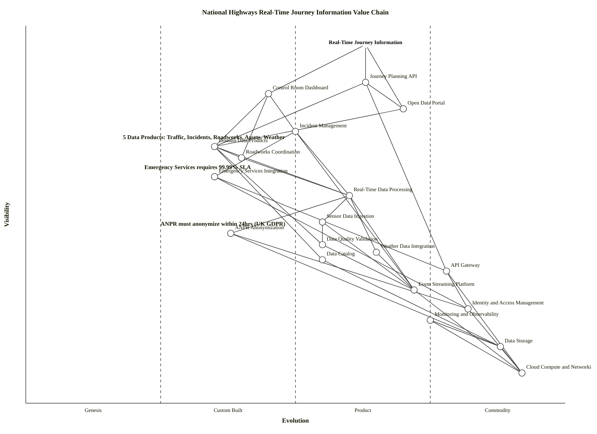

# Wardley Value Chain: National Highways Real-Time Journey Information

> **Template Origin**: Official | **ArcKit Version**: 4.3.1 | **Command**: `/arckit.wardley.value-chain`

## Document Control

| Field | Value |
|-------|-------|
| **Document ID** | ARC-001-WVCH-001-v1.0 |
| **Document Type** | Wardley Value Chain |
| **Project** | National Highways Data Architecture Modernization (Project 001) |
| **Classification** | OFFICIAL |
| **Status** | DRAFT |
| **Version** | 1.0 |
| **Created Date** | 2026-03-19 |
| **Last Modified** | 2026-03-19 |
| **Review Cycle** | Monthly |
| **Next Review Date** | 2026-04-18 |
| **Owner** | Programme Director, Data Architecture Modernization |
| **Reviewed By** | PENDING |
| **Approved By** | PENDING |
| **Distribution** | Programme Team, Architecture Team, Executive Sponsors |

## Revision History

| Version | Date | Author | Changes | Approved By | Approval Date |
|---------|------|--------|---------|-------------|---------------|
| 1.0 | 2026-03-19 | ArcKit AI | Initial creation from `/arckit:wardley.value-chain` command | PENDING | PENDING |

---

## Executive Summary

This value chain decomposes the primary user need for England's strategic road network — **road users accessing real-time, accurate traffic information to plan reliable journeys** — into 20 components across 5 dependency levels. The chain reveals that the critical path runs from the anchor through the Journey Planning API and Domain Data Products down to the Event Streaming Platform and Cloud Compute infrastructure. A key strategic insight is that ANPR Anonymization and Emergency Services Integration are custom-built components on the critical path with no commodity alternatives, representing both regulatory necessity and potential bottleneck risk. The data mesh architecture (Domain Data Products) acts as a central hub connecting 8 upstream consumer components to downstream processing infrastructure.

---

## User Need / Anchor

**Anchor Statement**: Road users can access real-time, accurate traffic information to plan reliable journeys on England's strategic road network.

```text
Anchor: Road users can access real-time, accurate traffic information to plan reliable journeys
User: 45 million daily road users on England's 4,300-mile strategic road network
Outcome: Journey time variability reduced by 20% through accurate real-time route information, incidents responded to 30% faster, and third-party navigation apps integrate National Highways data
```

This anchor is validated against BR-001 (Real-Time Journey Planning), BR-003 (Open Data API), and BR-004 (Operational Continuity). It can be satisfied through multiple architectural approaches — the value chain does not prescribe a specific technology solution.

---

## Users and Personas

| Persona | Role | Primary Need |
|---------|------|--------------|
| Road User (Driver) | General public using England's motorways and A-roads | Accurate, timely journey planning information to avoid congestion and incidents |
| Third-Party App Developer | Google Maps, Waze, TomTom engineers | Reliable, well-documented API providing real-time traffic data for integration into navigation apps |
| Control Room Operator | Regional control room staff (7 regions, 140 baseline operators) | Single unified dashboard replacing 7 legacy systems for incident management and traffic monitoring |
| Emergency Services Dispatcher | Police, ambulance, fire service coordinators | Priority access to real-time incident data and CCTV feeds for emergency response coordination |
| Roadworks Planner | National Highways and local authority planners | Conflict-free roadworks scheduling with automated impact assessment |
| Data Consumer (Internal) | National Highways analysts, domain teams | Discoverable, well-documented data products with clear SLAs for analysis and reporting |

---

## Value Chain Diagram

**View this map**: Paste the OWM syntax below into [https://create.wardleymaps.ai](https://create.wardleymaps.ai)

**ASCII Placeholder**:

```text
Visibility
    ^
0.95| [Real-Time Journey Information]
    |         /         |          \
0.85| [Journey Planning API]  [Control Room Dashboard]  [Open Data Portal]
    |         |              /     |     \                  |
0.72|         |    [Incident Mgmt]  |  [Roadworks Coord]    |
0.68|    [Domain Data Products] <---------+---------+-------+
    |         |         |
0.60|    [Emergency Svc Integration]
0.55|    [Real-Time Data Processing]
    |         /         |         \
0.48| [Sensor Data Ingestion] [ANPR Anonymization] [Weather Integration]
0.42| [Data Quality Validation]  [Data Catalog]
    |         |
0.35| [API Gateway]
0.30| [Event Streaming Platform]
0.25| [Identity & Access Mgmt]  [Monitoring & Observability]
0.15| [Data Storage]
0.08| [Cloud Compute & Networking]
    |
    +--Genesis--Custom--Product--Commodity-->  Evolution
       (0.0)   (0.25)  (0.50)   (0.75)  (1.0)
```

**OWM Syntax**:

```wardley
title National Highways Real-Time Journey Information Value Chain
anchor Real-Time Journey Information [0.95, 0.63]

component Journey Planning API [0.85, 0.63]
component Control Room Dashboard [0.82, 0.45]
component Open Data Portal [0.78, 0.70]
component Incident Management [0.72, 0.50]
component Domain Data Products [0.68, 0.35]
component Roadworks Coordination [0.65, 0.40]
component Emergency Services Integration [0.60, 0.35]
component Real-Time Data Processing [0.55, 0.60]
component Sensor Data Ingestion [0.48, 0.55]
component ANPR Anonymization [0.45, 0.38]
component Data Quality Validation [0.42, 0.55]
component Weather Data Integration [0.40, 0.65]
component Data Catalog [0.38, 0.55]
component API Gateway [0.35, 0.78]
component Event Streaming Platform [0.30, 0.72]
component Identity and Access Management [0.25, 0.82]
component Monitoring and Observability [0.22, 0.75]
component Data Storage [0.15, 0.88]
component Cloud Compute and Networking [0.08, 0.92]

Real-Time Journey Information -> Journey Planning API
Real-Time Journey Information -> Control Room Dashboard
Real-Time Journey Information -> Open Data Portal

Journey Planning API -> Domain Data Products
Journey Planning API -> API Gateway

Control Room Dashboard -> Incident Management
Control Room Dashboard -> Domain Data Products
Control Room Dashboard -> Roadworks Coordination

Open Data Portal -> Journey Planning API
Open Data Portal -> Domain Data Products

Incident Management -> Emergency Services Integration
Incident Management -> Real-Time Data Processing
Incident Management -> Event Streaming Platform

Domain Data Products -> Real-Time Data Processing
Domain Data Products -> Data Quality Validation
Domain Data Products -> Data Catalog

Roadworks Coordination -> Domain Data Products
Roadworks Coordination -> Real-Time Data Processing

Emergency Services Integration -> API Gateway
Emergency Services Integration -> Identity and Access Management

Real-Time Data Processing -> Sensor Data Ingestion
Real-Time Data Processing -> ANPR Anonymization
Real-Time Data Processing -> Weather Data Integration
Real-Time Data Processing -> Event Streaming Platform

Sensor Data Ingestion -> Event Streaming Platform
Sensor Data Ingestion -> Data Quality Validation

ANPR Anonymization -> Identity and Access Management
ANPR Anonymization -> Data Storage

Data Quality Validation -> Event Streaming Platform

Weather Data Integration -> Event Streaming Platform

API Gateway -> Identity and Access Management
API Gateway -> Cloud Compute and Networking

Event Streaming Platform -> Cloud Compute and Networking

Data Catalog -> Data Storage

Identity and Access Management -> Cloud Compute and Networking

Monitoring and Observability -> Data Storage
Monitoring and Observability -> Cloud Compute and Networking

Data Storage -> Cloud Compute and Networking

note Emergency Services requires 99.99% SLA [0.62, 0.22]
note ANPR must anonymize within 24hrs (UK GDPR) [0.47, 0.25]
note 5 Data Products: Traffic, Incidents, Roadworks, Assets, Weather [0.70, 0.18]

style wardley
```

<details>
<summary>Mermaid Value Chain Map (renders in GitHub, VS Code, and other Mermaid-enabled viewers)</summary>

> **Note**: Mermaid Wardley Maps use the `wardley-beta` keyword. This feature is in Mermaid's develop branch and may not render in all viewers yet. No sourcing decorators at the value chain stage — those are added when creating the full Wardley Map.



</details>

---

## Component Inventory

| ID | Component | Description | Depends On | Visibility |
|----|-----------|-------------|------------|------------|
| C-01 | Real-Time Journey Information | **Anchor**. Road users access real-time, accurate traffic information for reliable journey planning on England's strategic road network. | — | 0.95 |
| C-02 | Journey Planning API | Public RESTful API (OpenAPI 3.x) enabling journey planning queries with current traffic conditions, predicted journey times, and alternative routes. < 500ms p95 latency. Serves 50M requests/month target. | C-06, C-14 | 0.85 |
| C-03 | Control Room Dashboard | Unified web-based dashboard replacing 7 legacy systems, enabling 140+ operators to manage incidents, roadworks, and traffic from a single interface. WCAG 2.2 AA compliant. | C-05, C-06, C-07 | 0.82 |
| C-04 | Open Data Portal | Developer-facing portal with sandbox environment, documentation, API keys, and code examples under Open Government License. Enables third-party innovation ecosystem. | C-02, C-06 | 0.78 |
| C-05 | Incident Management | Automated incident lifecycle (Reported through Closed) with notifications to VMS, navigation apps ( < 10s), and emergency services CAD systems. 7-year retention. | C-08, C-09, C-15 | 0.72 |
| C-06 | Domain Data Products | Five data mesh products (Traffic Flow, Incidents, Roadworks, Asset Register, Weather) with published APIs, SLAs (99.9% availability, < 2 min freshness), and data quality metrics. | C-09, C-12, C-16 | 0.68 |
| C-07 | Roadworks Coordination | Roadworks planning with automated conflict detection (10-mile radius), impact assessment, and integration with 152 local highway authorities via DATEX II. | C-06, C-09 | 0.65 |
| C-08 | Emergency Services Integration | Bi-directional data exchange with police, ambulance, and fire CAD systems via PSN (Public Services Network). 99.99% SLA, mutual TLS authentication. | C-14, C-17 | 0.60 |
| C-09 | Real-Time Data Processing | Stream processing of 5TB/day sensor data with < 2s end-to-end latency. Transforms raw sensor feeds into usable traffic intelligence. Handles 10,000-50,000 sensors. | C-10, C-11, C-13, C-15 | 0.55 |
| C-10 | Sensor Data Ingestion | Intake from 10,000+ IoT sensors (traffic flow, speed, occupancy) supporting CSV, JSON, and proprietary binary protocols. Capacity for 50,000 sensors (5x growth). | C-15, C-12 | 0.48 |
| C-11 | ANPR Anonymization | GDPR-compliant processing of vehicle registration plates: immediate SHA-256 hashing, journey time calculation, automated deletion of originals within 24 hours. Legal hold exception process. | C-17, C-19 | 0.45 |
| C-12 | Data Quality Validation | Automated schema validation, range checks (speeds 0-100 mph), referential integrity, freshness monitoring (alert if no data in 5 min), and anomaly detection. > 99% completeness target. | C-15 | 0.42 |
| C-13 | Weather Data Integration | Ingestion of Met Office Datapoint API data: roadside observations (15-min refresh), 5-day forecasts (hourly), and severe weather warnings (real-time push). | C-15 | 0.40 |
| C-14 | API Gateway | Single entry point for all API consumers with rate limiting (10k req/hr public, custom for partners), authentication routing, DDoS protection, and request monitoring. | C-17, C-20 | 0.35 |
| C-15 | Event Streaming Platform | Publish-subscribe messaging for real-time data flows. At-least-once delivery for sensor data, exactly-once for safety-critical events. Schema registry for versioned event schemas. | C-20 | 0.30 |
| C-16 | Data Catalog | Searchable metadata repository with data lineage documentation, quality metrics, and SLA dashboards for all 5 domain data products. | C-19 | 0.38 |
| C-17 | Identity and Access Management | Zero-trust security: MFA for humans, mutual TLS/workload identity for services, RBAC with least privilege, continuous verification. Supports PSN certificate authority. | C-20 | 0.25 |
| C-18 | Monitoring and Observability | Structured JSON logging with correlation IDs, golden signals monitoring (latency, traffic, errors, saturation), distributed tracing (1-5% sampling), SLO-based alerting. | C-19, C-20 | 0.22 |
| C-19 | Data Storage | Tiered storage (hot/warm/cold) supporting 500TB baseline growing to 2.5PB over 5 years. AES-256 encryption at rest. UK regions only (Azure UK South + UK West). | C-20 | 0.15 |
| C-20 | Cloud Compute and Networking | Azure UK South (primary) and UK West (DR) infrastructure. Auto-scaling from 5,000 to 50,000 concurrent requests/second. Multi-region deployment with automated failover. | — | 0.08 |

---

## Dependency Matrix

The dependency matrix shows which components (rows) depend on which other components (columns). **X** = direct dependency; **I** = indirect dependency; blank = no dependency.

| | C-01 | C-02 | C-03 | C-04 | C-05 | C-06 | C-07 | C-08 | C-09 | C-10 | C-11 | C-12 | C-13 | C-14 | C-15 | C-16 | C-17 | C-18 | C-19 | C-20 |
|---|---|---|---|---|---|---|---|---|---|---|---|---|---|---|---|---|---|---|---|---|
| **C-01** | — | X | X | X | I | I | I | I | I | I | I | I | I | I | I | I | I | I | I | I |
| **C-02** | | — | | | | X | | | I | I | I | I | I | X | I | I | I | | I | I |
| **C-03** | | | — | | X | X | X | I | I | I | I | I | I | I | I | I | I | | I | I |
| **C-04** | | X | | — | | X | | | I | I | I | I | I | I | I | I | I | | I | I |
| **C-05** | | | | | — | | | X | X | I | I | I | I | I | X | | I | | I | I |
| **C-06** | | | | | | — | | | X | I | I | X | I | | I | X | | | I | I |
| **C-07** | | | | | | X | — | | X | I | I | I | I | | I | I | | | I | I |
| **C-08** | | | | | | | | — | | | | | | X | | | X | | | I |
| **C-09** | | | | | | | | | — | X | X | | X | | X | | | | | I |
| **C-10** | | | | | | | | | | — | | X | | | X | | | | | I |
| **C-11** | | | | | | | | | | | — | | | | | | X | | X | I |
| **C-12** | | | | | | | | | | | | — | | | X | | | | | I |
| **C-13** | | | | | | | | | | | | | — | | X | | | | | I |
| **C-14** | | | | | | | | | | | | | | — | | | X | | | X |
| **C-15** | | | | | | | | | | | | | | | — | | | | | X |
| **C-16** | | | | | | | | | | | | | | | | — | | | X | I |
| **C-17** | | | | | | | | | | | | | | | | | — | | | X |
| **C-18** | | | | | | | | | | | | | | | | | | — | X | X |
| **C-19** | | | | | | | | | | | | | | | | | | | — | X |
| **C-20** | | | | | | | | | | | | | | | | | | | | — |

---

## Critical Path Analysis

The critical path traces the longest dependency chain from the anchor to the deepest infrastructure component. Failure at any point on this path breaks the user-facing service.

**Primary Critical Path** (Journey Planning):

```text
Real-Time Journey Information (C-01, Vis: 0.95)
  └─> Journey Planning API (C-02, Vis: 0.85)
        └─> Domain Data Products (C-06, Vis: 0.68)
              └─> Real-Time Data Processing (C-09, Vis: 0.55)
                    └─> Sensor Data Ingestion (C-10, Vis: 0.48)
                          └─> Event Streaming Platform (C-15, Vis: 0.30)
                                └─> Cloud Compute and Networking (C-20, Vis: 0.08)
```

**Secondary Critical Path** (Incident Response):

```text
Real-Time Journey Information (C-01, Vis: 0.95)
  └─> Control Room Dashboard (C-03, Vis: 0.82)
        └─> Incident Management (C-05, Vis: 0.72)
              └─> Emergency Services Integration (C-08, Vis: 0.60)
                    └─> Identity and Access Management (C-17, Vis: 0.25)
                          └─> Cloud Compute and Networking (C-20, Vis: 0.08)
```

**Bottlenecks and Single Points of Failure**:

| Component | Risk Type | Impact if Failed | Mitigation |
|-----------|-----------|------------------|------------|
| Event Streaming Platform (C-15) | Hub dependency — 7 components depend on it directly or indirectly | All real-time data flow stops; APIs serve stale data; incidents not propagated | Multi-region deployment, dead letter queues, graceful degradation to cached data |
| Domain Data Products (C-06) | Central hub — 5 consumer components depend on it | Journey Planning API, Control Room, Open Data Portal all degraded | Per-domain isolation; failure in one data product should not cascade to others |
| Identity and Access Management (C-17) | Security gateway — blocks all authenticated access if down | Emergency services lose priority access; API consumers rejected; operators locked out | Active-active IAM deployment; cached token validation; break-glass emergency access |
| ANPR Anonymization (C-11) | Regulatory — failure creates UK GDPR exposure | ICO enforcement risk (up to £17.5M fine); legal liability for DPO | Automated failsafe: if anonymization pipeline fails, halt ANPR capture rather than store unanonymized data |
| Cloud Compute and Networking (C-20) | Foundation — everything depends on it | Total service outage | Multi-region (UK South + UK West) active-passive with automated failover; RTO < 15 min |

**Resilience Gaps**:

- [x] Event Streaming Platform (C-15) is a single logical dependency for all real-time data — requires multi-region deployment
- [x] Emergency Services Integration (C-08) requires 99.99% SLA (higher than any other component) — PSN network availability is outside National Highways control
- [x] ANPR Anonymization (C-11) has no fallback — regulatory constraint means data cannot be stored unanonymized even temporarily
- [x] Weather Data Integration (C-13) depends on external Met Office Datapoint API — need caching/fallback for Met Office outages

---

## Validation Checklist

- [x] Chain starts with user need (anchor): "Road users can access real-time, accurate traffic information to plan reliable journeys"
- [x] All critical dependencies captured: 20 components with 38 direct dependency relationships
- [x] Chain reaches commodity level: Cloud Compute and Networking (C-20) at visibility 0.08
- [x] No orphan components: Every component has at least one connection (verified via dependency matrix)
- [x] Dependencies reflect reality: Mapped from requirements document (ARC-001-REQ-v1.0) and architecture principles (ARC-000-PRIN-v1.0)
- [x] Visibility ordering correct: Higher-visibility components depend on lower-visibility ones; no inversions
- [x] Granularity appropriate for purpose: 20 components provides strategic clarity without excessive detail; each component maps to identifiable capabilities

---

## Visibility Assessment

| Component | Visibility | Level | Rationale |
|-----------|-----------|-------|-----------|
| Real-Time Journey Information (C-01) | 0.95 | User-facing | The anchor — directly experienced by 45M daily road users |
| Journey Planning API (C-02) | 0.85 | High | Third-party developers and navigation apps interact directly; < 500ms latency is user-perceptible |
| Control Room Dashboard (C-03) | 0.82 | High | 140+ operators interact daily; their primary work tool; failure immediately disrupts operations |
| Open Data Portal (C-04) | 0.78 | High | Developers interact directly; developer experience determines API adoption |
| Incident Management (C-05) | 0.72 | High | Operators and emergency services see incident data; delays are immediately noticed |
| Domain Data Products (C-06) | 0.68 | Medium-High | Internal and external consumers query data products; freshness and quality directly affect downstream features |
| Roadworks Coordination (C-07) | 0.65 | Medium-High | Planners and local authorities interact; public sees roadworks data in navigation apps |
| Emergency Services Integration (C-08) | 0.60 | Medium-High | Emergency dispatchers rely on this for incident alerts; failure has life-safety implications |
| Real-Time Data Processing (C-09) | 0.55 | Medium-High | Not directly visible but affects data freshness that users experience in the API |
| Sensor Data Ingestion (C-10) | 0.48 | Medium | Hidden from users; sensor failures noticed as data gaps in traffic information |
| ANPR Anonymization (C-11) | 0.45 | Medium | Invisible to users; failure creates regulatory exposure rather than user-visible degradation |
| Data Quality Validation (C-12) | 0.42 | Medium | Hidden validation layer; users would see bad data (negative speeds, stuck sensors) if it failed |
| Weather Data Integration (C-13) | 0.40 | Medium | Users see weather-correlated traffic data; absence of weather context is noticeable but not critical |
| Data Catalog (C-16) | 0.38 | Medium | Internal teams use for data discovery; invisible to external users |
| API Gateway (C-14) | 0.35 | Medium | Infrastructure component; users experience it indirectly via latency and rate limiting |
| Event Streaming Platform (C-15) | 0.30 | Low | Invisible plumbing; users would notice stale data if it failed but wouldn't know the cause |
| Identity and Access Management (C-17) | 0.25 | Low | Users see login prompts but the IAM infrastructure itself is invisible |
| Monitoring and Observability (C-18) | 0.22 | Low | Purely operational; users never interact with it; enables the team to detect issues before users notice |
| Data Storage (C-19) | 0.15 | Low | Deep infrastructure; users unaware of storage tiers, encryption, or replication |
| Cloud Compute and Networking (C-20) | 0.08 | Infrastructure | Deepest level; users have no awareness of Azure regions, auto-scaling, or network topology |

---

## Assumptions and Open Questions

**Assumptions Made**:

| # | Assumption | Basis | Confidence |
|---|------------|-------|------------|
| A-01 | Azure UK South and UK West are the target cloud regions | Requirements document specifies Azure UK regions for data sovereignty (NFR-C-005) | High |
| A-02 | Data mesh architecture with 5 domain data products is the target state | FR-006 and DR-005 define the 5 domain data products explicitly | High |
| A-03 | Emergency services integration uses PSN (Public Services Network) | INT-001 specifies PSN for secure bi-directional data exchange | High |
| A-04 | ANPR anonymization must occur within 24 hours | BR-005 and DR-003 specify 24-hour automated anonymization for UK GDPR compliance | High |
| A-05 | The Event Streaming Platform is a single logical component | Multiple streaming technologies may be used, but they serve a single architectural purpose; could be decomposed further during detailed design | Medium |
| A-06 | Monitoring and Observability is treated as a cross-cutting concern with its own visibility score | It supports all components but is modelled as a separate component for strategic clarity | Medium |
| A-07 | Local authority integration (152 councils) is part of Roadworks Coordination rather than a separate component | FR-005 and INT-003 describe local authority exchange as part of roadworks scheduling; could be separated if scope expands | Medium |

**Open Questions**:

| # | Question | Owner | Due Date |
|---|----------|-------|----------|
| Q-01 | Should the Asset Register data product be modelled as a separate value chain given its distinct user base (logistics companies, HGV routing)? | Enterprise Architecture Team | 2026-04-18 |
| Q-02 | Is the Met Office Datapoint API the sole weather data source, or will roadside weather stations feed directly into the platform? | Weather Data Domain Owner | 2026-04-18 |
| Q-03 | Should CCTV streaming be modelled as a distinct component or part of Sensor Data Ingestion? CCTV has different latency and storage characteristics. | Traffic Data Domain Owner | 2026-04-18 |
| Q-04 | How will the legacy Oracle migration (INT-005) interact with this value chain during the 6-month parallel running period? | Programme Director | 2026-04-18 |
| Q-05 | Does the Emergency Services Integration component need further decomposition into separate police, ambulance, and fire integrations given their different CAD systems? | COO / Emergency Services Liaison | 2026-04-18 |

---

**Generated by**: ArcKit `/arckit:wardley.value-chain` command
**Generated on**: 2026-03-19 14:00 GMT
**ArcKit Version**: 4.3.1
**Project**: National Highways Data Architecture Modernization (Project 001)
**AI Model**: Claude Opus 4.6 (claude-opus-4-6)
**Generation Context**: Value chain derived from requirements (ARC-001-REQ-v1.0), stakeholder analysis (ARC-001-STKE-v1.0), and architecture principles (ARC-000-PRIN-v1.0). Existing Wardley Map (ARC-001-WARD-001-v1.0) reviewed for consistency.
